# Model architecture and system layouts

Every diagram in this document is **generated from the artifacts, not drawn from
memory** — each element traces to a config key, a `file:line` in `research/reference/`,
or a row in `ASSUMPTIONS.md`. Across the eleven diagrams that is **336 grounding
references**.

Sources live in `docs/diagrams/*.mmd` as Mermaid, not as binary drawings, so they diff,
review in a pull request, and render on GitHub. `scripts/validate_diagrams.py` renders
every one and **fails the build on any that does not** — a broken diagram does not look
broken in source, it looks like a diagram, and only fails as a grey error box in front of
a reader. It found three such blocks already committed in `v0.7.0`.

```
python scripts/validate_diagrams.py                      # render-check every diagram
python scripts/validate_diagrams.py --svg docs/diagrams/rendered   # export SVG
```

Use `--svg` if you want files to open in Visio, Lucidchart or Figma. The Mermaid text
stays the source of truth; the SVG is a build artifact.

**A standing caveat.** Several diagrams carry measured numbers from `ASSUMPTIONS.md`.
Those are single-run figures on an instrument whose numerics are unproven — the Hardware
Validation Gate has not run. Read them as sizing, not as results.

---


# Model architecture

## The reference stack: 48 layers, two types

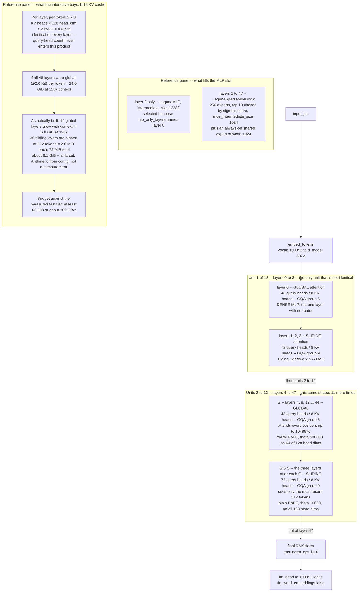

Laguna-S 2.1 is 48 decoder layers, but it is only two layer types plus one exception, so the diagram draws the repeating unit instead of 48 boxes. `layer_types` in the shipped config is a strict GSSS cycle — one global layer then three sliding — repeated twelve times, giving 12 full and 36 sliding. Layer 0 is the exception on a second axis: it is the sole entry in `mlp_only_layers`, so the one layer that attends globally is also the one with a dense MLP and no router. The remaining 47 all carry the 256-expert, top-10 MoE block.

The non-obvious thing is which number varies. Query heads change with layer type — 48 on global, 72 on sliding — but `num_key_value_heads` is a scalar 8 with no per-layer override, so KV cache cost is *identical* on every layer at 4.0 KiB per token in bf16. What actually varies is the GQA group size, 6 on global and 9 on sliding: a compute and arithmetic-intensity difference, not a capacity one. Cache savings come entirely from the 512-token window, and they are large: roughly 6.1 GiB at 128k context against 24.0 GiB if every layer were global.

That looks exactly like a two-tier storage hierarchy, and the sizing math is capacity planning. Three places the analogy breaks. There is no promotion, demotion, or miss path — a layer is bound to its tier by index at construction. Discarding out-of-window tokens is not a gamble with a hit-rate cost; the mask makes them unreadable, so it is lossless by construction. And the tiers are not numerically interchangeable: global layers use YaRN RoPE at theta 500000 over half the head dims, sliding layers plain RoPE at theta 10000 over all of them. You cannot widen the windows to test long context.

**What this diagram omits.** Layer internals are omitted entirely: QK-norm before RoPE, the per-head softplus output gate (config gating: per-head), the two RMSNorms and the two residual adds, router-logit softcapping, the aux-loss-free e_score_correction_bias, and moe_routed_scaling_factor 2.5. Those belong in a separate layer-internals diagram rather than crammed into this one. The ~6.1 GiB figure (12 global layers growing to 6.0 GiB at 128k, plus 36 windowed layers at 2.0 MiB each) is arithmetic over measured config values, not a measured allocation. The label says so. Only the 24.0 GiB all-global figure (ASSUMPTIONS row kv-per-token-laguna) and the >=62 GiB fast tier (row gpu-fast-tier-size) carry register entries. The windowed-residency claim assumes the serving stack actually caps the sliding layers' cache at 512 tokens. llama.cpp demonstrably does (CODE_MAP.md:61, two separate llama_kv_cache objects). Whether HF DynamicCache does was not checked, and the diagram does not distinguish the two. Parameter counts are not shown. 118B total / 8.5B active comes from the model card, not from anything derived here, so it was left out rather than restated. Masks and position embeddings are built once per layer *type* per forward and shared across all layers of that type (modeling_laguna.py:565-582). The diagram shows the type split but not that sharing. The diagram asserts KV cost is uniform across layers. This directly contradicts CODE_MAP.md:54 ("any KV-cost calculation done from the config alone is wrong for some layers"). The diagram follows the source and ASSUMPTIONS.md row laguna-heads-uniform, which explicitly corrects that claim. CODE_MAP is generated by scripts/generate_code_map.py and was not edited here; flagged back to its owner. The GSSS pattern is drawn as if it were structure. It is data: one list lookup at construction (modeling_laguna.py:365). That is stated in the prose but a diagram inherently makes it look architectural. This is the shipped Laguna-S 2.1 config at revision b0a9fd7c850e. CODE_MAP.md:73 records 48-vs-64 query heads for XS.2, so head counts are variant-specific and this diagram does not generalise across the family.

*Source: [`docs/diagrams/laguna-decoder-stack.mmd`](diagrams/laguna-decoder-stack.mmd) — 33 grounding references.*

---

## Inside one block

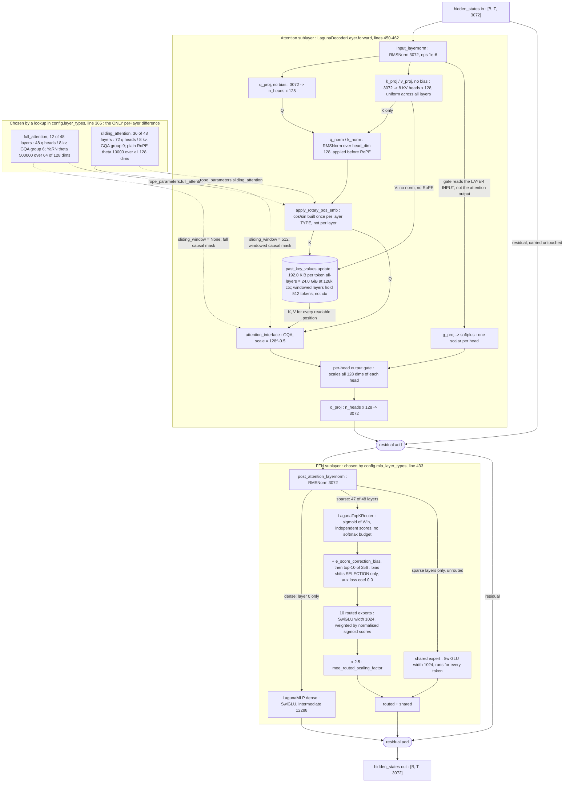

What you are looking at is one of the 48 layers, drawn end to end. Two sublayers, each pre-normed, each ending in an addition back onto the residual stream — the only path that runs the full depth of the model. Everything except the two boxes at the bottom right is identical in every layer; those two are selected by an index lookup into a config list at construction time, not by any runtime condition.

The non-obvious element is the per-head gate. `g_proj` reads the *normed layer input*, in parallel with the QKV projections — not the attention output — so the scalar that scales each head's 128 output dimensions is computed without ever seeing what attention retrieved. It is a learned volume knob per head, applied before `o_proj` mixes the heads together, which lets a head be muted for a given token before its contribution reaches the residual stream. This is not part of the standard decoder recipe, and the upstream code carries no comment explaining it.

Where the systems analogy breaks: the KV cylinder looks like a write-back cache and is not one. There is no miss path, no backing store and no promotion, and on a sliding layer out-of-window keys are architecturally unreadable, so discarding them is lossless rather than a gamble. Nor are the two layer types the same block with a different mask — they have different query-head counts (48 vs 72), different GQA group sizes (6 vs 9) and different positional encodings (YaRN at θ=500000 over half the head dimensions, versus plain RoPE at θ=10000 over all of them). Widening the sliding window to test long context is therefore not a configuration change: those layers were never trained with positional encoding that reaches past 512 tokens.

**What this diagram omits.** Scope is one layer. The embedding table, the 48-layer stack, the final norm and lm_head are out of frame, as is the 118B-total / 8.5B-active split — none of that is visible in a single block. The routed-expert box hides a Python for-loop over hit experts (modeling_laguna.py:219-229) that gathers tokens per expert and index_add_s results back. That is a reference implementation, not the dispatch a real deployment uses; drawing it would teach the wrong cost model. GAP FLAGGED, NOT PAPERED OVER: router-logit softcapping exists in code (modeling_laguna.py:180-181) and CODE_MAP.md:52 describes it as an active guard against expert collapse, but the shipped config sets moe_router_logit_softcapping to 0.0, so the branch never executes. Omitted from the diagram deliberately. CODE_MAP is documentation (class 3) and its Laguna section should say the guard is present but disabled at the shipped config. GAP FLAGGED: the '24.0 GiB at 128k' figure is all-layers-hold-full-context arithmetic from ASSUMPTIONS row kv-per-token-laguna. True residency is far lower because 36 of 48 layers cap at 512 tokens, and no register row currently carries that residency number. The label says 'windowed layers hold 512 tokens, not ctx' rather than inventing one. Someone should compute it and add a row. Attention is a single box. No eager/sdpa/flash distinction, no mask construction, no softmax internals, and no attn_weights return path. On this hardware that abstraction hides a real hazard: ASSUMPTIONS row sdpa-is-memory-efficient records that the default path retains the B*nh*T*T score matrix (147.2 bytes/T-squared) unless TORCH_ROCM_AOTRITON_ENABLE_EXPERIMENTAL=1 is set. GQA fan-out is stated in labels (8 KV heads serving 48 or 72 query heads) rather than drawn. Drawing the fan-out would have cost roughly ten nodes for one fact. Dropout, gradient checkpointing, and the fp32 upcast inside RMSNorm and inside the router are not shown as separate stages. This is the shipped Laguna S 2.1 config read at revision b0a9fd7c850e. It is the reference architecture, not Proteus's config surface, and should not be read as a target design.

*Source: [`docs/diagrams/laguna-decoder-block.mmd`](diagrams/laguna-decoder-block.mmd) — 44 grounding references.*

---

## The MoE path: sigmoid routing and a bias nobody advertises

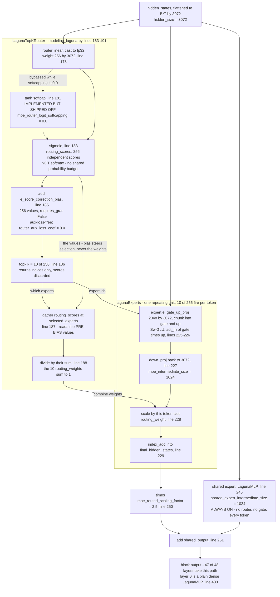

The diagram traces one token's hidden state through a single sparse Laguna MoE layer — 47 of the 48 layers, since `mlp_layer_types[0]` is `dense`. Two paths leave the same input: a shared expert that runs unconditionally on every token, and a router that selects 10 of 256.

Follow the two edges converging on `gather`. `topk` supplies the indices, but the values come from the sigmoid output *before* `e_score_correction_bias` was added (`modeling_laguna.py:185-187`). That is the entire aux-loss-free load-balancing trick: the bias shifts *which* experts win and never touches *how much* their output counts. `router_aux_loss_coef` is `0.0` in the shipped config, so this bias is the only balancing mechanism in the model — and it carries `requires_grad=False`, meaning it is not learned by backprop but written out-of-band by the trainer and frozen at inference.

The softcap on line 181 is real code behind `if self.router_logit_softcapping > 0.0`. The shipped value is `0.0`, so it never executes. Worth knowing it exists before concluding Laguna has no guard against router runaway. Sigmoid rather than softmax is the other structural choice: experts are scored independently instead of competing for a fixed probability budget, and the normalise on line 188 restores sum-to-one only across the 10 survivors.

Where the load-balancer analogy breaks: this balancer has no queue depth, no health check, and no overflow. Every selected expert runs — there is no capacity factor and no dropped token in this implementation. And imbalance is not a latency problem you can drain. During training an under-used expert receives fewer gradients and permanently learns less, so imbalance is self-reinforcing rather than transient.

**What this diagram omits.** Depicts one sparse MoE layer only. The 48-layer stack, attention, RMSNorm and residuals are out of scope; the diagram's only concession to the stack is the OUT node noting 47 of 48 layers take this path. LagunaExperts is decorated @use_experts_implementation (modeling_laguna.py:194). The per-expert loop drawn as the repeating unit is the readable reference implementation, not necessarily the kernel that runs. Shapes are per-token after the flatten at modeling_laguna.py:244. The batch/sequence collapse and the reshape back at :253 are not drawn. config.json keys norm_topk_prob, decoder_sparse_step and mlp_only_layers are present in the artifact but inert - dropped at modular_laguna.py:125-128. The diagram silently uses the live key (mlp_layer_types) and does not show the dead ones. No measured numbers: nothing in ASSUMPTIONS.md measures MoE routing on gfx1151. Every figure in the diagram is a config-file or source read, not an [M]. Inference path only. The rule that updates e_score_correction_bias during training is not in this file, so the mechanism that actually balances load is named but not drawn. moe_apply_router_weight_on_input is false in the shipped config and raises NotImplementedError if set (configuration_laguna.py:154-156); the alternative weighting path is not drawn. The 2.5 routed-scaling factor is drawn where the code applies it - after combine, before the shared-expert add - but the diagram does not explain why routed and shared outputs are on different scales.

*Source: [`docs/diagrams/laguna-moe-routing.mmd`](diagrams/laguna-moe-routing.mmd) — 39 grounding references.*

---

## MHA, GQA, MQA, MLA: one factor, four values

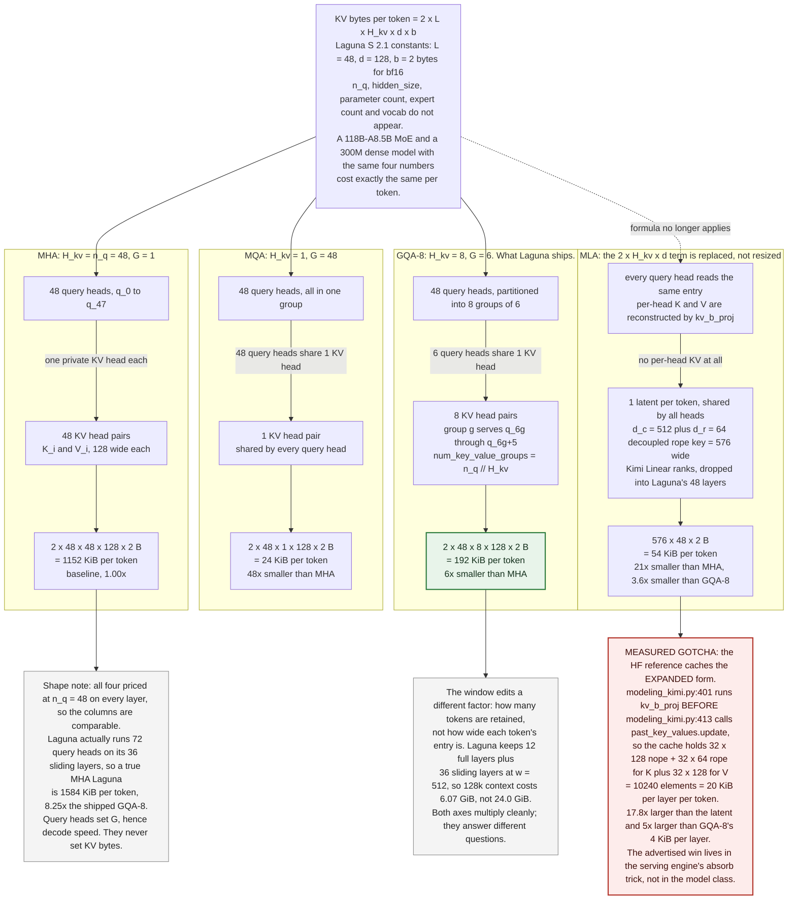

Four columns, one product. The formula at the top is the entire KV cost model: `2` (one key, one value) x `L` layers x `H_kv` key/value heads x `d` head width x `b` bytes per element. MHA, GQA and MQA are three values of a single integer in it — `H_kv` — and MLA is the one variant that replaces the term rather than resizing it, caching a single 576-wide latent per token instead of per-head keys and values. Every column is priced at Laguna S 2.1's real constants (`L=48`, `d=128`, bf16) with query heads held at 48 so the four are comparable, which is why the shipped GQA-8 column reads exactly 192 KiB/token.

The non-obvious thing is what the product does not contain: query heads, hidden size, parameter count, expert count, vocabulary. Laguna's 118B-A8.5B MoE and a 300M dense model with the same four numbers have identical KV cost per token — so the *small* model enters the KV-dominated regime at shorter contexts, not longer. The same absence is why MQA prices below MLA here: MLA's advertised 93.3% reduction is measured against an MHA baseline, and against GQA-8 at this shape it is 3.6x.

The systems analogy breaks in two places. First, this is not a storage format you can change at runtime. `G = n_q / H_kv` is frozen into the checkpoint's tensor shapes at pretraining time; there is no re-sharding, no index rebuild, no raising the group size in prod to see what happens. Second — the red box — a compression ratio is a property of the write path, not of the format. The HF reference MLA implementation expands the latent through `kv_b_proj` *before* it calls `cache.update`, caching 20 KiB per layer per token: 17.8x the latent, and five times worse than the GQA-8 it is meant to beat. Measure the cache; never read it off the config.

**What this diagram omits.** All four columns are priced at n_q = 48 on every layer so the comparison is like-for-like. That makes the 1152 KiB MHA baseline a counterfactual, not a shipped number: Laguna really runs 72 query heads on its 36 sliding layers, so a true MHA Laguna is 1584 KiB/token and the shipped saving is 8.25x, not 6x. The UNIFORM note says this in-diagram, but the two figures must not be quoted adjacent to each other without it. No MLA model exists at Laguna's shape. The 54 KiB/token figure drops Kimi Linear's ranks (kv_lora_rank 512, qk_rope_head_dim 64) into Laguna's 48-layer stack. It is arithmetic over two artifacts, not a property of any model that has been trained. The 20 KiB/layer/token gotcha figure is computed from Kimi's own 32 heads, not Laguna's. It does not scale to a 48-layer stack without restating that head count, and the diagram deliberately gives it per layer for that reason. The diagram prices CAPACITY only. It says nothing about whether the bandwidth saving is realised: repeat_kv (modeling_laguna.py:303-312) materialises a G-times copy on any masked layer, and every sliding layer is masked, so the layers with the highest G are structurally guaranteed to take the copying path. That is the curriculum module's section 5.2 and belongs in a separate diagram. Decode arithmetic intensity (AI = 2G/b) is omitted entirely. It is the other half of why H_kv matters, and ASSUMPTIONS.md -> decode-intensity-varies-by-layer records it as derived and never measured; putting a derived number beside measured config reads would give it authority it has not earned. Windowing appears as a single note, not as structure. The growing-term / fixed-term split (12 x 4 KiB per token + 36 x 4 KiB x 512 = 72 MiB) and the fact that the hybrid saves nothing below T = 512 are not drawn. kv_dtype is shown only as b = 2. fp8 or quantised KV storage, which halves bytes and doubles intensity, is not an axis in this diagram. Nothing here is measured on the Z13. Every figure is arithmetic over committed config artifacts read at revision b0a9fd7c850e; the Hardware Validation Gate has not run, so no throughput or residency claim from this machine backs any of it.

*Source: [`docs/diagrams/attention-variants-and-kv-cost.mmd`](diagrams/attention-variants-and-kv-cost.mmd) — 28 grounding references.*

---

## Proteus: the config surface is the experimental surface

```mermaid
flowchart TD
    CFG["ProteusConfig - one typed object loaded from YAML<br/>every field below is an ablation axis<br/>green values are read from laguna-s config.json at b0a9fd7c850e - tag [M]"]

    subgraph SCHED["Layer schedule - the list IS the hypothesis"]
        direction TB
        LIST["layer_types - one string per layer index<br/>read at layer construction, modeling_laguna.py:365<br/>Laguna S ships strict GSSS: 12 full + 36 sliding = 3 to 1"]
        FULL["full_attention<br/>KV residency grows with context"]
        SWA["sliding_attention<br/>sliding_window = 512 tokens"]
        RECUR["linear attention / SSM<br/>no such value exists in LagunaConfig - Proteus-only axis<br/>plug point: Mamba-2 ssm_state, Gated DeltaNet, Samba 1 to 1"]
    end

    subgraph GEOM["Attention geometry - varies BY LAYER TYPE, not by model"]
        direction TB
        QH["num_attention_heads_per_layer<br/>Laguna S: 48 query heads on full, 72 on sliding<br/>top-level num_attention_heads 48 is wrong for 36 of 48 layers"]
        KVH["num_key_value_heads = 8, uniform, no per-layer override<br/>head_dim = 128"]
        GQA["GQA group G = query heads / kv heads<br/>6 on full layers, 9 on sliding<br/>decode arithmetic intensity is 2G / dtype bytes"]
        AGATE["gating = per-head<br/>softplus output gate, one scalar per head<br/>alternative in code: per-element"]
    end

    subgraph POS["Positional scheme - also keyed by layer type"]
        direction TB
        RFULL["full layers: YaRN, rope_theta 500000, factor 128<br/>partial_rotary_factor 0.5, original ctx 8192"]
        RSWA["sliding layers: plain RoPE, rope_theta 10000<br/>partial_rotary_factor 1.0"]
        NOPE["NoPE and the partial-rotary sweep<br/>open axis - nothing in the reference exercises it"]
    end

    subgraph MOEBLK["MoE - per layer, independent of the attention schedule"]
        direction TB
        MTYPE["mlp_layer_types - dense or sparse per layer<br/>Laguna S: layer 0 dense, the other 47 sparse"]
        EXP["num_experts 256, num_experts_per_tok 10<br/>moe_intermediate_size 1024 plus always-on shared expert 1024<br/>moe_routed_scaling_factor 2.5"]
        ROUTER["router: sigmoid, not softmax<br/>e_score_correction_bias with router_aux_loss_coef 0.0<br/>logit softcapping exists in code but ships at 0.0 = OFF"]
    end

    DW["Depth x width<br/>num_hidden_layers x hidden_size = 48 x 3072, intermediate 12288<br/>our ablations run 20M-300M params - tag [A], untested"]

    subgraph BUDGET["Pinned by measurement on gfx1151 - budgets, not axes"]
        direction TB
        KVCOST["KV per token = 2 x 48 x 8 x 128 x 2 bytes = 192.0 KiB exactly<br/>24.0 GiB at 128k context - tag [M]"]
        TIER["fast tier flat at ~200 GB/s out to at least 62 GiB<br/>BIOS UMA carve-out 96 GB - tag [M], one run per arm"]
        BUF["a single tensor of 32 GiB or more hard-hangs at 0 CPU<br/>31 GiB copies cleanly at 199.9 GB/s - tag [M]"]
        ACT["SDPA retains the score matrix: 147.2 bytes per T squared<br/>AOTriton path is 6.6 and stays OFF by default - tag [M]"]
        DIST["torch.distributed is absent from the lab wheel<br/>expert / tensor / pipeline parallel fail at import - tag [M]"]
    end

    CFG --> LIST
    CFG --> QH
    CFG --> KVH
    CFG --> AGATE
    CFG --> MTYPE
    CFG --> DW

    LIST --> FULL
    LIST --> SWA
    LIST --> RECUR

    QH --> GQA
    KVH --> GQA

    FULL -->|"rope_parameters key"| RFULL
    SWA -->|"rope_parameters key"| RSWA

    MTYPE --> EXP
    EXP --> ROUTER

    KVH -.->|"sizes"| KVCOST
    KVCOST -.->|"must fit inside"| TIER
    TIER -.->|"and no single buffer may reach"| BUF
    LIST -.->|"long-context arms are gated by"| ACT
    EXP -.->|"expert count capped single-device by"| DIST
    DW -.->|"param budget capped single-device by"| DIST

    classDef root fill:#e3f2fd,stroke:#1565c0,color:#0d47a1
    classDef axis fill:#e8f5e9,stroke:#2e7d32,color:#1b5e20
    classDef pinned fill:#ffebee,stroke:#c62828,color:#b71c1c

    class CFG root
    class LIST,FULL,SWA,RECUR,QH,KVH,GQA,AGATE,RFULL,RSWA,NOPE,MTYPE,EXP,ROUTER,DW axis
    class KVCOST,TIER,BUF,ACT,DIST pinned
```

This is the config surface as an ablation tree, not a data-flow diagram — nothing here moves a tensor. Each green box is a field you can set, and an arrow means "this field selects that one." The blue root is the single typed config object; the red boxes at the bottom are not axes at all. They are budgets this machine has already measured, and they bound what the green boxes are permitted to say.

The non-obvious thing is how little of the architecture is architecture. The entire SWA/global hybrid question — the one the lab exists to answer — is a list of strings, one per layer, read once at construction (`modeling_laguna.py:365`). Change the list, change the model class. That is why `layer_types` hangs directly off the root instead of sitting inside some attention abstraction: there is no abstraction, and building one would be inventing a requirement.

Two axes are keyed by layer *type* rather than set once for the model, which is easy to miss from `config.json` alone. Query-head count is per layer (48 on full, 72 on sliding — the top-level `num_attention_heads: 48` is wrong for 36 of 48 layers), and the positional scheme is a different RoPE per type: YaRN at θ=500000 over half the head dims on full layers, plain RoPE at θ=10000 over all of them on sliding. You cannot simply widen the sliding windows to test long context; those layers were never trained with positional encoding that reaches past 512.

Where the systems analogy breaks: the red boxes look like a capacity plan, and the KV arithmetic genuinely is one — 192.0 KiB/token, 24.0 GiB at 128k, against a fast tier flat to at least 62 GiB. But a sliding layer does not *evict* the tokens outside its window. They are architecturally unreadable, so discarding them is lossless. No hit rate, no miss path, no tier to promote from.

**What this diagram omits.** The tree shows the config surface of the REFERENCE model (Laguna S 2.1) plus the axes Proteus intends to add. Proteus itself has no config code yet — `packages/proteus/src/proteus/__init__.py` is the only source file and `configs/` holds only a README. Every green box is a plan, not a shipped field. The 'linear attention / SSM' box has no config vocabulary anywhere. Laguna's `layer_types` validator accepts only `full_attention` and `sliding_attention`; the Mamba-2 / Gated DeltaNet / Samba references are where the mechanism would be read from, not a value that exists. The `NoPE and partial-rotary sweep` node deliberately has no incoming edge — no shipped config sets it. That is information, not a layout accident. The diagram omits every axis that is not per-layer or not experimental: vocab_size, tokenizer, rms_norm_eps, initializer_range, attention_bias, dropout, QK-norm (present in code at modeling_laguna.py:368 but not a planned axis), and the whole `base_model_tp_plan` / `ep_plan` surface (dead on this hardware — see the DIST box). `GQA group G = 6 / 9` is a measured config read; the claim that decode arithmetic intensity is 2G/dtype_bytes is DERIVED, not measured (ASSUMPTIONS row `decode-intensity-varies-by-layer`). The diagram states the formula without a measurement tag for that reason. The `at least 62 GiB` fast tier is a single run per arm — an anecdote by this lab's own >=3-seed standard. The upper edge was never found; the sweep hit the 32 GiB tensor fault, not a bandwidth knee. The red budgets are properties of gfx1151 under the current wheel (`torch 2.12.0a0+rocm7.13.0a20260313`). They are re-measured after any ROCm/PyTorch change; an upgrade invalidates the bottom third of this diagram. hipBLASLt configuration is not drawn. It is a per-run recorded control (ADR: hipblaslt-is-a-numerics-control), not a model axis, but it confounds any long-context result taken without it. MoE parameter counting is not shown. At 20M-300M ablation scale, `num_experts: 256` is not reachable; the real ablatable range is far smaller and nobody has costed it yet. I could not run mermaid-cli in this session (no shell tool available). Syntax was hardened by inspection: all labels quoted, no `<`/`>` outside `<br/>`, no `#` or `;` inside labels, dotted-edge labels in the `-.->|"..."|` form.

*Source: [`docs/diagrams/proteus-config-surface.mmd`](diagrams/proteus-config-surface.mmd) — 35 grounding references.*

---

# System layouts

## Four systems, and the boundary that is enforced

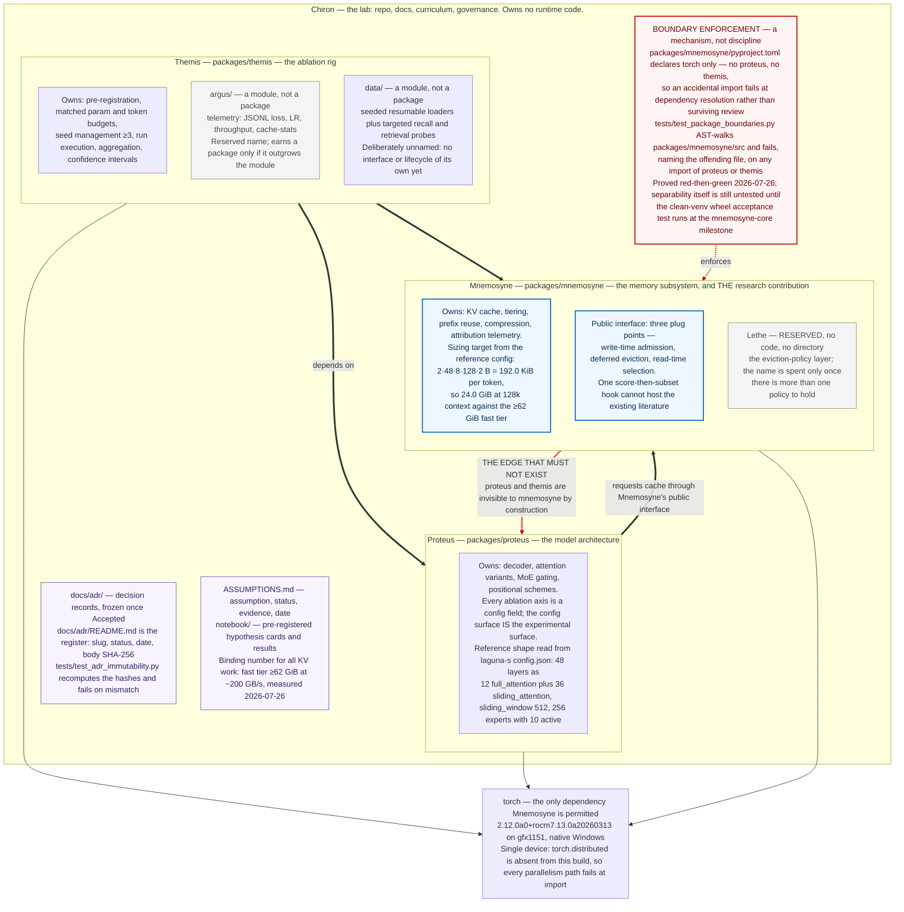

The four boxes are the whole lab. Chiron is the repository and its governance — records, registers, and the tests that keep them honest — and owns no runtime code. The three inner boxes are separately distributable packages in one uv workspace, and the arrows between them are their *declared* dependencies, drawn top-to-bottom so that "depends on" points down.

The non-obvious thing is the red dashed arrow, which is drawn precisely because it does not exist. Mnemosyne's `pyproject.toml` lists `torch` and nothing else. That omission is not tidiness; it is the research claim rendered as a build constraint. A memory subsystem that only works against our own decoder is an implementation detail rather than a contribution, so separability has to be mechanically true instead of asserted. Two artifacts hold it: the missing dependency, which makes an accidental `import proteus` fail at resolution, and `tests/test_package_boundaries.py`, which AST-walks Mnemosyne's source and fails *naming the offending file*, so the error is legible rather than cryptic. The guard itself has been exercised red-then-green; separability has not — that waits on a clean-venv wheel install at the `mnemosyne-core` milestone.

Where the systems reading breaks: this looks like a layering diagram, where the bottom is the most stable substrate and the arrows describe blast radius. It is not. Mnemosyne sits lowest because of what it must be detachable *from*, not because it changes least — it is the layer under the heaviest development. And `torch` here is not a swappable platform: it is one pinned ROCm nightly on one iGPU, with `torch.distributed` absent from the build entirely, so there is no horizontal escape hatch under the stack. The capacity and bandwidth figures in the boxes are single-run instrument characterisation, not results.

**What this diagram omits.** The arrows are DECLARED dependencies from pyproject.toml, not a runtime call graph. There is no call graph yet: `packages/**/src/**/*.py` currently contains five `__init__.py` files and nothing else, so no code exists for any arrow to describe. The three plug points on Mnemosyne (write-time admission / deferred eviction / read-time selection) come from `docs/adr/attribution-instrument-over-eviction-policy.md`, which is Status: **Proposed**, awaiting founder review. That node is drawn as if settled and is not. The diagram shows the boundary GUARD, not proven separability. `ASSUMPTIONS.md` row `mnemosyne-separable` reads "guard proven; separability itself untested" — the clean-venv wheel acceptance test has not run. Every number in a label is single-run instrument characterisation (>=62 GiB, ~200 GB/s), which the house standard calls an anecdote. The Hardware Validation Gate has not run, so nothing here counts as a research result. The Laguna numbers in the Proteus box describe the REFERENCE model under study, read from `research/reference/models/laguna-s/config.json`. They are not Proteus's own implemented shape — Proteus has no model code. The 192.0 KiB/token figure is exact for a full unwindowed cache. Actual residency is far lower because 36 of 48 layers are windowed at 512 — the diagram states the ceiling, not the working set. `torch.distributed` being absent is a property of the currently pinned wheel (`2.12.0a0+rocm7.13.0a20260313`), not of the hardware. A different wheel or rented hardware changes it. Chiron's other contents are omitted: `curriculum/`, `research/` (reference clones, memory track, notes), `configs/`, `BACKLOG.md`, `BLOCKERS.md`, `CHANGELOG.md`, and root `tests/` beyond the two guard tests named. Only two of the four ADRs' enforcement paths are shown (the hash register and the boundary lint). The `Proposed`/`Accepted`/`Superseded` status ladder itself is not drawn. `>=62 GiB` is a floor, not an edge — the bandwidth sweep never found where degradation begins; it hit the >=32 GiB single-tensor hang first. The diagram states it as a budget, which is how the notebook entry recommends using it, but it is not a measured tier boundary.

*Source: [`docs/diagrams/four-systems-and-boundaries.mmd`](diagrams/four-systems-and-boundaries.mmd) — 24 grounding references.*

---

## One ablation run, end to end

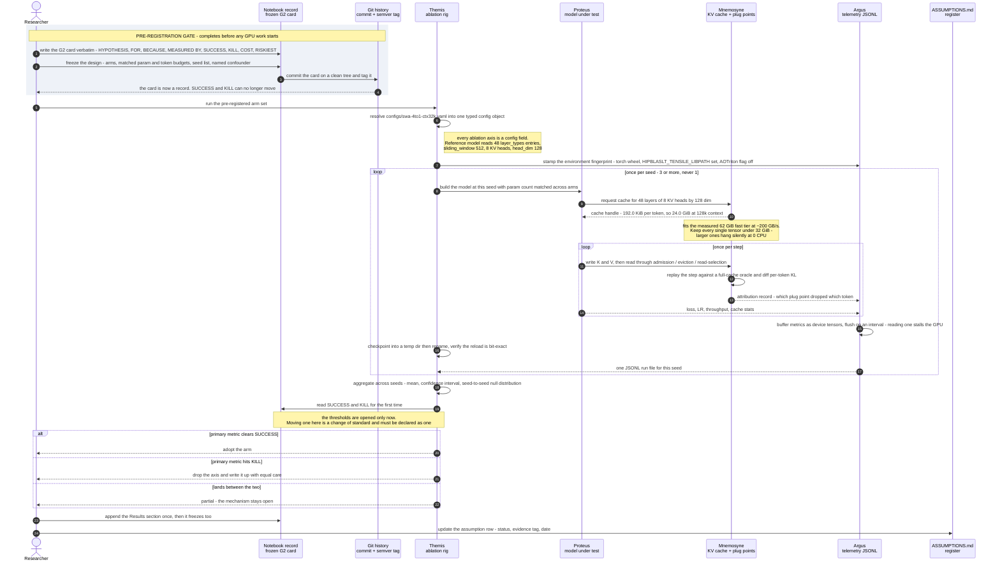

One ablation run, read top to bottom. The shaded block is the reason this is a sequence diagram and not a flowchart: the hypothesis card — HYPOTHESIS through RISKIEST — is committed and tagged at steps 3–4, and Themis does not open SUCCESS or KILL until step 19, after aggregation. Everything in between is executed by machinery that cannot see the thresholds it will be judged against. Reverse that order and the run still produces numbers; it stops producing evidence.

The three-way `alt` at the bottom is load-bearing. A KILL is a completed experiment written up with the same care as a SUCCESS, and the middle branch — landing between thresholds — is pre-declared as partial rather than argued into a win afterwards.

The non-obvious step is 12. Mnemosyne replays each probe step against a full-cache oracle: attribution requires running the expensive thing eviction exists to avoid. That is affordable at 20M–300M parameters and unaffordable at 70B, which is why small scale is the enabling condition here rather than a compromise.

Where the systems analogy breaks, twice. Step 15 looks like a write-ahead log with group commit — buffer records, flush on an interval. It is not: the buffer is volatile, and the batching does not amortize I/O. Metrics are held as unevaluated device tensors because reading one forces a host-device sync that stalls the GPU. Observability is charged directly against training throughput, which is not true of any logging system you have run in production. Step 16 breaks differently: the checkpoint has no journal and no incremental delta. Every save is a full rewrite committed by directory rename, so atomicity is rename-granularity — a torn save loses the whole checkpoint, not a tail.

**What this diagram omits.** This is design, not an observed trace. Themis, Proteus, Mnemosyne and Argus are scaffolded packages at version 0.1.0 containing only `__init__.py` docstrings — no run has ever taken this path. The ADR that specifies the three plug points and the full-cache oracle harness (`attribution-instrument-over-eviction-policy`) is still `Proposed`, awaiting founder review. Steps 11–13 draw a decision that has not been accepted. One arm is drawn. A real ablation runs at least two matched arms (e.g. `proteus-swa-4to1` vs `proteus-dense`); the arm loop is collapsed into the single "run the arm set" message. The oracle diff is drawn as if it runs every step. Per the ADR it runs on probes, not on every training step — the diagram trades that precision for a readable repeating unit. The config values shown (48 layers, 8 KV heads, head_dim 128, sliding_window 512) and the derived 192.0 KiB/token / 24.0 GiB at 128k are the *reference* model's, read from Laguna S 2.1's config.json. Our own ablations run at 20M–300M params, so those are the numbers being studied, not the numbers our arms will cost. Residency in practice is far below 24.0 GiB because 36 of 48 layers are windowed at 512 tokens. The diagram states the full-residency upper bound because that is what a capacity budget must clear. The Hardware Validation Gate is not drawn and has not passed. bf16 numerics, determinism and checkpoint integrity remain unproven, so nothing produced by this lifecycle counts as evidence yet. Failure paths are omitted entirely: OOM, preemption, resume-from-checkpoint, and the silent >=32 GiB hang at 0 CPU that would stall this sequence without raising an error. No distributed path is shown, and that is not a simplification — `torch.distributed` is absent from the lab wheel, so every parallelism path fails at import. The `>=3 seeds` loop is drawn as sequential. Whether seeds run sequentially or share a process is unspecified in any committed artifact.

*Source: [`docs/diagrams/experiment-lifecycle.mmd`](diagrams/experiment-lifecycle.mmd) — 39 grounding references.*

---

## Mnemosyne's contract with the outside world

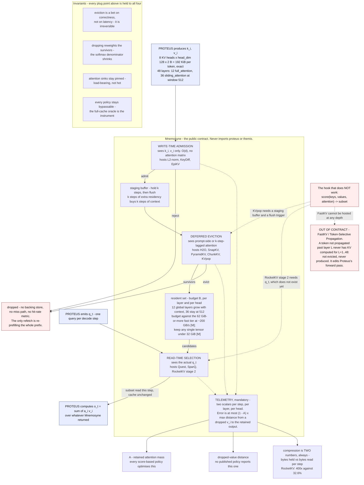

This is Mnemosyne's public contract, not its implementation. Read the blue nodes as Proteus: it produces `k_i` and `v_i` on the way in, emits `q_t` once per decode step, and consumes a subset on the way out. Everything between is the surface a memory policy plugs into. The three plug points differ in exactly one respect — when they run relative to the query — and that ordering is the entire design. Write-time admission sees only the key and value of the token being written: O(d) work, no attention matrix in scope. Deferred eviction runs after a bounded staging delay and sees prompt-side or k-step-lagged attention. Read-time selection runs per step and is the only place the actual `q_t` exists.

The non-obvious thing is why the obvious hook fails. `score(keys, values, attention) -> subset` is a *ranking* interface, and this is not a ranking problem — nine of the ten canonical policies commit to a retained subset before the query that will read it exists. The three dashed edges are the three ways that bites: KVpop needs a buffer to defer in, RocketKV's second stage needs a query nobody has emitted yet, and FastKV cannot be hosted at any depth, because it discards tokens inside the forward pass so their KV is never produced rather than evicted.

Where the caching analogy breaks: eviction here is a bet on correctness, not latency. No backing store, no miss path, and — the part that matters operationally — no hit-rate metric. A wrong eviction returns a fluent, confident, wrong answer with no error signal anywhere in the stack. That is why telemetry sits inside the contract rather than beside it.

**What this diagram omits.** The contract is Proposed, not Accepted. Both `research/synthesis.md` (status: proposed — awaiting founder review) and ADR `attribution-instrument-over-eviction-policy` (Status: Proposed) still await founder review. The diagram draws a proposal, not a decision in force. The four invariants are my synthesis, not a specialist's list. i1–i3 are read off §2's 'four breaks' in `kv-compression-and-eviction.md`; i4 comes from the ADR's oracle-diff requirement. The note never labels anything an invariant and nobody has signed off on this as the complete set. Gap flagged to memory-systems-researcher. No API shape anywhere. The source settles *when* each plug point runs and *what it can see*; it says nothing about signatures, who allocates and owns the cache tensors, the flush-trigger semantics of the staging buffer, or how read-time selection composes with a paged/block layout. The diagram shows a contract with no types in it. Gap flagged to ml-architect. 'budget B, per layer and per head' extrapolates. The note logs telemetry per layer and per head, but whether the *budget* should be allocated per layer, per head, or uniformly is live dispute §5.3 (PyramidKV vs Ada-KV vs LAVa). The diagram shows the axis exists; it does not claim a rule. The ≥62 GiB fast tier at ~200 GB/s is one run per arm — an anecdote by the house ≥3-seed standard — and its upper edge is unmeasured (the sweep hit the 32 GiB tensor fault, not a bandwidth knee). The 32 GiB fault rests on two observations with an untested mechanism. Nothing measured on this machine is admissible yet: `bf16-numerics-unproven` is untested and the Hardware Validation Gate has not run. Every [M] on the diagram is provisional in that sense. 192 KiB/token is exact for Laguna S 2.1 and for an all-global cache. Real residency is roughly 4x lower because 36/48 layers window at 512. The diagram states both facts and computes neither into a residency figure. The diagram is decode-shaped: one layer, one head, one step. It omits prefix reuse and cross-request sharing, quantization, offload to a slow tier, and the batch dimension — all of which the serving-hierarchy note treats and all of which will need their own diagram. FastKV is drawn as a single out-of-contract example. It stands in for a class (anything that alters the forward pass, including trained sparsity like NSA/DSA); the class boundary has not been enumerated.

*Source: [`docs/diagrams/mnemosyne-cache-interface.mmd`](diagrams/mnemosyne-cache-interface.mmd) — 27 grounding references.*

---

## The memory hierarchy, as measured here

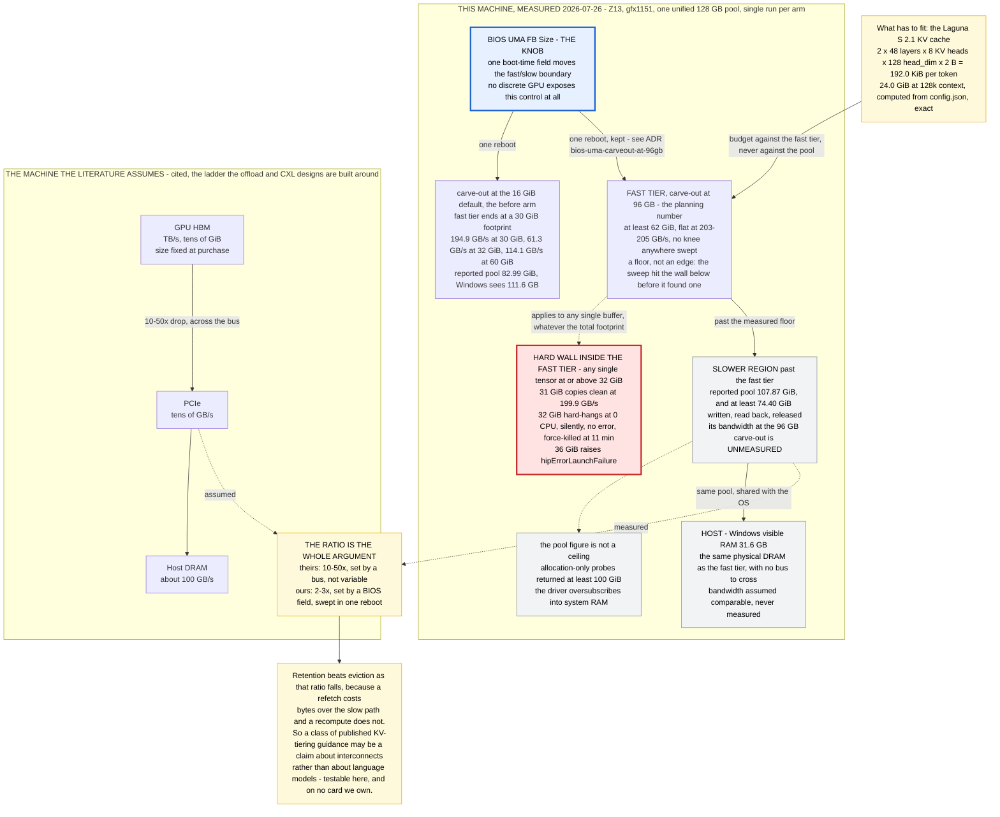

The left ladder is this machine as measured on 2026-07-26. The right one is the machine nearly every KV-offload and CXL-tiering paper is written for. They are the same picture drawn twice, and the gap between them is this lab's main structural advantage.

Three numbers carry the diagram. The fast tier is at least 62 GiB at a flat 203–205 GB/s, and that — not the 107.87 GiB the driver reports, not the ≥74.40 GiB that has been written and read back — is what every long-context experiment is sized against. Laguna S 2.1 costs 192.0 KiB of KV per token exactly, so a 128k context is 24.0 GiB and fits with room. Inside the fast tier sits a hard wall: any *single* tensor at or above 32 GiB. A 31 GiB buffer copies clean at 199.9 GB/s; a 32 GiB buffer hangs at zero CPU with no error. That wall is orthogonal to capacity — it does not care how much is free — and it stalls a run rather than crashing it.

The non-obvious element is the blue node. The fast/slow boundary here is a BIOS field, not a bus. Moving it from the 16 GiB default to 96 GB moved the boundary from 30 GiB to ≥62 GiB in one reboot. No discrete GPU can vary that ratio at all, which turns a fixed premise of the literature into a swept variable.

Where the storage-hierarchy analogy breaks: there is no change of medium and no miss path. Every box on the left is the same DRAM. Nothing is promoted, nothing demoted, nothing faults in — and "offload to host DRAM," the move the offload literature is built on, buys no capacity here, because the host's share shrank to 31.6 GB out of that same pool. These tiers are an allocation policy wearing a hierarchy's clothes.

**What this diagram omits.** Every measured number on the left ladder is a single run per arm — an anecdote by this repo's own standard (>=3 seeds, CIs). The effect sizes are large and the boundaries sharp across adjacent points, which is why they are reported, but nothing here is a research result. The >=62 GiB fast tier is a floor, not a measured edge. The sweep never found a bandwidth knee — it hit the >=32 GiB single-tensor fault first. Whether the fast tier ends at 62, 80, or 96 GiB is unknown. The 'slower region' box is drawn from the 16 GiB-carve-out arm, where bandwidth past 30 GiB fell to 61–114 GB/s. At the 96 GB carve-out currently in force, the region beyond 62 GiB was never swept, so its bandwidth is unmeasured. The diagram says so on the node; do not read the box as a measurement. Host-side bandwidth is assumed comparable to device-to-device, not measured. The cheapest test (host-to-device copy plus CPU memcpy on the same box, against the ~200 GB/s figure) has not been run. The right-hand ladder is the literature's design premise, cited, not benchmarked by us. TB/s, ~100 GB/s and 'tens of GB/s' are order-of-magnitude framings from the survey notes, not vendor specs for a named part. 24.0 GiB at 128k is the worst case with all 48 layers holding full context. In practice 36 of 48 Laguna layers are windowed at 512 tokens, so real residency is far lower — a window effect the diagram does not draw. The 32 GiB wall's mechanism is unexplained. A 32-bit overflow in the copy path is a medium-confidence hypothesis, not a finding; the discriminating test (32 GiB as fp32) has not been run. The diagram states the symptoms only. No temperature, power profile, or repeat-count control is represented. Thermal throttling was checked and cleared as a confounder for the boundary move, but only by the argument that small-footprint bandwidth was unchanged.

*Source: [`docs/diagrams/memory-hierarchy-measured.mmd`](diagrams/memory-hierarchy-measured.mmd) — 22 grounding references.*

---

## PagedAttention: a page table, until it isn't

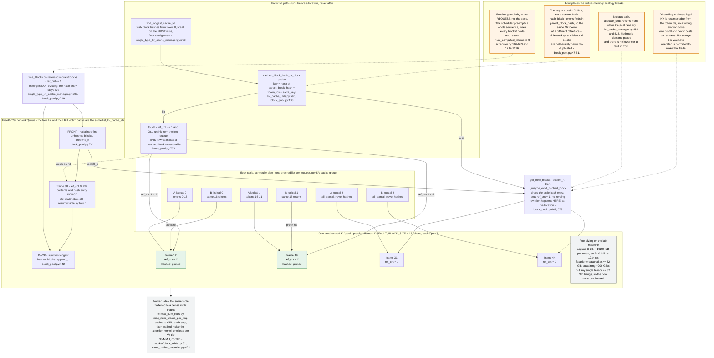

You are looking at a page table with the hardware taken out. `req_to_blocks` is one plain Python list per request per KV cache group; index `i` is logical KV block `i`, and the `block_id` stored there is the physical frame in a single preallocated pool of 16-token blocks. Requests A and B share a system prompt, so their first two logical slots resolve to the same two frames. That sharing happens once, at lookup time, before allocation — never retroactively. `touch` bumps `ref_cnt` and unlinks the frame from the free queue in O(1), and that refcount is the whole pinning mechanism: a frame with `ref_cnt > 0` cannot be handed out.

The non-obvious thing is the free list, because it is not a free list. `FreeKVCacheBlockQueue` holds `ref_cnt == 0` blocks with their KV contents *and* their hash entries intact, so a later request can resurrect one on a prefix hit. Freeing is not evicting; eviction happens lazily inside `get_new_blocks`, at the moment a frame is reallocated. That is why "blocks in use" and "entries still available for hits" are two different numbers, and why `free_blocks` is called with a request's blocks reversed — tail blocks are the least reusable prefix, so they sit nearest the front of the victim order.

Four analogy breaks are marked. The one that bites a systems reader hardest is granularity: there is no page fault, so when `allocate_slots` returns `None` the scheduler does not service a miss — it preempts an entire sequence, frees every block it holds, and resets `num_computed_tokens` to zero. The unit of eviction is the request. The fourth break is what makes that tolerable: KV is recomputable from the token ids, so a bad eviction costs one prefill and never costs correctness. No storage tier you have run in production is allowed to make that trade.

**What this diagram omits.** The diagram draws ONE KV cache group. Laguna's 12 full_attention + 36 sliding_attention layers actually run as separate groups with different frame geometry over the same pool; that is stated in the REQS subgraph title but not drawn, because drawing it doubles the node count for a second-order point. Frame numbers (12, 19, 31, 44, 88), the two-block shared prefix, and ref_cnt values are illustrative, not from a trace. Everything about the MECHANISM is from source; the specific integers are not. 192.0 KiB/token is the exact worst case if every layer retained every token. Real residency is far lower because 36 of 48 Laguna layers are windowed at 512 tokens (ASSUMPTIONS: kv-per-token-laguna). The diagram gives the ceiling, not the expected footprint. The >=62 GiB fast tier and ~200 GB/s figures are SINGLE-RUN, one run per arm — an anecdote by this lab's own >=3-seed standard. 62 GiB is also a floor (the sweep hit the >=32 GiB single-tensor fault before it found a bandwidth knee), not a measured edge. The >=32 GiB single-tensor hang is real and measured, but its mechanism is an untested [A] (suspected 32-bit overflow in the copy path). The diagram's advice to chunk the pool follows from the symptom, not from a diagnosis. Omitted from the vLLM machinery: hybrid kernel-vs-manager block sizes (worker/block_table.py:64-77), the watermark and reserved_blocks headroom in allocate_slots, fine-grained sub-block hash probing (single_type_kv_cache_manager.py:716-736), the null block, KV connector / external-cache paths, and copy-on-write partial-hit bookkeeping. Each is real; none is needed to understand the block table. The Triton pointer is one of several attention backends. Other backends consume the same block_table_tensor through CommonAttentionMetadata (`memory/vllm/vllm/v1/attention/backend.py:437`) but walk it differently; the diagram shows the unified-Triton path as representative. Line numbers are pinned to the revision recorded in PROVENANCE.md. Re-fetching upstream will move them; scripts/generate_code_map.py is what detects that, and this diagram will need the same treatment since its labels carry pointers.

*Source: [`docs/diagrams/paged-attention-block-table.mmd`](diagrams/paged-attention-block-table.mmd) — 27 grounding references.*

---

## The attribution harness

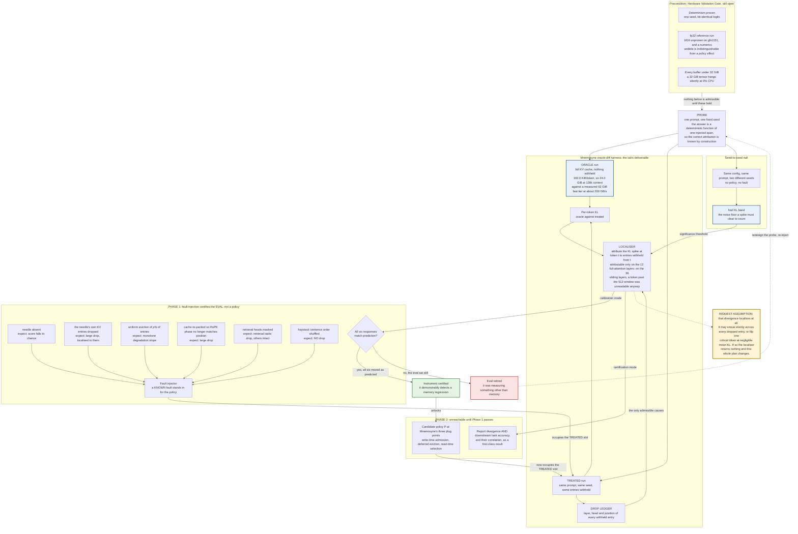

Read this as a differential test rig, not a training pipeline. One probe prompt and one fixed seed drive two forward passes that differ in exactly one thing: what the cache was allowed to keep. The oracle run keeps everything — affordable here and almost nowhere else, because 192.0 KiB/token of KV at the reference geometry is 24.0 GiB at 128k context against a measured 62 GiB fast tier. The treated run withholds entries and logs precisely which ones. Per-token KL between the two output distributions is the signal, the drop ledger is the suspect list, and the localiser tries to join them — with the seed-to-seed null band deciding what counts as a spike at all.

The non-obvious part is the left-hand loop, and it is why this is a system rather than a script. Phase 1 never judges a policy. It substitutes six *known* faults for the policy, each with a response predicted in advance, and asks whether the eval moves. An eval that survives all six without moving is measuring something other than memory and gets retired. This is ordinary alerting discipline: you do not trust a pager you have never seen fire. Only a certified instrument is admitted to Phase 2.

Two places the systems analogy breaks. First, there is no request ID. Causality runs through a continuous attention distribution rather than a call graph, so attribution is a statistical join against a noise floor, not a trace lookup — which is exactly the marked assumption: divergence may smear evenly across every dropped entry. Second, 36 of the 48 reference layers window at 512 tokens, where an out-of-window entry is architecturally unreadable and dropping it is lossless by construction. Flat KL on those layers is not evidence the policy was harmless; it is evidence you dropped something the model could never have read.

**What this diagram omits.** Nothing in this diagram has been run. The Hardware Validation Gate is open, `bf16-numerics-unproven` is untested, and determinism has not been demonstrated on this stack — the entire left column is a precondition, not a completed step. The KV geometry in the ORACLE box (192.0 KiB/token, 24.0 GiB at 128k, 12 full / 36 sliding layers, 512 window) is the Laguna S 2.1 *reference* model's, read from its config. The lab's own ablations run at 20M–300M params, where the absolute numbers differ; the ratio argument is what transfers. The ≥62 GiB fast tier at ~200 GB/s is a single run per arm — an anecdote by the house standard (`gpu-fast-tier-size`). Its upper edge is unmeasured; the sweep stopped at the 32 GiB single-tensor fault, not at a bandwidth knee. The diagram draws one probe and one pair of runs. The experimental standard is ≥3 seeds with confidence intervals; a single oracle/treated pair is an anecdote and the null band needs many pairs to exist at all. The six faults are checked here against the localiser's output for compactness. The §6.2 protocol also checks the eval's own score (chance level, monotone slope, targeted vs global drop); the diagram collapses those two checks into one `check` node. Phase 1 is shown as a clean pass/fail. In practice a partial pass — say, five of six faults detected — is the likely and more awkward outcome, and the diagram says nothing about what happens then. Omitted: the cost of the instrument itself. Reading device tensors to log per-token KL stalls the GPU pipeline (CODE_MAP, OLMo-core trainer.py:1037/:1394), so attribution telemetry is not free the way production logging is. Omitted: the internals and ordering of Mnemosyne's three plug points, and the policy-decomposition step (observation window / scoring function / budget allocation / sink pinning) that follows a verdict. The governing ADR (`attribution-instrument-over-eviction-policy`) is `Proposed`, not Accepted — it awaits founder review alongside `research/synthesis.md`. This diagram documents a proposed design.

*Source: [`docs/diagrams/attribution-oracle-diff.mmd`](diagrams/attribution-oracle-diff.mmd) — 18 grounding references.*

---
