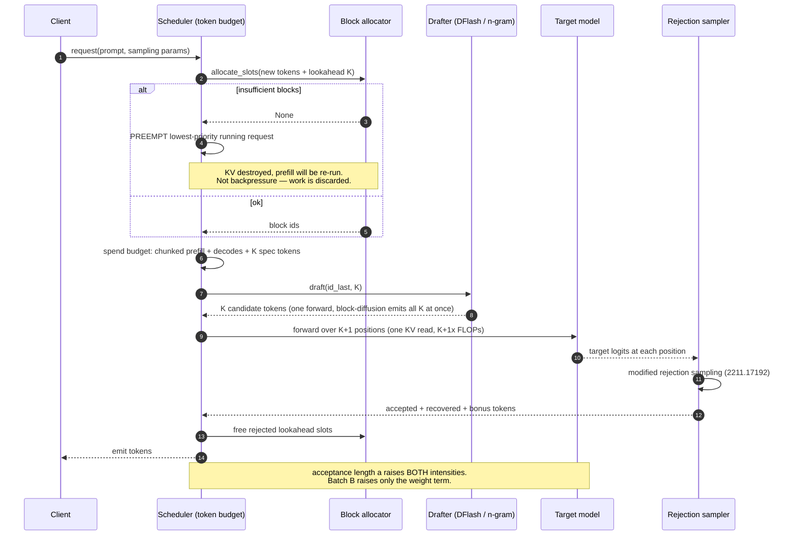

# Inference and quantization

This note settles three things. **One:** every serious 2026 inference technique —
weight quantization, KV quantization, speculative decoding, continuous batching — is a
move against the *same* inequality, arithmetic intensity versus the machine's ridge
point, and once you write that inequality down you can predict which techniques compose
and which are redundant. **Two:** speculation and batching are not interchangeable
throughput knobs: batching raises the arithmetic intensity of the *weight* read only,
while speculation raises the intensity of the *weight and the attention* read, which is
why the two have opposite behaviour as context grows and why the "spec decode is
pointless at high batch" folklore is wrong in exactly the regime this lab studies.
**Three:** on our hardware quantization buys memory economics and not tensor-core
economics — `torch._scaled_mm` is unsupported on gfx1151 `[M]` — which is a limitation
for a throughput lab and an advantage for a memory-systems lab, because it isolates the
variable we actually care about.

Read `research/memory/kv-cache-mechanics.md` first. It derives the decode arithmetic
intensity of attention as `2G/dtype_bytes`; this note is what you do about it.

---

## 1. The inequality, on our instrument

Decode is a read-amplification problem. Each generated token forces a full pass over the
model weights and a full pass over that sequence's KV cache, and does a trivial amount
of arithmetic with the bytes it drags in. The relevant number is **arithmetic
intensity** — FLOPs per byte moved — compared against the machine's **ridge point**,
peak FLOP/s divided by peak byte/s.

`[M]` **Our ridge point is ≈105 FLOP/byte**: 20.9 TFLOP/s bf16 GEMM at 8192³
(`scripts/benchmark_gemm.py`, `ASSUMPTIONS.md → gemm-throughput-below-reference`) over
199.9 GB/s device-to-device copy bandwidth at a 62 GiB footprint
(`scripts/measure_memory_bandwidth_tiers.py`, `gpu-fast-tier-size`). Both are single-run;
the GEMM figure is 63% of the ~33 TFLOPS cited for this silicon and that gap is
unexplained. The precision does not matter for what follows, because the gaps are
order-of-magnitude.

Two intensities govern decode, both derived in `kv-cache-mechanics.md` §3:

| Term | Arithmetic intensity | bf16 value | Raised by |
|---|---|---|---|
| Weight read | `2B / b_w` | `B` (batch size) | batching |
| Attention (KV) read | `2G / b` | `G` (GQA group size) | GQA, KV quantization |

`[M]` For the reference model Laguna-S, `G` is 6 on global layers and 9 on sliding ones
— **5.7% and 8.6% of our ridge**. Batch-1 MHA (`G = 1`) sits at 0.96%. Nothing about
this is a tuning problem; it is the shape of the computation.

**Worked, at our own scale.** Using the `[A]` Proteus placeholder config from
`kv-cache-mechanics.md` (300M params, 24 layers, `n_kv=8`, `d_h=64`, bf16, all-global —
medium confidence, cheapest fix is freezing an arm config) and the `[M]` 199.9 GB/s:

```
weights            600 MB  / 199.9 GB/s  =  3.00 ms per decode step
KV at 32k ctx, B=1 1.61 GB / 199.9 GB/s  =  8.06 ms per decode step
                                      total ≈ 11.1 ms/token  →  ~90 tok/s
```

`[A]` (arithmetic over one `[M]` number and one `[A]` config; medium confidence, and the
cheapest test that moves it is running the decode microbenchmark in Open questions #1.)
Note the shape of it: **at 32k context the cache costs 2.7× what the weights cost**, and
the weights are the part batching helps with. Halving the KV term with an FP8 cache
takes the step to 7.03 ms — a 1.57× end-to-end speedup from one dtype change, on a
machine where no FP8 arithmetic is available at all.

There are exactly three ways to move the inequality, and every technique below is one of
them: **move fewer bytes** (quantization), **do more useful FLOPs per byte moved**
(batching, GQA/MLA, speculation), or **move the bytes less often** (prefix reuse,
covered in `kv-serving-hierarchy.md`, not here).

**Where the storage analogy breaks.** You have tuned read amplification before, and the
fix was always an index or a cache. Neither is available. Every decode step reads 100% of
the KV cache — there is no locality to exploit — and the dependency chain token `t` →
token `t+1` is strictly serial, so there is nothing to prefetch. Speculative decoding
exists precisely because the *only* remaining move is to guess the future and check it.

---

## 2. Weight quantization: what the bytes actually are

Every format is the same three decisions: how many bits per element, how many elements
share a scale, and what the scale's own dtype is. Read them as block layouts, not as
brand names. From the code, not the marketing:

`[M]` **GGUF k-quants** (`architecture/llama-cpp-laguna/ggml/src/ggml-common.h`, rev
`04b2b72cb540`): `block_q4_K` (line 327) is a 256-weight super-block holding two fp16
super-scales, 12 bytes of 6-bit quantized per-sub-block scales and mins, and 128 bytes of
4-bit quants — **144 bytes for 256 weights = 4.5 bits/weight**, and the source comment
says so outright. `block_q8_0` (line 252) is 34 bytes per 32 weights = **8.5
bits/weight**. The half-bit of overhead is the scale, and it is why a "4-bit" GGUF file is
never 4 bits.

`[M]` **MXFP4** (same file, line 214): `block_mxfp4` is one uint8 shared exponent plus 16
bytes of packed E2M1 values — **17 bytes per 32 weights = 4.25 bits/weight**. This is the
OCP microscaling format `[C]` (2310.10537, Oct 2023). **NVFP4** is the same E2M1 element
type with a 16-element block and an FP8 (E4M3) scale rather than a 32-element block with
a power-of-two scale; the finer block and the non-power-of-two scale are the whole
difference, and they are the reason NVFP4 generally reports better accuracy than MXFP4 at
the same nominal bit count `[C]` (2603.08747, Mar 2026, a layer-wise and block-wise
sensitivity analysis of both).

`[M]` **Nobody quantizes the whole model.** Our local `gpt-oss-20b/config.json` declares
`quant_method: mxfp4` with `modules_to_not_convert` listing
`model.layers.*.self_attn`, `model.layers.*.mlp.router`, `model.embed_tokens` and
`lm_head`. The safetensors index carries 96 `*_blocks` / `*_scales` tensor pairs, all of
them `mlp.experts.{gate_up,down}_proj`. **MXFP4 here is an MoE-expert-weight format and
nothing else** — attention, routing, and embeddings stay bf16. Any claim of the form "the
model is 4-bit" needs this decomposition before it means anything.

**The algorithm families**, in the order they were invented and in the order they
compose:

- **Outlier isolation.** `[C]` LLM.int8() (2208.07339, Aug 2022) splits the outlier
  channels into a separate fp16 matmul. `[C]` SmoothQuant (2211.10438, Nov 2022) instead
  migrates activation difficulty into the weights with a per-channel scale.
- **Error-compensating weight rounding.** `[C]` GPTQ (2210.17323, Oct 2022) rounds
  column-by-column with a Hessian-based correction to the not-yet-quantized columns.
  `[C]` AWQ (2306.00978, Jun 2023) instead protects the ~1% of weight channels that
  matter most to activations, by scaling rather than by keeping them in high precision —
  which is why AWQ needs no backprop and no reconstruction.
- **Rotation.** `[C]` QuaRot (2404.00456, Mar 2024) multiplies by a random Hadamard
  before quantizing, smearing outliers evenly across a block so no single element
  dominates the scale; `[C]` SpinQuant (2405.16406, May 2024) learns the rotation instead
  of sampling it. This lineage is now the default frame for sub-8-bit work, and it is not
  confined to papers: `[M]` llama.cpp's Laguna branch applies a Hadamard rotation to K, V
  and Q before a quantized cache store (`src/llama-kv-cache.cpp:319`, `attn_rot_k`), gated
  by a runtime heuristic — quantized type AND `head_dim % 64 == 0` — and disableable by an
  undocumented `LLAMA_ATTN_ROT_DISABLE` env var, with nothing in the model config
  mentioning it.

**Where the compression analogy breaks, and it matters.** Storage compression is
lossless: you trade CPU for space and the bytes come back bit-exact. Weight quantization
is lossy and there is no verify-on-read, so the error is silent and permanent for the
life of the artifact. Worse, the error is *structured* rather than white — it
concentrates in a small number of channels, which is why every technique above is
fundamentally an outlier-management technique rather than a rounding technique.

**Contested, and to be left contested.**
- *Whether FP4 is deployable for weights AND activations.* W4A16 (weights 4-bit,
  activations 16-bit) is broadly accepted. W4A4KV4 is not: `[C]` 2603.08747 (Mar 2026)
  finds sensitivity is strongly layer- and block-dependent rather than uniform, and a
  cluster of 2026 papers exists specifically to recover the loss — `[C]` ARCQuant
  (2601.07475, Jan 2026, augmented residual channels), `[C]` 2601.20088 (Jan 2026,
  quantization-aware distillation), `[C]` 2606.05682 (Jun 2026, distillation that
  preserves internal geometry rather than output distribution), `[C]` ReQAT (2606.15682,
  Jun 2026, 4-bit QAT targeting reasoning accuracy specifically). A field that needs four
  recovery methods in six months does not have a solved format.
- *Whether FP4 belongs in training at all.* `[C]` NVIDIA reports pretraining a 12B model
  on 10T tokens in NVFP4 (2509.25149, Sep 2025); `[C]` 2603.10444 (Mar 2026) analyses a
  mean-bias effect in FP4-quantized training that is sometimes harmful and sometimes
  beneficial. Unsettled, and out of scope for us — we cannot run it.
- *Post-training quantization versus quantization-aware distillation.* Growing 2026
  evidence that PTQ alone does not reach FP4 targets on reasoning workloads; also growing
  evidence that distillation targets matter (output matching versus internal geometry,
  2606.05682). No consensus.

**On our hardware, this section is mostly theory.** `[M]` `torch._scaled_mm` raises
`RuntimeError: only supported on CUDA devices with compute capability >= 9.0 or 8.9, or
ROCm MI300+` on gfx1151 (torch `2.12.0a0+rocm7.13.0a20260313`, HIP 7.2.0, native
Windows). `[C]` AMD's scaled-WMMA path with per-block FP4/FP6/FP8 scaling lands on
gfx1250 and RDNA4-class targets, not RDNA 3.5 (LLVM/ROCm docs, checked 2026-07-26). So
low-precision weights on the Z13 are a **bandwidth and capacity** play: you halve or
quarter the bytes crossing the bus and pay a dequantize on the way in. Whether that is
net positive depends entirely on whether the dequant is fused into the GEMM prologue or
materialises a bf16 copy — which is measurable and which nobody has measured for us.

---

## 3. KV-cache quantization: the same formats, a different consequence

`kv-cache-mechanics.md` §5 covers this in depth; the delta here is the serving view.

The KV cache is the `b` factor in `per_token_bytes = 2 × L × n_kv × d_h × b`, and — from
§1 — it is also the denominator of `AI_attention = 2G/b`. So halving `b` **halves
capacity and doubles arithmetic intensity simultaneously**, with no interaction term
against GQA, MLA, windowing, or eviction. It is the cleanest knob in the whole system.

The 2026 consensus, such as it is: 8-bit/FP8 is production-boring, 4-bit is broadly safe,
2-bit is a live research question that is perplexity-friendly and reasoning-hostile.
`[C]` The empirical asymmetry every quantizer inherits is KIVI's (2402.02750, Feb 2024):
keys carry per-channel outliers, values do not, so quantize keys per-channel and values
per-token. `[C]` KVQuant (2401.18079, Jan 2024) adds pre-RoPE key quantization and
per-vector outlier isolation. `[C]` KVLinC (2510.05373, Oct 2025) is the current
rotation-plus-linear-correction entry.

Three things a 2024 reading list misses:

1. `[C]` **NVFP4 KV is shipping and unreplicated.** NVIDIA reports NVFP4 KV cache halving
   the footprint versus FP8 with sub-1% accuracy loss and up to 3× lower TTFT
   (developer communications, early 2026). Vendor-reported, single vendor, single
   hardware family, and the quantization path dequantizes NVFP4 → FP8 before the attention
   matmuls, so the reported win is capacity plus bandwidth, not FP4 arithmetic. Treat it
   as a claim, not a result.
2. `[C]` **Perplexity does not catch the failure that matters.** "Alignment Collapse Under
   KV Cache Quantization" (2606.09864, Jun 2026): Mistral-7B loses 15.2% of its refusals
   at 1.03× perplexity, across eleven instruction-tuned models and 1,894 prompts, with no
   universal safe bit-width. This is an attribution failure in the lab's own preferred
   sense — outcome metric fine, mechanism broken — and it is the strongest argument in the
   note for behavioural probes over aggregate loss.
3. `[C]` **On a bandwidth-starved machine, low-bit KV can be strictly free.** "When
   Quantization Is Free: An int4 KV Cache That Outruns fp16 on Apple Silicon"
   (2605.05699, May 2026) is the closest published analogue to our platform: a unified-
   memory, bandwidth-limited device where the dequantize cost is fully hidden behind the
   bytes it saves. Whether that holds on gfx1151 is an open question, not an inference.

`[M]` **Our own FP8 probe**, gfx1151, torch `2.12.0a0+rocm7.13.0a20260313`: all four FP8
variants (`float8_e4m3fn`, `e5m2`, `e4m3fnuz`, `e5m2fnuz`) allocate at 1 byte/element and
round-trip through bf16, median relative error 2.19% (e4m3) and 4.35% (e5m2) on N(0,1)
data. Single run, scratch script, not yet in the rig — an anecdote by house standard, and
a Hardware Validation Gate item.

`[M]` **And the reference engine has no FP8 KV at all.** `grep -i fp8` over the Laguna
llama.cpp branch's `src/`, `common/` and `include/` returns nothing; its quantized-KV
story is ordinary block quantization via `-ctk`/`-ctv` (allowed values `f32, f16, bf16,
q8_0, q4_0, q4_1, iq4_nl, q5_0, q5_1` — `common/arg.cpp:2190`) plus the automatic Hadamard
rotation above. A q8_0 KV cache is 8.5 bits/element, not 8. The lesson generalises: **the
cache format is a property of the inference path, not of the model.**

---

## 4. Speculative decoding: buying arithmetic intensity with guesses

**The systems bridge is speculative execution**, and it is unusually exact. You have a
serial dependency chain and idle execution units; you predict the chain, execute
speculatively, and squash on misprediction. The difference from a CPU branch predictor is
that the squash is *free of correctness cost* — the verification step is what defines the
output — but not free of memory cost, which is the part that bites in a serving system.

**The mechanism.** A cheap drafter proposes `K` tokens. The target model runs **one**
forward pass over all `K+1` positions and either accepts a prefix of them or corrects the
first mismatch. `[C]` Leviathan et al. (2211.17192, Nov 2022) and Chen et al.
(2302.01318, Feb 2023) independently show that a modified rejection-sampling acceptance
rule makes the output distribution **exactly** the target model's — this is what "lossless
acceleration" means, and it is a theorem, not a benchmark.

`[M]` **The theorem's fine print, from the code.** vLLM's rejection sampler
(`memory/vllm/vllm/v1/sample/rejection_sampler.py:40–60`, rev `0934b267906f`) cites
2211.17192 directly and decomposes output as *accepted + recovered + bonus* tokens — and
its own docstring states that the bonus token supports top-p/top-k sampling while "spec
decode does not support these sampling strategies." So the distributional guarantee holds
against the target's *raw* distribution; layer a truncation sampler on top and you are no
longer in the theorem. This is exactly the kind of thing that turns a "lossless" claim
into a quiet behaviour change.

**Why it works where batching does not.** This is the analytical point of the note.
Verifying `K+1` positions reads the KV cache **once** and performs `K+1` times the
attention FLOPs, so:

```
AI_attention(spec) = 2 · G · (K+1) / b          AI_weights(spec) = 2 · B · (K+1) / b_w
```

Batching multiplies bytes *and* FLOPs by `B` in the attention term and therefore cannot
move it at all; speculation multiplies only the FLOPs. `[M]` For Laguna-S global layers
(`G=6`, bf16) a 7-token draft block takes attention intensity from 6 to **48 FLOP/byte**
against our ~105 ridge — an 8× improvement on the term that batching provably cannot
touch. `[C]` This is precisely the mechanism MagicDec identifies (2408.11049, Aug 2024):
at long context and large batch, decode returns to being memory-bound because of the KV
cache, and speculation helps again there.

**The taxonomy**, ordered by how much of the target they reuse:

| Family | Drafter | Reuses | Anchor |
|---|---|---|---|
| Independent draft model | separate small LM | tokenizer only | `[C]` 2211.17192, 2302.01318 |
| Self-draft heads | extra LM heads on the target | all target features | `[C]` Medusa, 2401.10774 (Jan 2024) |
| Feature-conditioned AR draft | 1-layer transformer on target hidden states | hidden states + tokenizer | `[C]` EAGLE 2401.15077, EAGLE-2 2406.16858, EAGLE-3 2503.01840 |
| MTP heads | trained-in extra-token heads | the pretraining objective | `[C]` DeepSeek-V3 2412.19437 |
| Block-diffusion draft | small masked-diffusion model | target hidden states + embeddings | `[C]` DFlash 2602.06036 (Feb 2026) |
| Model-free | n-gram / retrieval over history | nothing | llama.cpp `ngram-*`, no paper |

Medusa's contribution is tree attention — draft several candidate continuations and verify
them in one masked forward `[C]` (2401.10774). EAGLE's is that predicting the target's
*feature* sequence is a better-conditioned problem than predicting its token sequence;
EAGLE-3 then reverses that, dropping feature prediction for direct token prediction with
multi-layer feature fusion, which is what lets draft quality scale with draft training
data `[C]` (2503.01840, Mar 2025).

### Laguna DFlash, read from the implementation

`[C]` DFlash (2602.06036, Feb 2026, rev. May 2026; ICML 2026) replaces autoregressive
drafting with a **block diffusion** drafter: the draft model emits the whole block in one
forward pass under a non-causal mask, conditioned on context features extracted from the
target. Authors' claims: over 6× lossless acceleration, up to 2.5× more speedup than
EAGLE-3. Not independently replicated.

`[M]` **From the reference implementation** (`architecture/llama-cpp-laguna`, rev
`04b2b72cb540`) the mechanism is unambiguous, and it is more interesting than the paper
abstract:

- `src/models/dflash.cpp:10` — the drafter *requires* a `target_layers` array in its GGUF
  metadata, and `:14` sets its encoder input width to `len(target_layers) × n_embd`. The
  drafter is not a small model that happens to share a tokenizer; it is a function of
  several named layers of one specific target.
- `src/models/dflash.cpp:153` — the decoder is dual-mode by batch type: an **embd batch**
  projects fused target features and writes them straight into the draft model's own K/V
  cache; a **token batch** then attends over `[committed, MASK, MASK, ...]` to emit the
  block. Injecting the target's hidden states as draft KV entries is the whole trick, and
  it is a KV-cache operation, which is why this note belongs next to the memory track.
- `common/speculative.cpp:945` — block size defaults to 16, read from a
  `dflash.block_size` GGUF key; `:958–963` clamps `--spec-draft-n-max` to `block_size − 1`
  because the input is literally `[id_last, <mask> × (block_size−1)]`.
- `common/speculative.cpp:1178` — one `llama_decode` builds every drafting sequence's
  noise block into a single batch; `:1207` reads the predicted block greedily at noise
  positions `1..n−1` and stops early if the top candidate's probability falls below
  `p_min`.
- Laguna drafters set `dflash.decoder_arch = laguna`, which switches the draft layers onto
  the target's decoder contract — softplus attention gate, per-aux feature norms, context
  K/V routed through the input layernorm (`docs/speculative.md`).

`[M]` Also note what the same engine ships beside it: EAGLE-3, MTP heads, and **four
different model-free n-gram drafters** with a shared cross-slot hash pool
(`docs/speculative.md`). For code-editing and reasoning workloads — repetitive output,
long verbatim quotes — an n-gram drafter with ~16 MB of state is a real competitor to a
trained one, and it needs no training run.

**The contested question, and it is the important one: does speculation survive high
batch?** Conventional wisdom says no, because at large batch decode becomes compute-bound
and the extra verification FLOPs are wasted. `[C]` MagicDec (2408.11049) and `[C]` the
batching-synergy analysis (2310.18813, Oct 2023) argue that with long enough context
decode returns to memory-bound and speculation pays again. `[C]` 2504.17674 (Apr 2025)
reports speculation costing 25.65% *more* energy at batch 128. `[C]` Meta's production
account (2508.08192, Aug 2025) is about making it work at scale, not about whether it
should. `[M]` The serving systems have already resolved this empirically by refusing to
choose: vLLM's scheduler builds a dense **batch-size → speculation-depth lookup table**
from a `num_speculative_tokens_per_batch_size` config
(`vllm/v1/core/sched/scheduler.py:245`, `vllm/v1/spec_decode/dynamic/utils.py:77`), and the
worked example in that file's own docstring is `[(1,16,3),(32,128,2)]` — fewer speculative
tokens as batch grows. Depth is a runtime function of load, not a constant.

**Frontier, last six months.** `[C]` DFlare (2606.02091, Jun 2026) scales block-diffusion
draft capacity; `[C]` Spec-AUF (2607.01893, Jul 2026) attacks train/inference
misalignment for masked block drafters specifically; `[C]` "Speculative Speculative
Decoding" (2603.03251, Mar 2026, ICLR 2026) overlaps drafting with verification — draft
the *next* block while the current one is being verified — reporting 30% over optimized
speculative baselines; `[C]` LK Losses (2602.23881, Feb 2026) optimizes acceptance rate
directly rather than through a proxy loss; `[C]` "Quantize the Target, Quantize the
Drafter" (2607.04244, Jul 2026) is the first entry I found that treats the
quantization × speculation interaction as its own object, which is the composition
question this note keeps running into.

**Where the analogy breaks.** A mispredicted branch costs you a pipeline flush; a
mispredicted draft costs you **KV cache blocks**. Draft tokens must be allocated slots
before verification and freed on rejection, so the scheduler must reserve
`num_lookahead_tokens` per running request (`vllm/v1/core/sched/scheduler.py:242`, set at
`:253`).
Speculation therefore *shrinks* the batch a given memory budget supports. In a
capacity-bound deployment — ours — speculation and batch size are direct competitors for
the same bytes, and that trade has no analogue in CPU speculative execution, where the
speculative state is a fixed hardware resource rather than a share of the working set.

---

## 5. Continuous batching: scheduling at iteration granularity

The idea, originating with Orca (Yu et al., OSDI 2022 — no arXiv id; cite by venue): stop
scheduling *requests* and start scheduling *iterations*. A finished sequence leaves the
batch immediately and a waiting one joins on the next forward pass, instead of the whole
batch waiting for its slowest member.

`[M]` **vLLM has taken this to its conclusion**, and the comment says it best
(`vllm/v1/core/sched/scheduler.py:430–438`, rev `0934b267906f`):

> There's no "decoding phase" nor "prefill phase" in the scheduler. Each request just has
> the `num_computed_tokens` and `num_tokens_with_spec`. […] At each step, the scheduler
> tries to assign tokens to the requests so that each request's `num_computed_tokens` can
> catch up its `num_tokens_with_spec`. This is general enough to cover chunked prefills,
> prefix caching, speculative decoding […]

The whole scheduler is then one resource: a per-step **token budget**
(`scheduler.py:447`), spent down across running and waiting requests. Chunked prefill is
what happens when a prefill does not fit the remaining budget and is truncated
(`:511`, `:859`); `long_prefill_token_threshold` (`:509`) caps any single prefill so one
128k prompt cannot starve every decode in the batch; speculative tokens are just more
demand against the same budget. `[C]` This is the Sarathi-Serve argument (2403.02310, Mar
2024): stall-free batching by mixing chunked prefill with decode in one pool captures most
of the goodput benefit of prefill/decode disaggregation without paying a KV transfer —
and it is contested against DistServe/Splitwise (`[C]` 2401.09670; 2311.18677), with 2026
work still trying to unify the two positions (`[C]` 2508.01989, Aug 2025).

**Where the analogy breaks — and this is the one that surprises infrastructure people.**
This looks like a work queue with admission control, and the admission control looks like
backpressure. It is not. `[M]` When the block allocator cannot satisfy a request, vLLM
does not stall it and does not fault a page — it **preempts the entire request**
(`vllm/v1/core/block_pool.py:647`; `kv-serving-hierarchy.md` covers the allocator in
depth). The preempted request's KV cache is destroyed and its prefill is re-run from
scratch on readmission. So the queue-depth control variable is *memory*, the eviction
granularity is *the whole sequence*, and overload does not degrade latency gracefully — it
converts completed work into wasted work. Any admission-control intuition calibrated on
CPU-bound services will mis-predict this system's overload behaviour.

`[C]` The 2026 scheduling literature is mostly about predicting the memory demand this
implies: Past-Future Scheduler (2507.10150, Jul 2025) estimates peak memory from the
historical distribution of output lengths precisely because eviction is so expensive;
2504.14489 (Apr 2025) multiplexes prefill and decode for goodput; 2606.15177 (Jun 2026)
adds MoE-aware coordination; 2604.06970 (Apr 2026) handles black-box inference at scale.
The unifying observation is that **goodput under an SLO, not throughput, is the objective
function** — and that TTFT and TPOT pull in opposite directions, which is why every one of
these papers is a scheduling paper rather than a kernel paper.

`[C]`/`[M]` **Not testable here in full.** Distributed collectives are incomplete on
gfx1151 (`ASSUMPTIONS.md → single-device-only`), so disaggregated arms are design-only.
Chunked prefill and continuous batching are single-pool and are testable.

---

## 6. What this means for the Z13, concretely

The Z13 trades bandwidth and FLOPS for capacity, and every technique above is either a
bandwidth play or a FLOPS play. That sounds like a bad match and is actually the
opposite: **because we cannot access low-precision tensor cores, any speedup we measure
from quantization is unambiguously a memory-economics effect.** On an H100 the two are
confounded in every measurement. Here they are separated by the hardware. That is a
better instrument for the question `research/memory/` is asking, and a worse one for
almost anything else.

The corresponding trap is that we will *underestimate* every technique whose published
gain includes a tensor-core term, and we must never report an FP8 or FP4 result from this
machine as a general result.

### Serving-flow diagram — one scheduler step with speculation



### Telemetry schema — the deliverable, not the afterthought

A decode benchmark that emits only tokens/s is unfalsifiable three days later. One JSONL
record per scheduler step, one per run header. Fields chosen so a failed run is
diagnosable without the console:

```
run header:  run_id, git_sha, torch_version, rocm_version, hip_version, driver,
             gpu_arch, bios_uma_fb_gb, hipblaslt_libpath_set, env_overrides,
             seed, model_config_hash, kv_dtype, weight_dtype, spec_type, K_max
per step:    step, t_wall_ms, batch_size, n_running, n_waiting, n_preempted_cum,
             tokens_scheduled, tokens_prefill, tokens_decode, tokens_spec,
             ctx_len_p50, ctx_len_max,
             kv_blocks_allocated, kv_blocks_free, kv_bytes_resident,
             prefix_hit_tokens, prefix_lookup_tokens,
             spec_tokens_proposed, spec_tokens_accepted, accept_len_mean,
             accept_rate_by_position[0..K],
             bytes_read_est, flops_est, arithmetic_intensity_est,
             achieved_bw_gbs, achieved_tflops, mfu_vs_20p9
```

Three notes on why these specific fields. `accept_rate_by_position` rather than a scalar
acceptance rate, because a drafter that is right at position 0 and wrong at position 5 is
a completely different object from one that is uniformly mediocre, and the scalar hides
it — llama.cpp already emits exactly this (`tools/server/server-context.cpp:620–624`), so
we are matching a shipped convention rather than inventing one. `bytes_read_est` and
`flops_est` so `arithmetic_intensity_est` is derivable and comparable against the 105
ridge on every step, which is the single number this whole note is about.
`n_preempted_cum` because preemption is silent, destroys work, and is the mechanism by
which a memory-pressure problem masquerades as a latency problem.

`[M]` **A CPU fallback is mandatory** (house rule) and here it is nearly free: the decode
microbenchmarks in Open questions #1–#3 are bandwidth measurements, and a CPU run over the
same unified memory is a legitimate second data point rather than a degraded one — the
Z13's CPU and GPU read the same DRAM. Report both. `[M]` Keep every individual buffer
under 32 GiB (`ASSUMPTIONS.md → large-tensor-fault-32gib`; a 32 GiB tensor hard-hangs at
0% CPU with no error), which means a large KV cache must be built as a paged pool of
shards, not one contiguous tensor. That is not a workaround — it is what every serving
engine already does.

---

## Open questions

Testable at 20M–300M params, one GPU, ≥62 GiB fast tier, no collectives. Each needs a
pre-registered hypothesis card before it runs, and all of them are blocked on the Hardware
Validation Gate.

1. **Does `AI_attention = 2G/b` predict measured decode throughput on gfx1151?** Sweep
   `n_kv ∈ {1,2,4,8,n_q}` at fixed `n_q`, and `b ∈ {2,1}`, measuring achieved bandwidth and
   tokens/s. The model predicts linear speedup in `G` and in `1/b` until the ~105 ridge,
   then flatness. This is the cheapest experiment in the note and it validates the
   instrument at the same time. Cross-listed with `kv-cache-mechanics.md` #1.
2. **Does FP8 KV storage with bf16 compute actually pay here, or does the dequant eat
   it?** We predict 1.57× at 32k/batch-1 from bytes alone (§1). If measured gain is well
   under that, the dequant is not fused and FP8 is costing us compute we do not have. This
   is the local test of the 2605.05699 "quantization is free on bandwidth-limited
   hardware" claim, and a negative result is as publishable internally as a positive one.
3. **Does speculation raise attention arithmetic intensity by `(K+1)` as derived?** Verify
   `K+1` positions against a fixed cache and measure achieved FLOP/byte versus `K`. A
   deviation localises to the attention kernel's handling of multi-query decode, and
   would invalidate the central analytical claim of §4. Attack this one first: it is the
   riskiest assumption in the note.
4. **Where does the speculation/batch frontier sit on a bandwidth-poor machine?**
   Reproduce vLLM's batch-size → K table shape at our scale: sweep `(B, K, context)` and
   find the surface where speculation stops paying. Our ridge is ~105 FLOP/byte versus an
   H100's ~300+, so the frontier should sit at a *higher* batch here than in the published
   results — a cheap, falsifiable, hardware-specific prediction.
5. **Does an n-gram drafter beat a trained drafter at ablation scale?** At 20M–300M the
   target is so cheap that a trained drafter's fixed cost may never amortize. Model-free
   drafting needs no training run and llama.cpp ships four variants. If the n-gram drafter
   wins at our scale, every small-scale speculative-decoding ablation in the literature
   has a confound.
6. **Does the alignment-collapse effect (2606.09864) have a small-scale analogue?** The
   published result is 3.8B–72B instruction-tuned models. If the low-dimensional-subspace
   mechanism is real, a narrow behavioural probe should detect it at 300M — which would
   give us a cheap attribution harness reusable by every later compression arm. Highest
   novelty-per-GPU-hour item in this note.
7. **What is the ridge point of the *attention kernel*, not of GEMM?** Our ~105 comes from
   an 8192³ GEMM and a copy benchmark. A decode-shaped attention roofline gives the number
   that actually governs, and resolves whether the unexplained 63%-of-cited GEMM shortfall
   also afflicts attention. Everything above is calibrated against this number, so it
   should probably be measured first.
8. **Does quantization × speculation compose additively or interact?** 2607.04244 (Jul
   2026) raises the question; a quantized drafter has lower acceptance but costs less per
   draft, and the product is not obviously monotone in bit-width. Two axes, one matched
   token budget, one afternoon at our scale.

---

## Memory-track hooks

- `kv-cache-mechanics.md` derives `AI_attention = 2G/b` for a single-token decode step;
  §4 above generalises it to `2G(K+1)/b` under speculation. If that generalisation is
  wrong, the note's central claim is wrong. It should be added to that note's open
  questions as a cross-reference, not restated there.
- `kv-serving-hierarchy.md` owns paging, prefix reuse, and offload tiering; this note
  deliberately does not re-derive them and cites the same `block_pool.py:647` preemption
  path for the overload-behaviour argument.
- **Speculation is a KV-capacity consumer.** Any Mnemosyne eviction-policy experiment run
  under a speculative decoder is running against a smaller and more volatile budget than
  the same policy without one. That is a confound to control for, and it is not mentioned
  anywhere in the eviction literature this lab has surveyed.
- **DFlash writes target hidden states directly into the draft model's KV cache**
  (`dflash.cpp:153`). That is a KV cache used as an inter-model communication channel
  rather than as a memo table, which does not fit the reconstructibility taxonomy in
  `memory-taxonomy.md`. Worth an explicit row there.

---

## Sources

**Every arXiv id below was verified against the live arXiv API on 2026-07-26** — 66
candidate ids queried, 0 unresolved, 60 cited here. Resolving an id proves the paper
exists, not that it supports the claim beside it: treat this as a fabrication check, not
a correctness proof.

**Decode economics and bandwidth**
- `1911.02150` — *Fast Transformer Decoding: One Write-Head is All You Need* (2019-11-06).
- `2311.18677` — *Splitwise: Efficient generative LLM inference using phase splitting* (2023-11-30).
- `2401.09670` — *DistServe* (2024-01-18).
- `2312.04985` — *SparQ Attention: Bandwidth-Efficient LLM Inference* (2023-12-08).
- `2607.13068` — *The Economics of AI Decoding Chips* (2026-07-10).
- `2305.13245` — *GQA* (2023-05-22); `2405.04434` — *DeepSeek-V2* / MLA (2024-05-07).

**Weight quantization**
- `2208.07339` — *LLM.int8()* (2022-08-15). `2211.10438` — *SmoothQuant* (2022-11-18).
- `2210.17323` — *GPTQ* (2022-10-31). `2306.00978` — *AWQ* (2023-06-01).
- `2404.00456` — *QuaRot: Outlier-Free 4-Bit Inference in Rotated LLMs* (2024-03-30).
- `2405.16406` — *SpinQuant: LLM quantization with learned rotations* (2024-05-26).
- `2209.05433` — *FP8 Formats for Deep Learning* (2022-09-12).
- `2310.10537` — *Microscaling Data Formats for Deep Learning* (2023-10-16). The MXFP4 spec lineage.
- `2310.19102` — *Atom: Low-bit Quantization for Efficient and Accurate LLM Serving* (2023-10-29).
- `2509.25149` — *Pretraining Large Language Models with NVFP4* (2025-09-29).
- `2601.07475` — *ARCQuant: Boosting NVFP4 Quantization with Augmented Residual Channels* (2026-01-12).
- `2601.20088` — *Quantization-Aware Distillation for NVFP4 Inference Accuracy Recovery* (2026-01-27).
- `2603.08747` — *Diagnosing FP4 inference: a layer-wise and block-wise sensitivity analysis of NVFP4 and MXFP4* (2026-03-05).
- `2603.10444` — *The Curse and Blessing of Mean Bias in FP4-Quantized LLM Training* (2026-03-11).
- `2605.12464` — *Search Your Block Floating Point Scales!* (2026-05-12).
- `2606.05682` — *Beyond Output Matching: Preserving Internal Geometry in NVFP4 LLM Distillation* (2026-06-04).
- `2606.06527` — *Characterizing the Impact of NVFP4 Quantization for Low-Power Edge AI Deployment* (2026-06-03).
- `2606.15682` — *ReQAT: Full-Precision Reasoning Accuracy with 4-bit FP QAT* (2026-06-14).
- `2607.04302` — *HiFA4: Training-Free 4-bit FlashAttention on Ascend HIF4 NPUs* (2026-07-05).

**KV-cache quantization**
- `2401.18079` — *KVQuant* (2024-01-31). `2402.02750` — *KIVI* (2024-02-05).
- `2510.05373` — *KVLinC: KV Cache Quantization with Hadamard Rotation and Linear Correction* (2025-10-06).
- `2605.05699` — *When Quantization Is Free: An int4 KV Cache That Outruns fp16 on Apple Silicon* (2026-05-07).
- `2606.09864` — *Alignment Collapse Under KV Cache Quantization: Diagnosis and Mitigation* (2026-06-01).

**Speculative decoding**
- `2211.17192` — *Fast Inference from Transformers via Speculative Decoding* (2022-11-30). The acceptance rule.
- `2302.01318` — *Accelerating LLM Decoding with Speculative Sampling* (2023-02-02).
- `2310.18813` — *The Synergy of Speculative Decoding and Batching* (2023-10-28).
- `2401.10774` — *Medusa* (2024-01-19). `2401.15077` — *EAGLE* (2024-01-26).
- `2406.16858` — *EAGLE-2* (2024-06-24). `2503.01840` — *EAGLE-3* (2025-03-03).
- `2401.07851` — *A Comprehensive Survey of Speculative Decoding* (2024-01-15).
- `2411.13157` — *Closer Look at Efficient Inference Methods: A Survey of Speculative Decoding* (2024-11-20).
- `2408.11049` — *MagicDec* (2024-08-20). The long-context/large-batch counter-argument.
- `2504.17674` — *Energy Considerations of LLM Inference and Efficiency Optimizations* (2025-04-24).
- `2505.15141` — *BanditSpec: Adaptive Speculative Decoding via Bandit Algorithms* (2025-05-21).
- `2508.08192` — *Efficient Speculative Decoding for Llama at Scale* (2025-08-11).
- `2509.04474` — *Scaling Up, Speeding Up: A Benchmark of Speculative Decoding for Efficient LLM Test-Time Scaling* (2025-08-30).
- `2602.06036` — *DFlash: Block Diffusion for Flash Speculative Decoding* (2026-02-05). ICML 2026.
- `2602.23881` — *LK Losses: Direct Acceptance Rate Optimization for Speculative Decoding* (2026-02-27).
- `2603.03251` — *Speculative Speculative Decoding* (2026-03-03). ICLR 2026.
- `2606.02091` — *DFlare: Scaling Up Draft Capacity for Block Diffusion Speculative Decoding* (2026-06-01).
- `2607.01893` — *Spec-AUF: Accept-Until-Fail Training under Train-Inference Misalignment for Masked Block Drafters* (2026-07-02).
- `2607.04244` — *Quantize the Target, Quantize the Drafter* (2026-07-05).
- `2607.06763` — *Trees from Marginals: Autoregressive drafting with factorized priors* (2026-07-07).
- `2412.19437` — *DeepSeek-V3 Technical Report* (2024-12-27). MTP as a training objective reused at inference. **Note:** widely-quoted MTP acceptance-length figures (e.g. 2.55) circulate via secondary sources; I could not confirm them in the abstract and did not fetch the full PDF, so they are deliberately not stated here.

**Batching and scheduling**
- Yu et al., *Orca: A Distributed Serving System for Transformer-Based Generative Models*, OSDI 2022 — **no arXiv id**; the origin of iteration-level (continuous) batching. Cited by venue rather than guessed.
- `2309.06180` — *PagedAttention / vLLM* (2023-09-12).
- `2403.02310` — *Sarathi-Serve* (2024-03-04). Chunked prefill, single pool.
- `2504.14489` — *Towards High-Goodput LLM Serving with Prefill-decode Multiplexing* (2025-04-20).
- `2507.10150` — *Past-Future Scheduler for LLM Serving under SLA Guarantees* (2025-07-14).
- `2508.01989` — *Prefill-Decode Aggregation or Disaggregation?* (2025-08-04).
- `2604.06970` — *Scheduling the Unschedulable: Taming Black-Box LLM Inference at Scale* (2026-04-08).
- `2606.15177` — *Coordinated Scheduling for MoE LLM Serving* (2026-06-13).

**Local code, verified this session** (revisions in `research/reference/PROVENANCE.md`)
- `architecture/llama-cpp-laguna` @ `04b2b72cb540`: `docs/speculative.md` (the full spec-type catalogue: `draft-simple`, `draft-eagle3`, `draft-dflash`, `draft-mtp`, four n-gram families); `src/models/dflash.cpp:10` (`target_layers` required), `:14` (encoder width = `len(target_layers) × n_embd`), `:153` (dual-mode embd/token batch); `common/speculative.cpp:945` (block_size default 16), `:958` (n_max clamp), `:1178` (block batch construction), `:1207` (greedy block read); `common/arg.cpp:2190` (allowed KV cache types); `src/llama-kv-cache.cpp:319` (`attn_rot_k` Hadamard rotation); `ggml/src/ggml-common.h:214` (`block_mxfp4`, 17 B / 32 w), `:252` (`block_q8_0`, 34 B / 32 w), `:327` (`block_q4_K`, 144 B / 256 w), `:90` (`K_SCALE_SIZE 12`), `ggml/include/ggml.h:429` (`GGML_TYPE_MXFP4 = 39`); `tools/server/server-context.cpp:620` (per-position acceptance telemetry).
- `memory/vllm` @ `0934b267906f`: `vllm/v1/core/sched/scheduler.py:430` (no prefill/decode phase), `:245` (dynamic spec-depth lookup), `:447` (token budget), `:509` (`long_prefill_token_threshold`), `:242`/`:253` (lookahead reservation); `vllm/v1/spec_decode/dynamic/utils.py:77` (batch-size → K table, `[(1,16,3),(32,128,2)]` example); `vllm/v1/spec_decode/dflash.py` (DFlash proposer); `vllm/v1/sample/rejection_sampler.py:40` (accepted/recovered/bonus, and the top-p/top-k caveat); `vllm/v1/core/block_pool.py:647` (allocation failure → preemption); `vllm/model_executor/layers/quantization/` (`fp8.py`, `mxfp4.py`, `auto_awq.py`, `auto_gptq.py`, `kv_cache.py`, `modelopt.py`, `turboquant/`).
- `models/gpt-oss-20b/config.json` + `model.safetensors.index.json`: `quant_method: mxfp4`, `modules_to_not_convert` excluding attention/router/embeddings/lm_head; 96 `*_blocks`/`*_scales` tensors, all MoE expert projections; `total_size` 13,761,264,768 B.

**Local measurements** (`ASSUMPTIONS.md`)
- `gemm-throughput-below-reference` — 20.9 TFLOPS bf16 at 8192³ (63% of the cited figure, unexplained).
- `gpu-fast-tier-size` — ≥62 GiB at ~199.9 GB/s with a 96 GB BIOS UMA carve-out.
- `large-tensor-fault-32gib` — single tensors ≥32 GiB hang at 0% CPU or fault.
- `torch-build` — torch `2.12.0a0+rocm7.13.0a20260313`, HIP 7.2.0, gfx1151, native Windows.
- FP8 dtype probe, 2026-07-26 — storage works at 1 B/element for all four FP8 variants; `torch._scaled_mm` unsupported. Single run, scratch script, **not committed**; an anecdote by house standard and a Hardware Validation Gate item.

**Non-arXiv, and weaker for it**
- vLLM engineering blog, *The State of FP8 KV-Cache and Attention Quantization in vLLM*, 22 Apr 2026 — https://vllm-project.github.io/2026/04/22/fp8-kvcache.html
- NVIDIA developer communications on NVFP4 KV cache (early 2026) — vendor-reported, single hardware family, not independently replicated. Numbers deliberately hedged in §3.
- ROCm documentation and LLVM commit traffic on scaled-WMMA target support (checked 2026-07-26): the FP4/FP6/FP8 per-block-scaled matrix path lands on gfx1250 / RDNA4-class targets, not gfx1151.
- Community Strix Halo llama.cpp benchmark repositories (e.g. `lhl/strix-halo-testing`, Mar 2026) report figures such as ~502 tok/s prompt processing under ROCm and ~55 tok/s generation for GPT-OSS-120B MXFP4 under Vulkan. **Community-reported, unversioned, and not reproduced here** — listed as calibration for expectations, explicitly not as evidence. Any number from this class must be re-measured with pinned versions before it enters `ASSUMPTIONS.md`.
