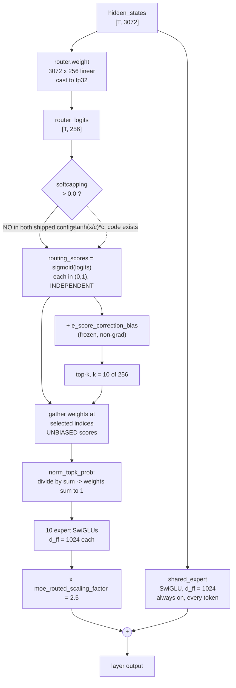
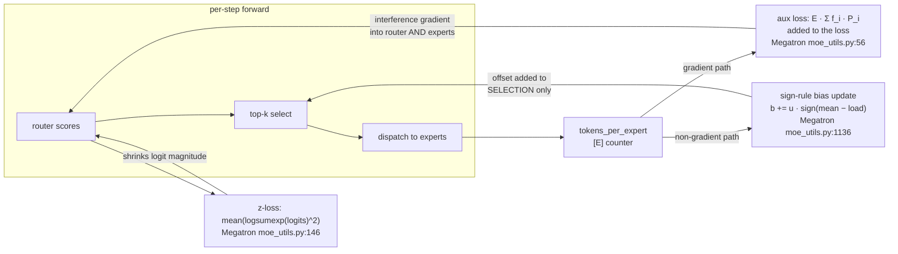
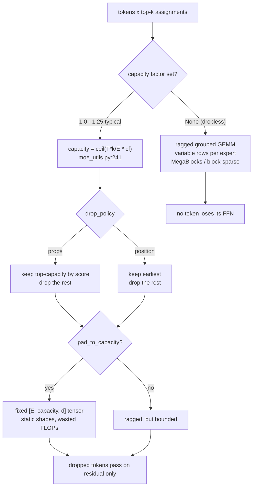

# MoE routing and failure modes: what the Laguna combination actually commits to

**What this note settles.** A 2026 MoE router is twelve lines of code with five independent
knobs — score function, selection bias, weight normalization, output scaling, and softcapping —
and Laguna's particular setting of them (sigmoid, aux-loss-free bias, sum-normalized top-10 of
256, ×2.5 routed gain, softcapping **off**) is not five free choices but two forced ones and
three inherited ones, which is exactly the pattern this lab exists to attack. The load-balancing
question is not "aux loss or bias" but "which *level* is the balance measured at and what happens
to the controller when it cannot converge" — and the 2026 evidence is that the aux-loss-free bias
has its own runaway failure mode at extreme sparsity, so it is a different controller, not a
strictly better one. The failure modes worth instrumenting are not the ones the surveys name
(collapse, hot experts) but the ones that are *silent*: bias saturation past a hard, computable
threshold; a token-dropping path that corrupts activations without raising anything; and an
auxiliary loss in the shipped Laguna port that is computed against a router the model does not
have.

---

## 1. The systems bridge, and where it breaks

A top-k router is a **content-addressed L7 load balancer** placed in front of a pool of 256
identical-shaped backends. Per request (token) it scores every backend, picks the 10 best, sends
the request to all 10, and returns a weighted merge of the responses. The score is a dot product
against a learned per-backend key vector — so it is consistent hashing where the hash function is
trained, not fixed.

Three places the analogy is load-bearing and one place it collapses.

**Holds.** Backend imbalance is the central operational problem, the fix is a per-backend weight
adjustment applied *before* selection, and the health signal is a moving measurement of recent
load. Megatron's update rule is literally weighted round-robin with an integral term
(`moe_utils.py:1136`):

```
b ← b + u · sign(mean(tokens_per_expert) − tokens_per_expert)
```

**Holds.** Tail latency is set by the *hottest* backend, not the average, because the step cannot
finish until every expert's GEMM finishes. Under expert parallelism this is an all-to-all with a
straggler; on a single device it is a ragged batch of 256 GEMMs whose largest tile sets the
kernel's runtime.

**Holds.** Capacity is a real, configured quantity, and overflow has a policy
(`moe_utils.py:241` `get_capacity`, `moe_utils.py:958` `apply_router_token_dropping`).

**Breaks — and this is the whole difference.** An overloaded web backend serves the request more
slowly. An overloaded expert **changes what it becomes**. The router's output is the training
signal for the expert; an expert that receives 40× its share of tokens gets 40× the gradient and
generalizes, an expert that receives none receives no gradient and stays at initialization
forever. Load imbalance is not a latency problem that resolves when traffic drops — it is an
irreversible allocation of representational capacity. There is no "drain and restart the pod."
This is why the balancing controller runs during training and is then *frozen*: in Laguna the
bias is `requires_grad=False` and carries no update rule at inference at all
(`modeling_laguna.py:170`). It is a deploy-time snapshot of a control loop that no longer runs.

The second break: a dropped request returns a 503 and the client retries. A dropped **token**
under a capacity factor silently receives only its residual connection for that layer
(`moe_utils.py:958` zeroes the routing probability and the mask). No exception, no counter in the
loss, nothing in the output distribution that says "this activation is missing a layer's worth of
FFN." It is a correctness fault that presents as a slightly worse model.

---

## 2. Laguna's router, term by term

The whole mechanism is `LagunaTopKRouter.forward`, and every claim below is read from the
checkpoint's own bundled implementation (`research/reference/models/laguna-s/modeling_laguna.py`,
revision `b0a9fd7c850e`) cross-checked against the upstream `transformers` port
(`architecture/transformers/.../laguna/modeling_laguna.py`, revision `b6d5084fb4a5`) and the
llama.cpp graph (`architecture/llama-cpp-laguna/src/models/laguna.cpp`, `04b2b72cb540`). All
three agree.



| Knob | Laguna-S value | Where | What it does |
|---|---|---|---|
| Score function | `sigmoid` | `modeling_laguna.py:183` | Each expert scored independently in (0,1). No competition for a fixed probability budget. |
| Experts / active | 256 / 10 | `config.json:21-22` | 2.79 × 10¹⁷ distinct routes per token per layer. |
| Selection bias | `e_score_correction_bias`, zeros-init, `requires_grad=False` | `modeling_laguna.py:170`, `:185` | Added to the **selection** score only. Combination weights are gathered from the *unbiased* scores (`:187`). |
| Softcapping | `moe_router_logit_softcapping: 0.0` | `laguna-s/config.json:261`; absent in `laguna-xs/config.json`, class default 0.0 at `configuration_laguna.py:128` | **Disabled in both shipped checkpoints.** The `tanh` path at `:181` is dead code as shipped. |
| Weight normalization | `norm_topk_prob: true` | `config.json:25`, applied `:188` | The 10 gathered sigmoid scores are divided by their sum. |
| Routed gain | `moe_routed_scaling_factor: 2.5` | `config.json:210`, applied `:250` | Routed branch enters the residual at 2.5×; shared expert at 1.0×. |
| Aux loss weight | `router_aux_loss_coef: 0.0` | `config.json:26` (class default is 0.001, `configuration_laguna.py:113`) | The auxiliary loss is switched off *and* `output_router_logits` defaults False, so it is not even computed (`modeling_laguna.py:744`). |
| Shared expert | 1, `d_ff = 1024` | `config.json:24`, `modeling_laguna.py:239` | Same width as one routed expert. Always on. |
| Dense layers | `mlp_only_layers: [0]`, `mlp_layer_types[0] == "dense"` | `config.json:28-30`, dispatch at `modeling_laguna.py:433` | Layer 0 is a plain 12288-wide SwiGLU. llama.cpp calls the same thing `n_layer_dense_lead` (`laguna.cpp:11`, `:282`); M.1 sets it to 3. |
| Capacity factor | **none exists** | — | No capacity, no drop policy, no z-loss, no expert groups, no node-limited routing anywhere in the architecture. |

### What the combination implies

**(a) Sigmoid and the bias are not two choices. They are one choice.** Megatron refuses the
combination of an expert bias with softmax scoring and raises at config-validation time
(`transformer_config.py:2284-2292`: *"Expert bias for aux-loss-free routing only supports
'sigmoid' and 'sqrtsoftplus' score functions"*). The reason is structural. Under softmax the
scores are a simplex — pushing one expert up necessarily pushes every other down, so a per-expert
additive offset does not mean "prefer this backend," it means "reweight the entire distribution,"
and the controller's per-expert error signal is no longer separable. Under sigmoid each score is
an independent bounded quantity and the bias is a clean per-backend offset. So "Laguna uses
sigmoid" and "Laguna uses aux-loss-free balancing" are the same decision stated twice, and an
ablation that varies one without the other is not a valid arm. `[C]` code, Megatron
`cd4afffa6484`.

**(b) There is a hard, computable saturation threshold, and it is 1.0.** The bias is added to
`sigmoid(logits)`, not to the logits (`modeling_laguna.py:185`; Megatron does the same at
`moe_utils.py:863`). Scores are therefore bounded in (0,1). If the **spread** of the bias vector
— `max_i b_i − min_j b_j` — reaches 1.0, then expert *i* outranks expert *j* for **every token
regardless of content**. Routing has become content-independent for that pair. This is a
derivation from the code, not a literature claim, and it hands you a complete saturation
detector: one scalar gauge per layer, `spread(e_score_correction_bias)`, with a red line at 1.0
and a yellow line wherever your score distribution's typical top-k gap sits. Under the sign-rule
update with rate *u* (Megatron default `1e-3`, `transformer_config.py:800`) the bias is a bounded
random walk with step *u*, so reaching spread 1.0 requires at least 1/u ≈ 1000 consistently
one-directional steps — which means saturation is always preceded by a long, visible, monotone
drift. `[A]` high confidence in the arithmetic; the operational claim that this gauge predicts
collapse is untested. Cheapest test: train a 60M MoE at deliberately extreme sparsity (top-1 of
64) and log the spread against per-expert token share.

**(c) The shipped model has no runaway-confidence guard at all.** Softcapping is off, there is no
router z-loss, and the router weight is initialized to `zeros` in the upstream port
(`modeling_laguna.py:169`) then overwritten by `init.normal_(std=0.02)` in `_init_weights`
(`:499`). What *is* present is `.float()` on the router matmul (`:178`) — router logits are
computed in fp32 regardless of model dtype, the same defensive choice Megatron exposes as
`moe_router_dtype` (`router.py:104`) and applies to the bias itself (`_maintain_float32_expert_bias`,
`router.py:259`, with the comment *"to avoid routing errors when updating the expert_bias"*).
Note what this implies for us: **the router is the one place in the network where the reference
implementations refuse bf16**, which lands directly on `bf16-numerics-unproven` in
`ASSUMPTIONS.md`.

**(d) The auxiliary loss in the shipped `transformers` port does not describe Laguna's router.**
`load_balancing_loss_func` (`modeling_laguna.py:596`) is the inherited Switch-Transformer
implementation. It applies **softmax** to the gate logits (`:632`), re-runs top-k on those softmax
probabilities (`:634`), and never sees `e_score_correction_bias`. With `router_aux_loss_coef: 0.0`
this is harmless in the shipped checkpoint. It is not harmless for anyone who fine-tunes a
Laguna-derived model and turns the coefficient on: they will be regularizing a counterfactual
softmax router toward balance while the real sigmoid-plus-bias router does something else. This
is a live trap in code, not a hypothetical. `[C]` `transformers` `b6d5084fb4a5`.

**(e) `norm_topk_prob: true` throws away the one thing sigmoid gives you.** Sigmoid scores carry
absolute magnitude — "this token needs expert 41 a lot" versus "a little" — and dividing the
gathered top-10 by their sum discards it, leaving only relative proportions. The routed branch
therefore contributes a *convex combination* whose total gain is fixed at 2.5 for every token in
the corpus, regardless of how confident the router was. The model cannot express "this token
barely needs the sparse FFN." Whether that matters is untested publicly and is one of the
cheapest ablations available.

**(f) The ×2.5 and the top-10 are inherited, not derived.** `moe_routed_scaling_factor: 2.5` is
the same constant as DeepSeek-V3 `[C]` (2412.19437, 2024-12-27), and 256 experts with a
1024-wide shared expert is the same family shape. Nothing published ablates 2.5 against 1.0.
Prime target.

---

## 3. The arithmetic: granularity, shared experts, and what sparsity buys

All numbers computed directly from `laguna-s/config.json` at `b0a9fd7c850e` `[M]` (arithmetic on
the artifact, not a vendor claim):

| Quantity | Laguna-S 2.1 |
|---|---|
| Params per routed expert | 3 · 3072 · 1024 = **9.44 M** |
| Routed experts per MoE layer | 256 → **2.416 B** per layer |
| 47 MoE layers, routed only | **113.5 B** |
| Attention (12 full @ 48 heads, 36 SWA @ 72 heads) | **2.80 B** |
| Embeddings + untied lm_head | 2 × 100352 × 3072 = **0.62 B** |
| **Total** | **117.5 B** (card says 118 B) |
| Active per token | **8.41 B** (card says ~8 B) |
| Sparsity | **7.16 %** of parameters active |
| Active FFN width per MoE layer | (10 + 1) × 1024 = **11 264** |
| Dense layer 0 FFN width | **12 288** |

Read the last two rows together. **A Laguna MoE layer activates 92 % of the FFN width of its own
dense layer 0, and in exchange holds 23.4× more FFN parameters** (257 experts' worth vs 11
activated). That is the sparsity trade stated without a press release: same activated FLOPs as a
conventional dense FFN, twenty-three times the parameters, and the entire cost shifted from
compute to memory capacity and bandwidth. The same arithmetic on Laguna-XS gives 33.4 B total /
3.00 B active, which matches its card and llama.cpp's internal `LLM_TYPE_30B_A3B` label
(`laguna.cpp:60`).

**Granularity.** DeepSeekMoE's argument `[C]` (2401.06066, 2024-01-11) is that splitting a dense
FFN into many narrow experts increases the number of expressible expert *combinations* and lets
specialization be finer-grained, and the fine-grained scaling law `[C]` (2402.07871, 2024-02-12)
puts granularity in the exponent. Laguna's granularity factor is 12288/1024 = **12** `[M]`;
Qwen3-Next runs 5120/512 = 10 with 512 experts and top-10 `[M]`; Kimi Linear runs 9216/1024 = 9
with 256 experts, top-8, one shared expert and `moe_router_activation_func: sigmoid` `[M]`;
DeepSeek-V3 runs 18432/2048 = 9 `[C]` (2412.19437). gpt-oss-20b is the counter-example that shows
the axis is real: 32 experts, top-4, and a single declared `intermediate_size` of 2880 equal to
`hidden_size` — each expert is a full-width FFN, granularity 1 — paired with a
`router_aux_loss_coef` of **0.9**, three orders of magnitude above everyone else `[M]`. Coarse
experts and an aggressive balance penalty travel together; fine experts and a bias controller
travel together. `[M]` values read from the `config.json` files under
`research/reference/models/`.

**Shared experts.** Laguna, Qwen3-Next, Kimi Linear and DeepSeek all ship exactly one shared
always-on expert `[M]` (config fields `shared_expert_intermediate_size` / `num_shared_experts`);
gpt-oss ships none — its config has no shared-expert field and `model.py` has no shared branch. The theoretical case is recent `[C]`
(2505.10860, 2025-05-16 — convergence analysis giving sample-efficiency gains for *both* the
shared-expert strategy and normalized sigmoid gating, i.e. precisely Laguna's pair), and there is
mechanistic evidence that shared experts carry cross-domain basics while routed experts refine
`[C]` (2505.24593, 2025-05-30). The systems reading is cleaner: the shared expert is a **floor**
on the FFN transform, so the router never has to spend one of its k slots on "the generic thing,"
and an expert that loses all its traffic still leaves the token with a working FFN. It is a
safety margin against routing failure as much as a capacity choice.

**What sparsity costs, on our hardware specifically.** Weight traffic at decode is a coupon-collector
problem. At batch *B* with top-*k* of *E*, the expected number of distinct experts touched per
step is `E · (1 − (1 − k/E)^B)`. At B = 1 you read only the active parameters; at B ≳ E/k · ln E
you read essentially every expert every step, but amortized over B tokens. So MoE decode
efficiency is a *step function of batch size* in a way dense decode is not, and the knee sits at a
computable place. Against the measured 62 GiB fast tier at ~200 GB/s `[M]`
(`notebook/uma-carveout-controls-fast-tier.md`, 2026-07-26), this is directly measurable at
ablation scale and is one of the few MoE questions our hardware answers *better* than a datacentre
GPU, because the bandwidth ceiling is low enough for the knee to be unmistakable.

---

## 4. Load balancing: three controllers, three failure signatures



**Auxiliary loss (Switch)** `[C]` (2101.03961, 2021-01-11; formula and implementation at
Megatron `moe_utils.py:56-143`): `loss = E · Σ_i f_i · P_i`, where `f_i` is the fraction of tokens
dispatched to expert *i* and `P_i` the mean router probability for it. It is minimized when both
are uniform. The problem is that it is minimized when **either** is uniform — Sigma-MoE-Tiny
observed exactly this degenerate solution in layer 0 of a top-1-of-96 model: *"the gating
probabilities p are optimized toward uniformity, whereas the token allocation fractions f remain
highly non-uniform"* `[C]` (2512.16248, 2025-12-18). The optimizer takes the cheap half of the
objective. Second problem, named by DeepSeek: the aux loss injects an **interference gradient**
into the same parameters that are trying to minimize language-modelling loss `[C]` (2408.15664,
2024-08-28).

**Which batch the balance is measured over is a first-order choice, not an implementation detail.**
`[C]` (2501.11873, 2025-01-21, *"Demons in the Detail: On Implementing Load Balancing Loss for
Training Specialized MoE Models"*) — a micro-batch-level loss forces every *sequence* toward
uniform expert usage, which actively fights domain specialization; a global-batch-level loss only
asks the corpus to be balanced. Megatron ships all three as separate coefficients (`aux_loss`,
`seq_aux_loss`, `global_aux_loss`, `router.py:402`). Any paper reporting "aux loss hurt/helped"
without stating the level is under-specified.

**Router z-loss** `[C]` (2202.08906, 2022-02-17): penalize `logsumexp(logits)²` to keep logit
magnitudes small (Megatron `moe_utils.py:146`, applied at `router.py:639`). ST-MoE introduced it
specifically as a *numerical* stabilizer for bf16 training, and it is the closest thing the field
has to a written postmortem of MoE instability. **Laguna has no z-loss.** Its analogue would have
been the router-logit softcapping — the Gemma-2 `tanh(x/c)·c` trick `[C]` (2408.00118, 2024-07-31)
— and that is exactly the mechanism Laguna implements and then disables. The plausible reading is
that Laguna does what Gemma 3 did when it dropped Gemma 2's softcapping: rely on QK-norm and fp32
router logits instead. That is a hypothesis about the designers' reasoning, not a documented
claim. `[A]` medium confidence.

**Aux-loss-free bias** `[C]` (2408.15664, 2024-08-28, with 1B/3B controlled ablations and a
batch-level-vs-global-level analysis; theory recasting it as a primal-dual method with
monotonic-improvement and logarithmic-regret results at `[C]` 2512.03915, 2025-12-03). No gradient
touches the balancing signal at all; the bias is updated by a sign rule outside the optimizer.
DeepSeek-V3 nonetheless kept a *complementary sequence-wise auxiliary loss with a very small
coefficient* `[C]` (2412.19437) — i.e. the frontier model that popularized "aux-loss-free" did not
actually run with zero auxiliary loss. **Laguna does** (`router_aux_loss_coef: 0.0`, and the loss
is not even computed). That is a strictly more aggressive position than DeepSeek-V3's, and it is
the single most interesting thing about Laguna's MoE configuration.

---

## 5. Failure register

Symptom → mechanism → evidence → is it silent. Written as a systems postmortem table because
that is what it is.

| Failure | Mechanism | Evidence | Silent? |
|---|---|---|---|
| **Routing collapse** | Router concentrates on a few experts; the rest receive no gradient and remain near initialization. Self-reinforcing: more traffic → better expert → more traffic. | `[C]` 1701.06538 (2017-01-23) named it; 2101.03961, 2202.08906 | No — visible in per-expert token counts, *if* you log them |
| **Bias runaway** (aux-loss-free specific) | When sparsity makes balance unreachable, the sign-rule integrator never settles; biases grow monotonically until *"the expert with the highest bias captures nearly all tokens."* | `[C]` 2512.16248 (2025-12-18), at top-1-of-96, 40:1 sparsity. Fix proposed: progressive sparsification, more experts active in the first 8 layers early in training | **Partly** — collapse is visible, the *cause* is only visible if you log the bias vector |
| **Degenerate aux-loss minimum** | LBL is minimized by uniform *probabilities* rather than uniform *dispatch*; the optimizer takes the cheap half. | `[C]` 2512.16248, layer 0 | **Yes** — the aux loss goes down while balance does not improve |
| **Hot expert / straggler** | Step latency is set by the largest expert GEMM (single device) or the slowest rank's all-to-all (EP). | `[C]` 2006.16668 (2020-06-30) introduced capacity for exactly this | No — shows as throughput |
| **Dropped tokens** | Token exceeding an expert's capacity gets its routing probability zeroed; it passes through the layer on the residual alone. | Mechanism at Megatron `moe_utils.py:958`; capacity at `:241`. Policies: `probs` (drop lowest-scoring) or `position` (drop latest), `transformer_config.py:903` | **Yes** — no error, no loss term, only slightly worse outputs |
| **Router saturation** | Logits grow until the score function's gradient vanishes: softmax → one-hot; sigmoid → scores pinned at 0 or 1 so top-k ordering is determined by ties. | `[C]` 2202.08906 (z-loss motivation); 2605.19378 (2026-05-12) reports *global soft saturation with complete expert homogenization* for linear routers and *selective deadlock* in ~1/3 of layers for MLP routers, in diffusion transformers | **Partly** |
| **Bias saturation** | Bias spread ≥ 1.0 makes routing content-independent for the extreme pair (see §2b). | Derivation from `modeling_laguna.py:185` + `sigmoid` codomain. `[A]` | **Yes**, unless you log the spread |
| **Train/inference router mismatch** | Kernel/precision differences make the inference router pick different experts than the training router did for the same hidden state; catastrophic under RL. | `[C]` 2510.11370 (2025-10-13) | **Yes** — looks like an RL instability, not a routing bug |
| **bf16 router error** | Score gaps between adjacent experts are small; a bf16 rounding error flips a top-k boundary. | Every reference implementation casts router logits to fp32 (`modeling_laguna.py:178`; `router.py:104`) and Megatron keeps the bias in fp32 with an explicit comment (`router.py:259`) | **Yes** |
| **Misrouting on hard tokens** | The trained router is near-optimal on confident tokens and close to uninformative on the fragile ones that matter for reasoning; better equal-compute routes exist in the frozen model and go unselected. | `[C]` 2605.07260 (2026-05-08), counterfactual routing across Qwen3, GPT-OSS, DeepSeek-V2, OLMoE | **Yes** — the model is balanced, converged, and still routing badly |

Two of these deserve emphasis for a lab whose stated methodological complaint is attribution
failure. **"Balanced" is not "good."** 2605.07260 holds the model fixed, enumerates equal-compute
alternative routes, and scores them by next-token likelihood; the trained route wins on easy
tokens and is near-random on hard ones. A load-balance metric cannot see this. And **specialization
may not be what routing is doing at all** — `[C]` 2604.09780 (2026-04-10) argues that because the
router is a linear map, hidden-state similarity alone explains expert usage, so *"specialization is
an emergent property of the representation space, not of the routing architecture itself,"* with a
companion geometric account at `[C]` 2605.12476 (2026-05-12). This directly contests DeepSeekMoE's
expert-specialization framing and is very new. Present as contested.

---

## 6. Capacity factors, dropping, and why our hardware changes the question



A capacity factor exists for one reason: fixed tensor shapes. `capacity = ceil(T·k/E · cf)`
(`moe_utils.py:256`) with `cf` typically 1.0–1.25 makes every expert's input a rectangle, which
makes the dispatch an all-to-all of known size and the expert compute a batched GEMM. MegaBlocks
`[C]` (2211.15841, 2022-11-29) removed the hyperparameter entirely by reformulating the MoE FFN as
block-sparse matmuls, which is why "dropless" is now the default framing and why grouped/ragged
GEMM is the primitive every modern stack wants. **Laguna's reference implementations are dropless
by construction** — the HF path loops over hit experts and `index_add_`s their outputs
(`modeling_laguna.py:219-229`), the llama.cpp path builds a `build_moe_ffn` node graph with no
capacity concept (`llama-graph.cpp:1799`).

Expert-choice routing `[C]` (2202.09368, 2022-02-18) inverts the problem — each expert picks its
top tokens, so load is *perfectly* balanced by construction and no token is dropped in aggregate.
It is not usable for causal decoding as stated, because an expert choosing among tokens requires
seeing the whole sequence. This is the cleanest illustration in the field that balance and
causality are in direct tension, and it is why token-choice plus a controller won.

**For this lab.** We have no collectives `[C]` (`ASSUMPTIONS.md: single-device-only`), so expert
parallelism, all-to-all, node-limited routing and the entire distributed half of the MoE
literature are design-only. What remains is real and is the half that matters here: capacity is a
*kernel-shape* question (ragged GEMM vs padded batched GEMM) and load imbalance shows up as
wasted FLOPs and a longer critical-path GEMM, not as a network straggler. That is a cleaner
experiment, not a degraded one — we can measure the quality cost of dropping without the
confound of communication cost, which is precisely the confound that makes published
capacity-factor comparisons hard to read.

---

## 7. Upcycling

Converting a trained dense checkpoint into an MoE by copying its FFN into *E* experts and adding
a router `[C]` (2212.05055, 2022-12-09) is attractive at our budget because it reuses a dense run.
The known failure is structural: *E* identical experts have identical gradients under a symmetric
router, so specialization has to be broken out of a symmetry that initialization created.
Drop-Upcycling `[C]` (2502.19261, 2025-02-26) attacks exactly this by partially re-initializing
each copy. NVIDIA's recipe for LLM-scale upcycling `[C]` (2410.07524, 2024-10-10) adds granularity
and a virtual-group approach. The 2026 wave is still active — continual dense-to-sparse upcycling
`[C]` (2606.10722, 2026-06-09) and state-preserving scaling to a 120B sparse MoE `[C]`
(2606.07404, 2026-06-05). Nothing here is settled, and the specific question relevant to us — does
upcycling beat from-scratch at matched *total* token budget including the dense run — is not
answered in a form that transfers to 300M.

---

## 8. Contested, and left contested

1. **Is the bias sufficient alone?** DeepSeek reports better perplexity and 10–20× better global
   load balance than an auxiliary loss `[C]` (2408.15664). Sigma-MoE-Tiny reports the bias running
   away in lower layers at extreme sparsity `[C]` (2512.16248), and DeepSeek-V3 itself retained a
   small sequence-wise auxiliary loss `[C]` (2412.19437). Laguna's `0.0` is the most aggressive
   published position. Treat the auxiliary-loss weight as an ablation axis, not a default.
2. **Does sigmoid beat softmax generally, or only at high granularity?** The sample-efficiency
   argument `[C]` (2405.13997, 2024-05-22) is small-scale regression theory; the theory for the
   *shared-expert + normalized-sigmoid* pair specifically is newer `[C]` (2505.10860). gpt-oss
   ships coarse experts with post-top-k softmax (`gpt_oss/torch/model.py:316`) and does fine.
   Confounded in every shipped comparison.
3. **Does expert specialization exist?** DeepSeekMoE `[C]` (2401.06066) and knowledge-attribution
   work `[C]` (2505.24593) say yes; the geometry line `[C]` (2604.09780, 2605.12476) says apparent
   specialization is representation-space similarity read through a linear map. Both 2026.
4. **Optimal sparsity.** `[C]` 2501.12370 (2025-01-21) gives an optimal sparsity under fixed
   compute; `[C]` 2508.18672 (2025-08-26) argues it must be set jointly by active FLOPs and tokens
   per parameter and is *different for reasoning tasks*; `[C]` 2603.21862 (2026-03-23) fits
   holistic laws over hundreds of models and reports the near-optimal band **widens** with scale;
   `[C]` 2603.10379 (2026-03-11) adds the expert-vs-attention FLOP split as its own power law.
   No single successor law. And note `[C]` 2603.22339 (2026-03-21): the standard IsoFLOP parabola
   fit is biased even on noise-free data, which is a warning aimed squarely at 20M–300M sweeps.
5. **Dropless vs capacity factor.** Dropless is the modern default on kernel grounds; whether the
   quality difference at `cf = 1.25` is measurable at small scale is not established.
6. **Upcycling vs from-scratch** at matched total tokens.

---

## 9. What this constrains for Proteus and Mnemosyne

**Proteus.** Every knob in §2's table is a config field, which by house rule makes it an
experimental axis. The three that are *inherited convention* rather than demonstrated — the ×2.5
routed gain, `norm_topk_prob: true`, and the 12× granularity factor — are the ablation targets,
because nobody has published a test of any of them. The two that are *forced* — sigmoid-with-bias
as a pair, and fp32 router logits — should be treated as constraints and not varied casually.

**Mnemosyne.** Three hooks, and they are sharper than they first look.

- **The expert working set and the KV cache are the same 62 GiB `[M]`.** On unified memory there
  is no separate weight tier. An MoE model's hot-expert set and its KV cache contend for one pool
  at ~200 GB/s, which makes "how much fast tier does the KV policy get" a function of routing
  balance. That is a budget interaction no discrete-GPU paper has to model, and it is a
  natural-experiment property of our hardware rather than a limitation.
- **Expert weights and KV entries sit on opposite sides of the memory track's central axis.**
  `research/memory/memory-taxonomy.md` argues reconstructibility, not speed, is what partitions
  memory. A KV entry is a memo-table row: evicting it costs a recompute. An expert weight is
  parametric memory: evicting it costs a *fetch from a slower tier*, and it cannot be recomputed
  at all. So the expert-offload literature `[C]` (2502.05370, 2025-02-07; 2603.19289, 2026-03-09;
  2605.17889, 2026-05-18) is solving a genuinely different problem from KV eviction even though it
  uses the same vocabulary of prefetch, hit rate and tiering. If Mnemosyne's interface is to stay
  general, this is the boundary case that tests whether the abstraction is honest.
- **Router telemetry is the MoE analogue of cache-hit-rate instrumentation, and it is the thing
  the literature does not report.** Per-layer per-expert token counts, bias spread, and top-k
  score gaps are cheap to emit as JSONL and are exactly the attribution signals whose absence the
  memory track identified as the field's weak spot. Argus should carry them from the first MoE
  arm, not after the first confusing result.

---

## 10. Open questions

Testable at 20M–300M params, one GPU, 62 GiB fast tier `[M]`, no collectives. Each is stated so
it can fail.

1. **Does the bias-spread gauge predict collapse before the loss does?** Train matched 60M MoEs at
   top-1-of-64, top-2-of-64 and top-8-of-64; log `spread(e_score_correction_bias)` and MaxVio per
   layer per step. Prediction: spread crosses 0.3 well before per-expert share degenerates.
   Falsified if collapse happens with a flat spread. Cheapest experiment in this note.
2. **Is `router_aux_loss_coef = 0.0` right, or is a small non-zero value better?** Arms at 0.0,
   1e-4, 1e-3, 1e-2 with the bias controller on in all four, matched tokens, 3 seeds. The
   DeepSeek-V3 position and the Laguna position differ by exactly this axis and nobody has run it
   at a scale we can afford.
3. **Sigmoid vs softmax crossed with granularity.** 2×3 design: {sigmoid+bias, softmax+aux} ×
   {E=16 coarse, E=64, E=256 fine} at matched active params. Tests the "sigmoid only wins at high
   granularity" hypothesis directly. Note arm validity: softmax+bias is not a legal cell
   (§2a) — the design is 2×3, not 2×2×3.
4. **Does `moe_routed_scaling_factor` do anything?** 1.0 vs 2.5 at matched everything. An
   inherited DeepSeek constant with no published ablation. If it is a no-op, that is a publishable
   negative result about a number in four frontier configs.
5. **Does `norm_topk_prob` cost anything under sigmoid?** True vs false. Tests §2e: whether
   discarding routing-confidence magnitude matters.
6. **Shared expert on/off at matched active parameters** (10 routed + 1 shared vs 11 routed).
   Measure not just loss but the *variance* of per-expert token share — the hypothesis is that the
   shared expert is a stabilizer, not a capacity addition.
7. **Where is the decode batch-size knee?** Measure tokens/s vs batch for a 300M MoE at several
   (E, k) and compare against the coupon-collector prediction `E(1−(1−k/E)^B)`. Pure systems
   measurement, no training, runs today, and it calibrates every later cost model on this machine.
8. **Quality cost of a capacity factor, without the network confound.** `cf ∈ {1.0, 1.25, 2.0,
   dropless}`, log the drop rate per layer, and check whether drops concentrate on rare tokens.
9. **Does the bf16 router actually flip routes on gfx1151?** Run a trained small MoE's router in
   fp32 and bf16 over the same hidden states, count top-k disagreements per layer. Directly
   attacks `bf16-numerics-unproven` `[C]` on a component where every reference implementation
   already refuses bf16 — and if the disagreement rate is non-trivial it is a Hardware Validation
   Gate item, not a curiosity.
10. **Upcycling vs from-scratch at matched total tokens**, counting the dense run's tokens against
    the upcycled arm's budget. Most published comparisons do not.

---

## Sources

**Code read this session** (revisions from `research/reference/PROVENANCE.md`, all fetched
2026-07-26)

- `research/reference/models/laguna-s/config.json` and `modeling_laguna.py` — poolside/Laguna-S-2.1 @ `b0a9fd7c850e`, OpenMDW-1.1
- `research/reference/models/laguna-xs/config.json` — poolside/Laguna-XS-2.1 @ `205dc65dd4bd`
- `research/reference/architecture/transformers/src/transformers/models/laguna/{modeling,configuration}_laguna.py` — huggingface/transformers @ `b6d5084fb4a5`, Apache-2.0
- `research/reference/architecture/llama-cpp-laguna/src/models/laguna.cpp`, `src/llama-graph.cpp` — poolsideai/llama.cpp @ `04b2b72cb540`, MIT
- `research/reference/architecture/megatron-lm/megatron/core/transformer/moe/{moe_utils,router}.py`, `transformer_config.py` — NVIDIA/Megatron-LM @ `cd4afffa6484`
- `research/reference/architecture/gpt-oss/gpt_oss/torch/model.py` — openai/gpt-oss @ `7b583341fe16`, Apache-2.0
- `research/reference/models/{gpt-oss-20b,qwen3-next,kimi-linear-model}/config.json` — for the granularity comparison

**arXiv `[C]`** — every id below resolved against the live arXiv API on 2026-07-26. Ids marked
*(bibliography)* are on the reading list for the axis they cover but carry no load-bearing claim
in the body above.

- 1701.06538 — Outrageously Large Neural Networks: The Sparsely-Gated Mixture-of-Experts Layer (2017-01-23)
- 2006.16668 — GShard: Scaling Giant Models with Conditional Computation and Automatic Sharding (2020-06-30)
- 2101.03961 — Switch Transformers: Scaling to Trillion Parameter Models with Simple and Efficient Sparsity (2021-01-11)
- 2112.06905 — GLaM: Efficient Scaling of Language Models with Mixture-of-Experts (2021-12-13) *(bibliography)*
- 2202.08906 — ST-MoE: Designing Stable and Transferable Sparse Expert Models (2022-02-17)
- 2202.09368 — Mixture-of-Experts with Expert Choice Routing (2022-02-18)
- 2203.03466 — Tensor Programs V: Tuning Large Neural Networks via Zero-Shot Hyperparameter Transfer (2022-03-07) *(bibliography)*
- 2203.15556 — Training Compute-Optimal Large Language Models (2022-03-29) *(bibliography)*
- 2211.15841 — MegaBlocks: Efficient Sparse Training with Mixture-of-Experts (2022-11-29)
- 2212.05055 — Sparse Upcycling: Training Mixture-of-Experts from Dense Checkpoints (2022-12-09)
- 2401.06066 — DeepSeekMoE: Towards Ultimate Expert Specialization in MoE Language Models (2024-01-11)
- 2402.07871 — Scaling Laws for Fine-Grained Mixture of Experts (2024-02-12)
- 2405.04434 — DeepSeek-V2: A Strong, Economical, and Efficient Mixture-of-Experts Language Model (2024-05-07) *(bibliography)*
- 2405.13997 — Sigmoid Gating is More Sample Efficient than Softmax Gating in Mixture of Experts (2024-05-22)
- 2408.00118 — Gemma 2: Improving Open Language Models at a Practical Size (2024-07-31)
- 2408.15664 — Auxiliary-Loss-Free Load Balancing Strategy for Mixture-of-Experts (2024-08-28)
- 2409.14107 — Routing in Sparsely-gated Language Models responds to Context (2024-09-21) *(bibliography)*
- 2410.07524 — Upcycling Large Language Models into Mixture of Experts (2024-10-10)
- 2412.19437 — DeepSeek-V3 Technical Report (2024-12-27)
- 2501.11873 — Demons in the Detail: On Implementing Load Balancing Loss for Training Specialized Mixture-of-Experts Models (2025-01-21)
- 2501.12370 — Parameters vs FLOPs: Scaling Laws for Optimal Sparsity for Mixture-of-Experts Language Models (2025-01-21)
- 2502.05370 — Taming Latency-Memory Trade-Off in MoE-Based LLM Serving via Fine-Grained Expert Offloading (2025-02-07)
- 2502.12928 — Finedeep: Mitigating Sparse Activation in Dense LLMs via Multi-Layer Fine-Grained Experts (2025-02-18) *(bibliography)*
- 2502.19261 — Drop-Upcycling: Training Sparse Mixture of Experts with Partial Re-initialization (2025-02-26)
- 2505.10860 — On DeepSeekMoE: Statistical Benefits of Shared Experts and Normalized Sigmoid Gating (2025-05-16)
- 2505.24593 — Decoding Knowledge Attribution in Mixture-of-Experts: A Framework of Basic-Refinement Collaboration and Efficiency Analysis (2025-05-30)
- 2508.07785 — Grove MoE: Towards Efficient and Superior MoE LLMs with Adjugate Experts (2025-08-11) *(bibliography)*
- 2508.09752 — μ-Parametrization for Mixture of Experts (2025-08-13) *(bibliography)*
- 2508.18672 — Optimal Sparsity of Mixture-of-Experts Language Models for Reasoning Tasks (2025-08-26)
- 2509.23678 — Towards a Comprehensive Scaling Law of Mixture-of-Experts (2025-09-28) *(bibliography)*
- 2510.11370 — Stabilizing MoE Reinforcement Learning by Aligning Training and Inference Routers (2025-10-13)
- 2512.03915 — A Theoretical Framework for Auxiliary-Loss-Free Load Balancing of Sparse Mixture-of-Experts in Large-Scale AI Models (2025-12-03)
- 2512.16248 — Sigma-MoE-Tiny Technical Report (2025-12-18)
- 2602.09001 — DirMoE: Dirichlet-routed Mixture of Experts (2026-02-09) *(bibliography)*
- 2603.10379 — Optimal Expert-Attention Allocation in Mixture-of-Experts: A Scalable Law for Dynamic Model Design (2026-03-11)
- 2603.19289 — Speculating Experts Accelerates Inference for Mixture-of-Experts (2026-03-09)
- 2603.21862 — Holistic Scaling Laws for Optimal Mixture-of-Experts Architecture Optimization (2026-03-23)
- 2603.22339 — Problems with Chinchilla Approach 2: Systematic Biases in IsoFLOP Parabola Fits (2026-03-21)
- 2604.00801 — Routing-Free Mixture-of-Experts (2026-04-01) *(bibliography)*
- 2604.09780 — The Myth of Expert Specialization in MoEs: Why Routing Reflects Geometry, Not Necessarily Domain Expertise (2026-04-10)
- 2605.07260 — When Are Experts Misrouted? Counterfactual Routing Analysis in Mixture-of-Experts Language Models (2026-05-08)
- 2605.11689 — Slicing and Dicing: Configuring Optimal Mixtures of Experts (2026-05-12)
- 2605.12476 — Routers Learn the Geometry of Their Experts: Geometric Coupling in Sparse Mixture-of-Experts (2026-05-12)
- 2605.17889 — CoX-MoE: Coalesced Expert Execution for High-Throughput MoE Inference with AMX-Enabled CPU-GPU Co-Execution (2026-05-18)
- 2605.19378 — Sparse Mixture-of-Experts Routing in Visual Diffusion Transformers: Diagnosis, Boundary Calibration and Evolutionary Roadmap from Routing Collapse to Selective Deadlock (2026-05-12)
- 2606.07404 — Reversible Foundations: Training a 120B Sparse MoE through State-Preserving Scaling (2026-06-05)
- 2606.10722 — Continual LLM Upcycling: A Predictor-Gated Bank-Wise Sparsity Training Recipe for Dense-to-Sparse LLMs (2026-06-09)

**Lab measurements `[M]`**

- `ASSUMPTIONS.md: gpu-fast-tier-size` — ≥62 GiB flat at ~200 GB/s, 2026-07-26, single run per arm
- `ASSUMPTIONS.md: reference-model`, `kv-per-token-laguna`, `laguna-heads-uniform` — Laguna-S config facts
- `notebook/uma-carveout-controls-fast-tier.md` — the fast-tier sweep

**Read for context but not cited above** — `research/memory/memory-taxonomy.md` (reconstructibility
axis), `research/memory/kv-cache-mechanics.md` (decode arithmetic intensity), `research/reference/CODE_MAP.md`
(Laguna pointer set).

**Corrections to existing lab documents.** `CODE_MAP.md`'s Laguna table lists router-logit
softcapping at `modeling_laguna.py:181` as a shipped guard against runaway confidence. The
mechanism is present in code but **disabled in both shipped checkpoints**
(`laguna-s/config.json:261` sets `moe_router_logit_softcapping: 0.0`; `laguna-xs/config.json`
omits the key and the class default is 0.0 at `configuration_laguna.py:128`). Laguna as shipped
has no router-logit guard, no z-loss, and no auxiliary loss. `CODE_MAP.md` is class-3
documentation and should be amended; this note records the discrepancy so the amendment is
traceable.

**Named but not read in depth** (ids verified, claims not independently checked): 2502.16927
(BigMac), 2602.07265 (XShare), 2603.00054 (Expert Divergence Learning), 2604.23996 (SMoES),
2512.18452 (Secret mixtures of experts inside your LLM).
