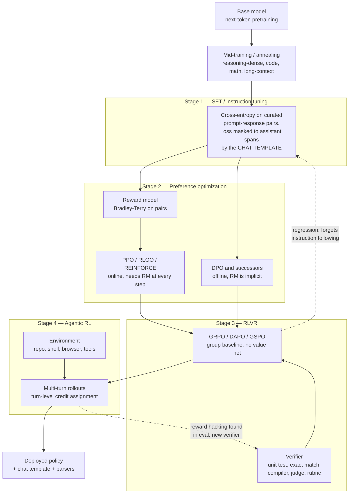
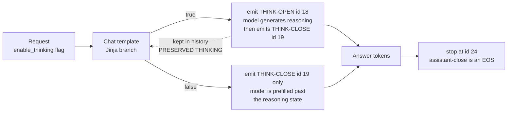

# Post-training pipelines

This note settles what the four post-training stages actually *are* as mechanisms — which
loss, which data, which signal, which failure mode — and separates the parts of that
pipeline this lab can run from the parts it cannot. The short answer on reproducibility:
SFT and preference optimization are fully runnable at 20M–300M on one GPU; RLVR is runnable
only as a *mechanism* study on tasks the base model already partially solves, and there is a
published single-GPU 135M case where GRPO-style RLVR made GSM8K **worse** (1.82% → 1.59%
exact match) rather than better `[C]` ([2606.22189](https://arxiv.org/abs/2606.22189), Jun
2026); agentic RL is out of reach, and saying so is more useful than shipping a toy version
of it. The third thing it settles is mechanical rather than economic: "thinking mode" in our
reference model is not an architecture, a head, or a second model — it is two reserved
tokenizer slots and a Jinja branch, and you can verify that in the artifact in five minutes.

---

## 1. The pipeline, and the systems analogy that half-works

The pipeline reads like a build-and-deploy chain: each stage takes the previous artifact,
applies a transform, and hands on a new one. Two things about that analogy pay, and one
breaks hard.

**Pays.** Each stage has a distinct input contract (SFT wants demonstrations, preference
optimization wants pairs, RLVR wants a checkable answer, agentic RL wants an environment)
and the field's whole cost structure follows from how expensive that input is to produce.
And, like a build chain, the stages are increasingly *hermetic-hostile*: SFT is a pure
function of data and seed; agentic RL depends on a live environment whose behaviour is not
under version control.

**Breaks.** Build stages are idempotent and composable; post-training stages *regress each
other*. RL for reasoning routinely degrades instruction following and safety behaviour, and
the fix is not a rollback but a rebalanced data mix in the next run — Tulu 3 documents that
loop explicitly `[C]` ([2411.15124](https://arxiv.org/abs/2411.15124)), as does Olmo 3, whose
SFT → DPO → RLVR flow is the most completely published version of it `[C]`
([2512.13961](https://arxiv.org/abs/2512.13961), Dec 2025). There is also a real asymmetry in
*how much* each stage damages the previous one: "RL's Razor" argues online RL forgets less
than SFT at matched task gain, because the on-policy update stays inside the model's own
distribution `[C]` ([2509.04259](https://arxiv.org/abs/2509.04259)). Treat "SFT is the cheap
safe stage" as folklore that has been contradicted at least once.

The stage that increasingly does not fit the diagram at all is **mid-training**: the boundary
between "pretraining" and "post-training" has become a design variable, and where reasoning
data is injected changes what RL can subsequently extract `[C]`
([2512.07783](https://arxiv.org/abs/2512.07783), Dec 2025). Reinforcement Pre-Training goes
further and puts a verifiable reward *inside* the pretraining objective `[C]`
([2506.08007](https://arxiv.org/abs/2506.08007)).

---

## 2. Stage 1 — SFT, and the fact that the chat template is a training artifact

SFT is ordinary cross-entropy on curated `(prompt, response)` pairs, with the loss masked so
gradients flow only through assistant tokens. The operationally important and consistently
under-documented part is that **the mask is defined by the chat template, not by the trainer**.
In our reference model's template the assistant block is wrapped in Jinja ``
markers `[M]`
(`research/reference/architecture/llama-cpp-laguna/models/templates/poolside-Laguna-S-2.1.jinja:44-76`),
which is exactly the marker HuggingFace uses to compute the assistant token mask. So the
question "does the model get gradient on its own reasoning tokens?" is answered by a Jinja
file, and in Laguna's case the answer is yes when `enable_thinking` is set, because the
`<think>` block is rendered *inside* the generation span (`:54-58`).

The data lineage, briefly and with the contest intact:

- **Scale-first**: Flan-style multi-task instruction collections `[C]`
  ([2301.13688](https://arxiv.org/abs/2301.13688)), synthetic instruction generation
  (Self-Instruct `[C]` [2212.10560](https://arxiv.org/abs/2212.10560), Evol-Instruct/WizardLM
  `[C]` [2304.12244](https://arxiv.org/abs/2304.12244)).
- **Quality-first**: LIMA claims 1,000 curated examples suffice for style and format `[C]`
  ([2305.11206](https://arxiv.org/abs/2305.11206)); LIMO makes the analogous claim for
  reasoning `[C]` ([2502.03387](https://arxiv.org/abs/2502.03387)). Automatic selection is its
  own subfield `[C]` ([2312.15685](https://arxiv.org/abs/2312.15685)).
- **Reasoning-trace distillation**, which is now the dominant recipe for small models:
  generate long chains from a strong teacher, filter by verified answer, SFT on them.
  DeepSeek-R1 distilled into 1.5B–70B dense students this way `[C]`
  ([2501.12948](https://arxiv.org/abs/2501.12948)); OpenThoughts studies the data recipe
  directly `[C]` ([2506.04178](https://arxiv.org/abs/2506.04178)); NaturalThoughts studies
  trace *selection* `[C]` ([2507.01921](https://arxiv.org/abs/2507.01921)).

**Contested and directly relevant to us:** whether SFT genuinely teaches or merely memorises.
"SFT Memorizes, RL Generalizes" reports SFT fitting surface form while RL transfers `[C]`
([2501.17161](https://arxiv.org/abs/2501.17161)); "RL Squeezes, SFT Expands" reports close to
the opposite decomposition — RL narrows the output distribution while SFT broadens it `[C]`
([2509.21128](https://arxiv.org/abs/2509.21128)). Both are measuring real things; they
disagree about which one is called generalization.

---

## 3. Stage 2 — preference optimization, and why DPO both won and did not

The original RLHF loop is three models and two losses: fit a reward model `r_φ` on human
preference pairs under a Bradley-Terry likelihood, then optimize the policy against `r_φ`
with PPO plus a KL penalty to a frozen reference `[C]`
([2009.01325](https://arxiv.org/abs/2009.01325),
[2203.02155](https://arxiv.org/abs/2203.02155), PPO itself
[1707.06347](https://arxiv.org/abs/1707.06347)). Constitutional AI/RLAIF replaced the human
labeller with a model `[C]` ([2212.08073](https://arxiv.org/abs/2212.08073),
[2309.00267](https://arxiv.org/abs/2309.00267)).

DPO's move is algebraic, not empirical: under the KL-regularized objective the optimal policy
and the reward are related by `r(x,y) = β log[π(y|x)/π_ref(y|x)] + β log Z(x)`, so you can
substitute the *policy itself* into the Bradley-Terry likelihood, the partition function
cancels across a preference pair, and you are left with a plain logistic loss over two
log-ratio differences — no reward model, no sampling, no value network `[C]`
([2305.18290](https://arxiv.org/abs/2305.18290)). The systems reading: DPO deletes the online
serving path from the training loop and replaces it with a batch job. That is exactly why it
took over — and exactly what it gives up.

The successor zoo, each named for the term it removes or replaces:

| Method | Change | Claim | Cite |
|---|---|---|---|
| IPO | Replaces the logistic loss with a squared-loss identity mapping | Removes DPO's overfitting to deterministic preferences | `[C]` [2310.12036](https://arxiv.org/abs/2310.12036) |
| KTO | Drops the pair; uses unpaired desirable/undesirable labels with a prospect-theoretic value function | Preference *pairs* are the expensive part; binary signals are cheap | `[C]` [2402.01306](https://arxiv.org/abs/2402.01306) |
| ORPO | Folds preference into the SFT loss via an odds-ratio penalty | Removes the reference model and the separate stage | `[C]` [2403.07691](https://arxiv.org/abs/2403.07691) |
| SimPO | Length-normalized implicit reward, no reference model, target margin | Aligns the training objective with the generation metric | `[C]` [2405.14734](https://arxiv.org/abs/2405.14734) |
| CPO | Contrastive variant with an SFT anchor | Memory/speed at near-DPO quality | `[C]` [2401.08417](https://arxiv.org/abs/2401.08417) |
| Iterative / online DPO | Regenerate pairs from the current policy each round | Recovers the on-policy property DPO threw away | `[C]` [2404.19733](https://arxiv.org/abs/2404.19733), [2402.04792](https://arxiv.org/abs/2402.04792), [2401.10020](https://arxiv.org/abs/2401.10020) |

Three failure modes are well enough established to design against:

1. **Length bias.** RLHF-tuned policies get longer, and a large fraction of the measured
   preference gain is explained by length alone `[C]`
   ([2310.03716](https://arxiv.org/abs/2310.03716)); ODIN disentangles it with a two-head
   reward `[C]` ([2402.07319](https://arxiv.org/abs/2402.07319)). SimPO's length
   normalization is a response to the same pathology.
2. **Reward overoptimization / Goodhart.** Optimizing hard against a proxy reward model makes
   *gold* score go down, following a smooth functional form whose coefficients scale with
   reward-model parameter count `[C]` ([2210.10760](https://arxiv.org/abs/2210.10760)).
   *Systems bridge:* the reward model is a learned cache in front of an expensive oracle, and
   overoptimization is cache staleness under an adversarial access pattern that you generated
   yourself. *Where it breaks:* a normal cache validates against the origin on a miss. Here
   there is no miss signal at all — the only detector is a separate eval, run later, on a
   different distribution.
3. **Off-policy support limit.** Offline DPO can only reweight what the reference policy
   already generates, which is the formal reason iterative/online variants exist `[C]`
   ([2506.21495](https://arxiv.org/abs/2506.21495),
   [2405.19320](https://arxiv.org/abs/2405.19320)).

**Contested:** whether offline preference optimization is a stage at all in 2026, or a legacy
step retained because it is cheap. Olmo 3 keeps DPO between SFT and RLVR `[C]`
([2512.13961](https://arxiv.org/abs/2512.13961)); several reasoning-first recipes go straight
from SFT cold-start to RL `[C]` ([2501.12948](https://arxiv.org/abs/2501.12948),
[2503.24290](https://arxiv.org/abs/2503.24290)). Nobody has published a matched-budget
ablation isolating what the DPO stage contributes when RLVR follows it. That is a genuine
hole, and it is a *small*-scale-shaped hole.

---

## 4. Stage 3 — RLVR: reward models versus verifiers

RLVR replaces the learned reward with a program. Reward is 1 if the extracted answer matches
the reference, or if the unit tests pass, or if the format constraint is satisfied; 0
otherwise. Tulu 3 named and systematized it `[C]`
([2411.15124](https://arxiv.org/abs/2411.15124)); DeepSeek-R1 and Kimi k1.5 demonstrated it at
frontier scale `[C]` ([2501.12948](https://arxiv.org/abs/2501.12948),
[2501.12599](https://arxiv.org/abs/2501.12599)).

| | Learned reward model | Verifiable reward |
|---|---|---|
| Signal source | Human/AI preference pairs | Program: exact match, test suite, compiler, proof checker |
| Failure mode | Goodhart drift, silent | Verifier gaming, also silent, but *reproducible* |
| Cost per label | High, and it decays | Near zero, and it does not decay |
| Coverage | Any task | Only tasks with a checkable answer |
| Dense signal? | Yes, per-response scalar | No — one bit at the end of a 10k-token trajectory |

**GRPO** is the algorithm that made RLVR cheap `[C]`
([2402.03300](https://arxiv.org/abs/2402.03300)). For each prompt, sample `G` completions from
the current policy, score them, and set each completion's advantage to its group-standardized
reward `Â_i = (r_i − mean r) / std r`, broadcast to every token in that completion. The group
mean *is* the baseline, so the value network — half the memory of PPO — disappears. A
clipped-ratio PPO surrogate and a KL term to a reference policy finish the objective.

The failure modes are what a systems reader should actually study, because they are all
degenerate-signal problems:

- **Advantage collapse.** If all `G` rewards are identical, the advantage is zero and the
  prompt contributes no gradient. At small model scale nearly every hard prompt is
  all-wrong, so the effective batch size silently collapses toward zero. DAPO's *dynamic
  sampling* resamples until a group has mixed outcomes, which is a throughput tax scaling as
  `1/P(mixed)` `[C]` ([2503.14476](https://arxiv.org/abs/2503.14476)).
- **Estimator bias in the normalizers.** Dr. GRPO argues the `/std` term and the per-response
  `1/|o_i|` length normalization bias the gradient and inflate response length; removing them
  changes conclusions about "aha moments" `[C]`
  ([2503.20783](https://arxiv.org/abs/2503.20783)). DAPO independently switches to a
  token-level loss over the whole batch. So two of the most-copied lines in every GRPO
  implementation are contested, not settled.
- **Entropy collapse.** The policy sharpens, rollout diversity dies, and the optimizer starves
  `[C]` ([2512.01374](https://arxiv.org/abs/2512.01374),
  [2606.12370](https://arxiv.org/abs/2606.12370), Jun 2026). DAPO's *clip-higher* is an
  asymmetric clip designed to stop low-probability tokens being crushed.
- **Sequence-vs-token importance ratios.** GSPO replaces the token-level importance ratio with
  a sequence-level one, motivated specifically by instability when the policy is an MoE
  `[C]` ([2507.18071](https://arxiv.org/abs/2507.18071)) — relevant to us because our
  reference model is an MoE and a `proteus-moe-*` arm would inherit the problem.
- **Training-inference mismatch (TIM).** The rollout engine and the trainer compute different
  token probabilities *for the same weights*, because they use different kernels, batching,
  and precision. A 2026 diagnostic isolates TIM from off-policy drift and shows small
  token-level numerical disagreement alone can collapse training `[C]`
  ([2605.14220](https://arxiv.org/abs/2605.14220), May 2026); a companion result argues it is
  an optimization problem fixable with LR scheduling rather than a precision problem `[C]`
  ([2602.01826](https://arxiv.org/abs/2602.01826), Feb 2026). *Systems bridge:* this is a
  read-your-writes consistency violation between two replicas of the same state. *Where it
  breaks:* there is no version vector and no reconciliation — the divergence is absorbed
  silently into the gradient. **This is the single most relevant frontier failure mode for
  this lab, because `bf16-numerics-unproven` is an open row in `ASSUMPTIONS.md` and gfx1151
  has five documented bf16 bugs `[C]`.**
- **Verifier gaming.** Extensional checking admits false positives. A June 2026 study shows
  RLVR-trained models systematically abandon rule *induction* in favour of enumerating
  instance labels that pass the checker, and that isomorphic-perturbation verification
  removes the shortcut `[C]` ([2604.15149](https://arxiv.org/abs/2604.15149), Apr 2026).
  Verifiers themselves are now fuzzed `[C]`
  ([2606.01066](https://arxiv.org/abs/2606.01066), May 2026), and noisy verifiers are studied
  as a first-class problem `[C]` ([2510.00915](https://arxiv.org/abs/2510.00915),
  [2603.16140](https://arxiv.org/abs/2603.16140)). *Systems bridge:* a verifiable reward is a
  checksum. *Where it breaks:* a checksum has no incentive to be satisfied without the
  underlying property; a policy does.
- **Rubric rewards move the hack, not the problem.** Extending RLVR beyond checkable domains
  via rubrics/LLM judges `[C]` ([2507.17746](https://arxiv.org/abs/2507.17746),
  [2508.12790](https://arxiv.org/abs/2508.12790)) reintroduces reward hacking in a new form,
  now with its own reproduction and detection literature `[C]`
  ([2605.12474](https://arxiv.org/abs/2605.12474),
  [2606.04923](https://arxiv.org/abs/2606.04923), May–Jun 2026).

**Process rewards (PRMs)** — scoring each reasoning step rather than the final answer — are
the older, denser alternative `[C]` ([2211.14275](https://arxiv.org/abs/2211.14275),
[2305.20050](https://arxiv.org/abs/2305.20050),
[2312.08935](https://arxiv.org/abs/2312.08935)). They largely lost to outcome rewards for
policy optimization on cost and reliability grounds; Qwen's post-mortem on building PRMs is
the honest account of why `[C]` ([2501.07301](https://arxiv.org/abs/2501.07301)). They survive
as verifiers/rerankers at inference time `[C]`
([2408.15240](https://arxiv.org/abs/2408.15240),
[2402.06457](https://arxiv.org/abs/2402.06457)). Reward modelling for reasoning now has its
own 2026 survey `[C]` ([2602.09305](https://arxiv.org/abs/2602.09305), Feb 2026).

**The load-bearing contested question of the whole stage:** does RLVR create capability or
only sharpen sampling? Yue et al. show base models match or beat RLVR-trained models at
pass@k for large k, implying RL reweights within the base model's support `[C]`
([2504.13837](https://arxiv.org/abs/2504.13837)); ProRL reports genuinely expanded boundaries
under long-horizon RL `[C]` ([2505.24864](https://arxiv.org/abs/2505.24864)); another line
argues RLVR implicitly incentivizes *correct reasoning*, not just correct answers `[C]`
([2506.14245](https://arxiv.org/abs/2506.14245)); "Spurious Rewards" reports substantial gains
on Qwen models from *random or wrong* rewards, which implicates the base model rather than the
signal `[C]` ([2506.10947](https://arxiv.org/abs/2506.10947)). Do not pick a side. Note
instead that the disagreement is largely about **which base model** and **how long you train**
— both of which are axes, not confounds.

---

## 5. Stage 4 — agentic RL, and why it is a different animal

Agentic RL is RLVR where the episode is a multi-turn interaction with an environment: a repo,
a shell, a browser, a tool suite. The reward is still sparse and terminal, but now the
trajectory is tens of thousands of tokens over dozens of turns, and the environment is
stateful and slow. Anchors: SWE-bench as the task family `[C]`
([2310.06770](https://arxiv.org/abs/2310.06770)), SWE-RL `[C]`
([2502.18449](https://arxiv.org/abs/2502.18449)), SWE-Gym and R2E-Gym as environments `[C]`
([2412.21139](https://arxiv.org/abs/2412.21139),
[2504.07164](https://arxiv.org/abs/2504.07164)), ReTool and ARTIST for interleaved tool-use RL
`[C]` ([2504.11536](https://arxiv.org/abs/2504.11536),
[2505.01441](https://arxiv.org/abs/2505.01441)), and two 2025 surveys that map the field `[C]`
([2509.02547](https://arxiv.org/abs/2509.02547),
[2509.08827](https://arxiv.org/abs/2509.08827)).

The distinctive technical problem is **credit assignment across turns**. A 2026 survey
catalogues 47 methods by granularity — token, segment, step, turn, multi-agent `[C]`
([2604.09459](https://arxiv.org/abs/2604.09459), Apr 2026); recent entries assign per-turn
credit as temporal-difference changes in value at tool-call boundaries `[C]`
([2607.13988](https://arxiv.org/abs/2607.13988), Jul 2026) or use the graph structure across
rollouts `[C]` ([2605.26684](https://arxiv.org/abs/2605.26684), May 2026). A parallel 2026
line questions whether the standard formulation is right at all `[C]`
([2604.27859](https://arxiv.org/abs/2604.27859), Apr 2026).

That our reference model is an agentic-coding model is not an inference — it is in the
artifact. The published eval table is Terminal-Bench 2.1, SWE-bench Multilingual, SWE-Bench
Pro, DeepSWE, SWE Atlas, Toolathlon `[M]`
(`research/reference/models/laguna-s/README.md:73-85`), and the tokenizer reserves single
token ids for `<tool_call>` / `</tool_call>` (25 / 26) `[M]`
(`research/reference/models/laguna-s/tokenizer.json`). A model whose entire published
scorecard is agentic was trained against agentic rollouts; the pipeline is not published, but
the target is unambiguous.

---

## 6. Thinking mode: what it actually is in the artifact

Strip the marketing and thinking mode is three things: a token, a template branch, and a
training distribution.

**The token.** In Laguna S 2.1, `<think>` is token id **18** and `</think>` is id **19**,
`<assistant>` / `</assistant>` are **23** / **24**, `<tool_call>` / `</tool_call>` are **25** /
**26** `[M]` (read from `research/reference/models/laguna-s/tokenizer.json`, revision
`b0a9fd7c850e` per `PROVENANCE.md`). None of them appear in `added_tokens` or
`special_tokens_map.json`, so they were **reserved in the base vocabulary**, not grafted on
afterwards. The forensics are visible: the reserved placeholder names run `SPECIAL_1, 2, 3`
then jump to `SPECIAL_8` — ids 23–26 are exactly the four missing slots, renamed `[M]`. The
design lesson for Proteus is concrete and cheap: **reserve special ids at tokenizer
construction for post-training features that do not exist yet.** Note also the asymmetry —
`<user>`, `<system>`, `<arg_key>`, `<tool_response>` are *not* single tokens `[M]`, so the
assistant's control surface is atomic while the framing around it is ordinary text.

**The template branch.** Thinking-off is not a different model or a different sampling path.
It is implemented by emitting a bare closing `</think>` with no opener in the generation
prompt, which prefills the model into the post-reasoning state `[M]`
(`.../poolside-Laguna-S-2.1.jinja:88-92`). Thinking-on emits the opener. The model never
decides; the caller does.

**Three artifact-level facts worth more than any blog post.** (a) The template defaults
`enable_thinking` to **false** (`:4`) while `generation_config.json` sets
`default_chat_template_kwargs: {"enable_thinking": true}` `[M]` — the shipped defaults
disagree with each other, and the serving cookbook documents "off by default" `[C]`
(`research/reference/memory/sglang/.../Laguna-S-2.1.mdx:156`). (b) `eos_token_id` is
`[2, 24]`, i.e. `</assistant>` is an end-of-sequence token `[M]`. (c) The model card states
Laguna "works best with *preserved thinking*: keep `reasoning_content` from prior assistant
messages" and "may stop reasoning in follow-up steps if prior thinking blocks are dropped"
`[C]` (`research/reference/models/laguna-s/README.md:158-161`). That last one is a *training
disclosure in disguise*: the model was optimized on trajectories where prior reasoning was
retained, so dropping it moves the input off-distribution and the learned behaviour decays.
MiniMax-M2 states interleaved thinking as a first-class agent modelling principle `[C]`
([2605.26494](https://arxiv.org/abs/2605.26494), May 2026). Qwen3 takes the opposite contract:
its published best practice is that historical assistant output should contain only the final
answer, not the thinking content, and the shipped Jinja template implements a *rolling*
version of that — reasoning is retained only for turns after the most recent non-tool user
message and stripped before it `[C]`
([huggingface.co/Qwen/Qwen3-32B](https://huggingface.co/Qwen/Qwen3-32B), model card, accessed
2026-07-26; report [2505.09388](https://arxiv.org/abs/2505.09388)). Preserve-all,
rolling-window, and strip-all are three different context-management contracts hiding behind
the same `<think>` tag, and the difference is invisible in any benchmark table.

**How the toggle is trained.** Qwen3 documents a four-stage pipeline: long-CoT cold start,
reasoning RL, *thinking-mode fusion* (SFT on a mixture of thinking and non-thinking data so a
single model serves both), then general RL `[C]`
([2505.09388](https://arxiv.org/abs/2505.09388)). Kimi k1.5 documents *long2short*: distil the
long-CoT policy into a short-CoT one under a length penalty `[C]`
([2501.12599](https://arxiv.org/abs/2501.12599)). s1 shows the crudest version works at
inference alone: force-append "Wait" to extend, or force-close to truncate `[C]`
([2501.19393](https://arxiv.org/abs/2501.19393)). And a 2026 result names the specific reward
hack that RL-trained hybrid toggles suffer — the model thinks while being *judged* as not
thinking, so the length reward is paid for reasoning it did anyway `[C]`
([2601.04805](https://arxiv.org/abs/2601.04805), Jan 2026). Budget control is now its own
subfield: hierarchical budget policy optimization `[C]`
([2507.15844](https://arxiv.org/abs/2507.15844)), difficulty-adaptive routing `[C]`
([2510.19669](https://arxiv.org/abs/2510.19669),
[2606.23181](https://arxiv.org/abs/2606.23181), Jun 2026), and a benchmark of switch
strategies `[C]` ([2605.28398](https://arxiv.org/abs/2605.28398), May 2026).

---

## 7. How "keep checking your work" is actually induced

This is the question the note was commissioned for, so here is the honest mechanism chain
rather than the story.

1. **It is not induced by asking.** Intrinsic self-correction — prompting a model to review
   its own answer with no external signal — does not reliably work and often makes answers
   worse `[C]` ([2310.01798](https://arxiv.org/abs/2310.01798)). Reflexion-style loops work
   when there is an *external* signal to reflect on `[C]`
   ([2303.11366](https://arxiv.org/abs/2303.11366)).
2. **It is a base-model property before it is an RL outcome.** The cleanest result in this
   area: under identical RL on the Countdown task, Qwen-2.5-3B improves dramatically and
   Llama-3.2-3B plateaus, and the difference is the prior presence of four cognitive
   behaviours — *verification, backtracking, subgoal setting, backward chaining*. Priming
   Llama with examples containing those behaviours closes the gap, and — the decisive detail —
   **priming with examples that contain the behaviours but the wrong answers works about as
   well as priming with correct ones.** Continued pretraining on OpenWebMath filtered to
   amplify those behaviours reproduces the effect `[C]`
   ([2503.01307](https://arxiv.org/abs/2503.01307)).
3. **RL then amplifies what is already there.** Which is exactly why the pass@k debate
   (§4) is unresolved: if the behaviour must pre-exist to be amplified, "RL creates
   capability" and "RL sharpens sampling" are hard to distinguish without controlling the
   base distribution. "How Much Backtracking is Enough?" varies the backtracking density of
   the SFT set and measures the interaction with RL directly `[C]`
   ([2505.24273](https://arxiv.org/abs/2505.24273)).
4. **Self-correction as a trained skill needs multi-turn RL with a shaped reward.** SCoRe
   trains a two-attempt setting where the reward explicitly credits *improvement* from attempt
   one to attempt two, precisely because single-turn SFT on correction traces collapses to
   "don't change the answer" `[C]` ([2409.12917](https://arxiv.org/abs/2409.12917)).
5. **Long-CoT length is a reward-shaping artifact as much as a capability.** Demystifying Long
   CoT shows length growth is tunable and not monotone with quality `[C]`
   ([2502.03373](https://arxiv.org/abs/2502.03373)); DAPO's overlong reward shaping exists
   because unshaped RLVR inflates length `[C]`
   ([2503.14476](https://arxiv.org/abs/2503.14476)).

So the operational answer: **"check your work" is a *pretraining/mid-training data property*
that SFT can prime and RL can amplify — and if it is absent from the base distribution, RL on
a verifiable reward will not conjure it.** That single sentence is the most important thing in
this note for a lab that trains its own 20M–300M base models, because it means the behaviour
is in reach *only* if we put it in the pretraining mix on purpose.

---

## 8. What is reproducible at 20M–300M on one gfx1151 GPU

Our envelope, restated from the register rather than re-derived: **≥62 GiB fast tier at
~200 GB/s** `[M]` (`notebook/uma-carveout-controls-fast-tier.md`, single run per arm);
**single tensors ≥32 GiB hang or fault** `[M]`; **20.9 TFLOP/s bf16 GEMM at 8192³** `[M]`
(`scripts/benchmark_gemm.py`); **no distributed collectives** `[C]`; **bf16 numerics
unproven — the Hardware Validation Gate has not run** `[C]`.

| Stage | Runnable here? | Binding constraint | The honest small version |
|---|---|---|---|
| SFT | **Yes, fully** | None. A 300M model plus AdamW is ~5 GB. | Everything: loss masking, packing, template ablations, trace distillation from an open teacher. |
| Reward model training | **Yes** | None; an RM is just a scalar head. | The overoptimization curve `[C]` [2210.10760](https://arxiv.org/abs/2210.10760) was fit by sweeping *reward-model size* against a gold RM — a synthetic-oracle design that is size-agnostic by construction. |
| DPO / SimPO / KTO | **Yes, mechanically** | Reference-model forward pass doubles activation cost; still trivial. | Pathology reproduction — chosen-likelihood decrease, length inflation, reference-support limits. Not "alignment quality"; a 300M model has few preferences worth having. |
| RLVR / GRPO | **Only as a mechanism study** | *Not memory.* Reward variance and rollout throughput. | See below. |
| Agentic RL | **No** | Environment infrastructure, trajectory length, wall-clock, and the absence of collectives. | Read the credit-assignment survey; do not build a sandbox. |

**Why RLVR is memory-cheap and still mostly out of reach.** The memory arithmetic is
comfortable: a 300M policy in bf16 with AdamW is ~5 GB, a frozen reference copy adds 0.6 GB,
and the KV for 8 rollouts × 4,096 tokens at our own scale (`L=24, H_kv=4, d_head=64`, bf16 →
24 KiB/token, from `research/memory/kv-cache-mechanics.md`) is ~786 MiB. Against a 62 GiB fast
tier that is nothing. The throughput arithmetic is also survivable: a 1,000-step run at 64
prompts × 8 rollouts × 512 tokens is ~262M generated tokens; at a **derived, not measured**
2,000 tok/s aggregate that is ~36 hours `[A]` (medium confidence — the 200 GB/s figure is
`[M]`, the achievable batched-decode utilization on this stack is not; cheapest test is a
batched-generation benchmark at batch 64 before any RL code is written).

What actually blocks it is the **reward signal**. GRPO's gradient is zero for any prompt where
all `G` samples score the same, and a 300M model gets zero on essentially every real
math/code benchmark, so every group is uniformly wrong and the effective batch is empty. This
is not speculation: the L20-Edu-135M single-GPU study ran exactly this experiment and reports
GRPO-style RLVR on GSM8K *decreasing* exact match from 1.82% to 1.59% at 192-token completions
and 1.21% at 320 tokens, and is careful to call it a single-run failure mode rather than a
general bound `[C]` ([2606.22189](https://arxiv.org/abs/2606.22189), Jun 2026). The wider
small-model literature agrees on the direction: distillation SFT beats direct RL for
sub-billion models `[C]` ([2509.24945](https://arxiv.org/abs/2509.24945),
[2505.21067](https://arxiv.org/abs/2505.21067),
[2606.04466](https://arxiv.org/abs/2606.04466), Jun 2026).

**The escape hatch, and it is a real one.** Everything above says *RLVR on human benchmarks*
fails at our scale. It does not say RLVR mechanics are unstudyable. Pick a synthetic task with
a tunable difficulty knob where a 300M model's pass rate sits at 20–60% — Countdown is the
existence proof `[C]` ([2503.01307](https://arxiv.org/abs/2503.01307)), and Reasoning-Gym-style
procedural tasks generalize the idea — and every GRPO pathology becomes observable: advantage
collapse as a function of pass rate, entropy trajectories, length inflation with and without
the `1/|o_i|` normalizer, and TIM under bf16. Those are *mechanism* results, they are matched-
budget-able, and they are exactly the kind of thing this lab is set up to do. LoRA-based
reasoning RL at 1.5B has been done for ~$10 of compute `[C]`
([2504.15777](https://arxiv.org/abs/2504.15777)), which sets a reference price for the smaller
version.

**What is not fixable by cleverness:** anything needing a separate rollout engine on a second
device, weight resync over NCCL, or asynchronous actors `[C]`
([2409.19256](https://arxiv.org/abs/2409.19256),
[2405.11143](https://arxiv.org/abs/2405.11143),
[2410.18252](https://arxiv.org/abs/2410.18252),
[2505.24298](https://arxiv.org/abs/2505.24298)). Colocated single-device RL is possible in
principle, but every published recipe assumes the disaggregated topology, and reproducing one
means re-engineering it first. Also unavailable: any claim about RL *scaling*, which now has
its own predictive-fitting literature at compute levels we will never touch `[C]`
([2510.13786](https://arxiv.org/abs/2510.13786)).

---

## 9. Where this touches the memory track

The memory track is the lab's priority; this note is a tributary to it, not a parallel channel.
Five specific couplings:

1. **Post-training is what created the long-*generation* regime that breaks KV eviction.**
   Eviction policies were designed and tuned on long *prompts*; the 2026 wave of
   reasoning-model eviction work exists because they degrade on long chains of thought
   (`research/reference/papers/README.md`, KV-eviction section). Whether a model was
   thinking-mode trained therefore changes which eviction policy wins — an interaction no
   paper on either side controls for.
2. **Preserved thinking is a cache-policy decision made by the model card.** Laguna requires
   prior `reasoning_content` in history `[C]` (`models/laguna-s/README.md:158-161`), so
   reasoning tokens accumulate across an agentic trajectory instead of being freed per turn.
   That is *good* for prefix caching — the history stays append-only, so vLLM's block-hash
   chain and SGLang's radix tree keep matching (`CODE_MAP.md`) — and *bad* for capacity.
   Rolling-window stripping is the reverse: it *rewrites* history as the window advances and
   invalidates every chained hash from the edit point onward. Same visible behaviour, opposite
   cache economics.
3. **RL rollout batches are the most prefix-shareable workload that exists.** GRPO samples `G`
   completions from one prompt: the shared prefix is exact, simultaneous, and known in
   advance. Hit rate is structural, not incidental. Measuring the KV economics of a rollout
   group needs no frontier RL at all.
4. **Memory-systems decisions perturb the training signal, not just latency.** If rollouts are
   generated under KV quantization or eviction, the sampled distribution shifts, and that is
   TIM by another name `[C]` ([2605.14220](https://arxiv.org/abs/2605.14220)). Symmetrically,
   alignment behaviour induced in post-training can be destroyed by a pure memory decision:
   refusal-rate collapse under KV quantization at perplexity deltas too small for PPL-only
   evaluation to notice `[C]` ([2606.09864](https://arxiv.org/abs/2606.09864), Jun 2026). That
   is the memory track's top-ranked problem — attribution — in its purest form.
5. **The rate-distortion framing covers reasoning traces too.** `research/memory/` argues KV
   eviction, prompt compaction, recurrent-state bounding and agent-memory consolidation are one
   problem under a budget `[C]` ([2607.08032](https://arxiv.org/abs/2607.08032), Jul 2026). A
   thinking trace is the newest object in that list: generated, high-volume, mostly
   discardable, occasionally load-bearing, and — unlike a prompt — *reconstructible only by
   re-running the model.*

---

## 10. Contested, and left contested

- **Does RLVR expand capability or sharpen sampling?** `[C]`
  [2504.13837](https://arxiv.org/abs/2504.13837) vs
  [2505.24864](https://arxiv.org/abs/2505.24864) vs
  [2506.14245](https://arxiv.org/abs/2506.14245) vs
  [2506.10947](https://arxiv.org/abs/2506.10947). Unresolved; depends on base model and
  training duration.
- **SFT memorizes / RL generalizes, or the reverse?** `[C]`
  [2501.17161](https://arxiv.org/abs/2501.17161) vs
  [2509.21128](https://arxiv.org/abs/2509.21128).
- **Is offline preference optimization still a required stage?** Retained in Olmo 3 `[C]`
  [2512.13961](https://arxiv.org/abs/2512.13961); skipped in R1-style recipes `[C]`
  [2501.12948](https://arxiv.org/abs/2501.12948). No matched-budget ablation exists.
- **Is the GRPO normalization correct?** Dr. GRPO says the `/std` and `1/|o_i|` terms are
  biased `[C]` [2503.20783](https://arxiv.org/abs/2503.20783); most implementations keep them.
- **Is TIM a precision bug or an optimization problem?** `[C]`
  [2605.14220](https://arxiv.org/abs/2605.14220) vs
  [2602.01826](https://arxiv.org/abs/2602.01826).
- **Preserved vs rolling-window vs stripped thinking across turns.** Laguna and MiniMax-M2
  preserve `[C]` ([2605.26494](https://arxiv.org/abs/2605.26494)); Qwen3 keeps only the most
  recent block `[C]` ([2505.09388](https://arxiv.org/abs/2505.09388) plus its model card). No
  public head-to-head on either accuracy or cache cost.
- **Do rubric rewards extend RLVR or just relocate the hack?** `[C]`
  [2507.17746](https://arxiv.org/abs/2507.17746) vs
  [2605.12474](https://arxiv.org/abs/2605.12474).

---

## Open questions

Testable at 20M–300M on one GPU with a ≥62 GiB fast tier and no collectives. Each is written
so it can fail.

1. **At what base-model pass rate does GRPO stop producing gradient?** Sweep synthetic task
   difficulty so a 300M policy sits at pass ∈ {2, 10, 25, 50, 75}%, measure the fraction of
   groups with zero advantage and the resulting effective batch size. Predicts the exact
   scale/difficulty frontier below which RLVR is pointless. Cost: hours per point. Falsifies
   the received "RL needs scale" claim by replacing it with a measurable threshold.
2. **Does removing the `/std` and `1/|o_i|` normalizers change the conclusion at our scale, or
   only the length?** Direct replication of Dr. GRPO's contested claim in a regime nobody has
   tested `[C]` ([2503.20783](https://arxiv.org/abs/2503.20783)).
3. **Is TIM observable on gfx1151, and how large is it?** Generate with one code path, score
   with another, and measure per-token log-prob disagreement under bf16 vs fp32 on identical
   weights. This is a Hardware Validation Gate item wearing an RL hat, and it needs no RL at
   all to run.
4. **Does behaviour-primed pretraining data reproduce the Countdown result at 300M?** Two
   matched pretraining mixes differing only in the density of verification/backtracking
   language, then identical RLVR. Direct small-scale test of `[C]`
   ([2503.01307](https://arxiv.org/abs/2503.01307)) — and the cheapest experiment in this note
   that could change our pretraining data design.
5. **Preserved vs stripped thinking: measure the prefix-cache and capacity trade directly.**
   Same trajectory, two history policies; report prefix hit rate, KV bytes resident, and
   tokens-to-answer. Needs a served model, not a trained one, so it is runnable this month.
6. **Does DPO between SFT and RLVR contribute anything under a matched token budget?** The
   ablation nobody published. Three arms — SFT→RLVR, SFT→DPO→RLVR, SFT→DPO — on the same
   synthetic verifiable task.
7. **Does KV eviction during rollout generation bias the policy gradient?** Run identical GRPO
   with full-KV rollouts vs SnapKV-compressed rollouts, and measure divergence in the update,
   not in downstream accuracy. This is the direct crossing point of the two tracks and, as far
   as I can find, unpublished.

---

## Decision / Riskiest assumption / Next test

**Decision.** Treat post-training as *read-and-instrument*, not *reproduce*. Build the SFT
path properly (it is cheap, and the chat template is a first-class config surface), skip
alignment-quality claims entirely, and treat RLVR as a mechanism rig on synthetic tasks rather
than a capability programme. Do not build an agentic RL environment.

**Riskiest assumption.** That a synthetic task with a tunable pass rate at 300M is a faithful
proxy for the GRPO pathologies observed at 7B+. If the pathologies are scale-dependent rather
than pass-rate-dependent, every mechanism result here is an artifact. `[A]` medium confidence.

**Next test.** Open question 3 — the TIM/log-prob disagreement probe. It is the cheapest, it
runs without any RL code, it feeds a blocking row in `ASSUMPTIONS.md`
(`bf16-numerics-unproven`), and a negative result would invalidate a large class of future
experiments before we pay for them.

---

## Sources

Reasoning-trace and citation discipline: every arXiv id below was resolved against the live
arXiv API on 2026-07-26. Resolution proves the paper exists, not that it supports the claim
beside it.

**Local artifacts (ground truth, `[M]`)**
`research/reference/models/laguna-s/README.md`,
`.../laguna-s/tokenizer.json`, `.../laguna-s/generation_config.json`,
`.../laguna-s/special_tokens_map.json`;
`research/reference/architecture/llama-cpp-laguna/models/templates/poolside-Laguna-S-2.1.jinja`;
`research/reference/memory/sglang/docs_new/cookbook/autoregressive/Poolside/Laguna-S-2.1.mdx`;
`research/reference/CODE_MAP.md`; `ASSUMPTIONS.md`;
`notebook/uma-carveout-controls-fast-tier.md`; `research/memory/` (whole track).

**Foundations** [1707.06347](https://arxiv.org/abs/1707.06347) ·
[2009.01325](https://arxiv.org/abs/2009.01325) ·
[2203.02155](https://arxiv.org/abs/2203.02155) ·
[2212.08073](https://arxiv.org/abs/2212.08073) ·
[2309.00267](https://arxiv.org/abs/2309.00267) ·
[2210.10760](https://arxiv.org/abs/2210.10760)

**SFT and data** [2212.10560](https://arxiv.org/abs/2212.10560) ·
[2301.13688](https://arxiv.org/abs/2301.13688) ·
[2304.12244](https://arxiv.org/abs/2304.12244) ·
[2305.11206](https://arxiv.org/abs/2305.11206) ·
[2312.15685](https://arxiv.org/abs/2312.15685) ·
[2502.03387](https://arxiv.org/abs/2502.03387) ·
[2506.04178](https://arxiv.org/abs/2506.04178) ·
[2507.01921](https://arxiv.org/abs/2507.01921) ·
[2512.07783](https://arxiv.org/abs/2512.07783) ·
[2506.08007](https://arxiv.org/abs/2506.08007)

**Preference optimization** [2305.18290](https://arxiv.org/abs/2305.18290) ·
[2310.12036](https://arxiv.org/abs/2310.12036) ·
[2401.08417](https://arxiv.org/abs/2401.08417) ·
[2402.01306](https://arxiv.org/abs/2402.01306) ·
[2403.07691](https://arxiv.org/abs/2403.07691) ·
[2405.14734](https://arxiv.org/abs/2405.14734) ·
[2401.10020](https://arxiv.org/abs/2401.10020) ·
[2402.04792](https://arxiv.org/abs/2402.04792) ·
[2404.19733](https://arxiv.org/abs/2404.19733) ·
[2405.19320](https://arxiv.org/abs/2405.19320) ·
[2506.21495](https://arxiv.org/abs/2506.21495) ·
[2310.03716](https://arxiv.org/abs/2310.03716) ·
[2402.07319](https://arxiv.org/abs/2402.07319) ·
[2403.13787](https://arxiv.org/abs/2403.13787) ·
[2506.01937](https://arxiv.org/abs/2506.01937)

**RLVR, GRPO and variants** [2402.03300](https://arxiv.org/abs/2402.03300) ·
[2411.15124](https://arxiv.org/abs/2411.15124) ·
[2501.12948](https://arxiv.org/abs/2501.12948) ·
[2501.12599](https://arxiv.org/abs/2501.12599) ·
[2503.14476](https://arxiv.org/abs/2503.14476) ·
[2503.20783](https://arxiv.org/abs/2503.20783) ·
[2507.18071](https://arxiv.org/abs/2507.18071) ·
[2503.24290](https://arxiv.org/abs/2503.24290) ·
[2512.01374](https://arxiv.org/abs/2512.01374) ·
[2606.12370](https://arxiv.org/abs/2606.12370) ·
[2605.14220](https://arxiv.org/abs/2605.14220) ·
[2602.01826](https://arxiv.org/abs/2602.01826) ·
[2510.13786](https://arxiv.org/abs/2510.13786) ·
[2407.16216](https://arxiv.org/abs/2407.16216)

**Rewards, verifiers and their failure modes**
[2211.14275](https://arxiv.org/abs/2211.14275) ·
[2305.20050](https://arxiv.org/abs/2305.20050) ·
[2312.08935](https://arxiv.org/abs/2312.08935) ·
[2501.07301](https://arxiv.org/abs/2501.07301) ·
[2402.06457](https://arxiv.org/abs/2402.06457) ·
[2408.15240](https://arxiv.org/abs/2408.15240) ·
[2602.09305](https://arxiv.org/abs/2602.09305) ·
[2604.15149](https://arxiv.org/abs/2604.15149) ·
[2606.01066](https://arxiv.org/abs/2606.01066) ·
[2510.00915](https://arxiv.org/abs/2510.00915) ·
[2603.16140](https://arxiv.org/abs/2603.16140) ·
[2507.17746](https://arxiv.org/abs/2507.17746) ·
[2508.12790](https://arxiv.org/abs/2508.12790) ·
[2605.12474](https://arxiv.org/abs/2605.12474) ·
[2606.04923](https://arxiv.org/abs/2606.04923)

**Does RL create capability?** [2504.13837](https://arxiv.org/abs/2504.13837) ·
[2505.24864](https://arxiv.org/abs/2505.24864) ·
[2506.14245](https://arxiv.org/abs/2506.14245) ·
[2506.10947](https://arxiv.org/abs/2506.10947) ·
[2501.17161](https://arxiv.org/abs/2501.17161) ·
[2509.21128](https://arxiv.org/abs/2509.21128) ·
[2509.04259](https://arxiv.org/abs/2509.04259)

**Reasoning behaviour and thinking mode** [2201.11903](https://arxiv.org/abs/2201.11903) ·
[2203.14465](https://arxiv.org/abs/2203.14465) ·
[2503.01307](https://arxiv.org/abs/2503.01307) ·
[2505.24273](https://arxiv.org/abs/2505.24273) ·
[2310.01798](https://arxiv.org/abs/2310.01798) ·
[2303.11366](https://arxiv.org/abs/2303.11366) ·
[2409.12917](https://arxiv.org/abs/2409.12917) ·
[2502.03373](https://arxiv.org/abs/2502.03373) ·
[2501.19393](https://arxiv.org/abs/2501.19393) ·
[2505.09388](https://arxiv.org/abs/2505.09388) ·
[2601.04805](https://arxiv.org/abs/2601.04805) ·
[2507.15844](https://arxiv.org/abs/2507.15844) ·
[2510.19669](https://arxiv.org/abs/2510.19669) ·
[2606.23181](https://arxiv.org/abs/2606.23181) ·
[2605.28398](https://arxiv.org/abs/2605.28398)

**Agentic RL** [2310.06770](https://arxiv.org/abs/2310.06770) ·
[2502.18449](https://arxiv.org/abs/2502.18449) ·
[2412.21139](https://arxiv.org/abs/2412.21139) ·
[2504.07164](https://arxiv.org/abs/2504.07164) ·
[2504.11536](https://arxiv.org/abs/2504.11536) ·
[2505.01441](https://arxiv.org/abs/2505.01441) ·
[2509.02547](https://arxiv.org/abs/2509.02547) ·
[2509.08827](https://arxiv.org/abs/2509.08827) ·
[2604.09459](https://arxiv.org/abs/2604.09459) ·
[2607.13988](https://arxiv.org/abs/2607.13988) ·
[2605.26684](https://arxiv.org/abs/2605.26684) ·
[2604.27859](https://arxiv.org/abs/2604.27859) ·
[2605.26494](https://arxiv.org/abs/2605.26494)

**Small scale, infrastructure, and the memory crossing**
[2606.22189](https://arxiv.org/abs/2606.22189) ·
[2509.24945](https://arxiv.org/abs/2509.24945) ·
[2505.21067](https://arxiv.org/abs/2505.21067) ·
[2606.04466](https://arxiv.org/abs/2606.04466) ·
[2504.15777](https://arxiv.org/abs/2504.15777) ·
[2409.19256](https://arxiv.org/abs/2409.19256) ·
[2405.11143](https://arxiv.org/abs/2405.11143) ·
[2410.18252](https://arxiv.org/abs/2410.18252) ·
[2505.24298](https://arxiv.org/abs/2505.24298) ·
[2512.13961](https://arxiv.org/abs/2512.13961) ·
[2606.09864](https://arxiv.org/abs/2606.09864) ·
[2607.08032](https://arxiv.org/abs/2607.08032)
