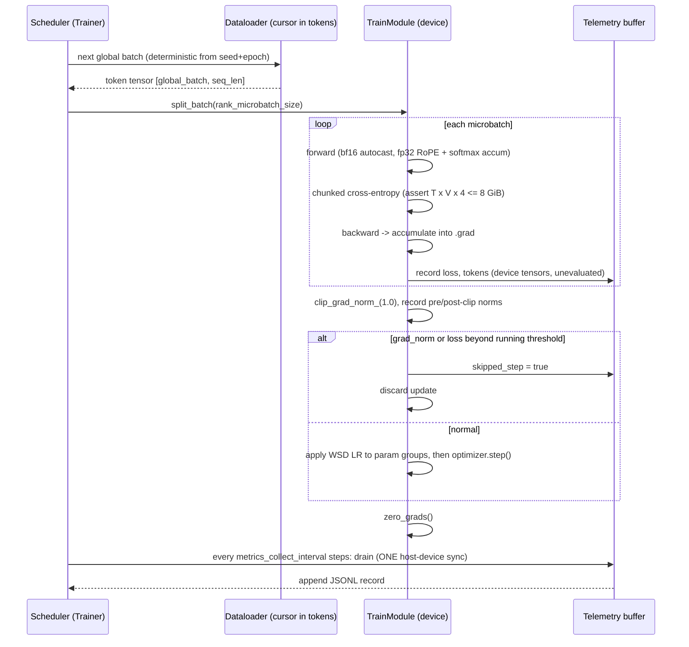
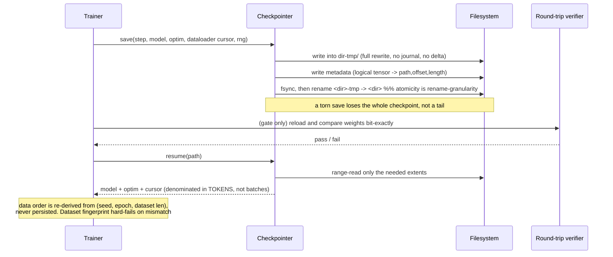

# Pretraining recipes

This note settles three things. **One:** the 2026 pretraining recipe is a small, boring,
well-documented set of defaults (AdamW, warmup-stable-decay, muP, a staged data mixture,
a separate long-context stage) plus one genuinely live argument — whether matrix-preconditioned
optimizers have displaced AdamW — and that argument is contested along a specific axis, batch
size, not along "is Muon better." **Two:** at our ablation scale the binding constraint is
wall-clock, not memory: 300M params × 6B tokens is `[A]` ~21 days on this machine and ~$20
rented, and that single ratio should decide what we run locally versus what we cost and gate.
**Three:** the recipe choices that actually matter for the memory track are muP (it is what
makes a 30M-vs-300M policy ranking mean anything), the WSD trunk-and-branch structure (it is
how N architecture arms fit in one compute budget), and the long-context extension stage (it
is where the KV-capacity experiments get their checkpoints).

Written for a reader who has run ingest pipelines, storage tiers, and observability stacks.
The bridges are real; the places they break are flagged, because the breaks are where the ML
content lives.

---

## 0. The frame: a training run is a batch job with an unusually cruel failure mode

Everything below is one of four things a distributed-systems engineer already owns:

| Recipe component | What it is in systems terms | Where the analogy breaks |
|---|---|---|
| Optimizer | a stateful stream processor: per-key (per-parameter) state, updated once per batch | the state is not recoverable from the input stream; lose the optimizer moments and you cannot replay to reconstruct them, only re-derive them by training |
| LR / batch schedule | admission control and rate limiting over the same job | the rate limit changes what the final artifact *is*, not just when it arrives |
| Data mixture / curriculum | shard weighting in an ingest pipeline | reweighting is not commutative and not linear; the same bytes in a different order produce a different model |
| Checkpointing | DR with an RPO | the "database" is 10 GB of float noise with no schema and no integrity check other than "does the loss curve continue" |

The cruel failure mode: a training run does not crash when it goes wrong. It produces a
number. `[M]` On this machine specifically, it may not even produce a number — a 32 GiB
single-tensor allocation hangs at 0 CPU with no error (`ASSUMPTIONS.md:
large-tensor-fault-32gib`), which means a bad microbatch size presents as a stalled job, not
a failed one. Design the telemetry (§9) for post-mortem diagnosis without a console, because
that is the situation you will actually be in.

---

## 1. Optimizers: AdamW and the 2025–2026 challengers

### AdamW, the incumbent

Per parameter, AdamW keeps two exponential moving averages — the gradient (`m`, first moment)
and the squared gradient (`v`, second moment) — and takes a step proportional to `m/(√v+ε)`.
The division is the whole idea: it makes the step size scale-invariant per coordinate, so
parameters with tiny gradients still move. "W" is decoupled weight decay: the decay is applied
to the weights directly rather than folded into the gradient, so it does not get divided by
`√v`.

Storage arithmetic, mixed precision, per parameter: bf16 weights (2 B) + bf16 gradients (2 B)
+ fp32 master weights (4 B) + `m` (4 B) + `v` (4 B) = **16 bytes/param**. At 300M params that
is **4.8 GB**, against the `[M]` ≥62 GiB fast tier measured on our Z13
(`notebook/uma-carveout-controls-fast-tier.md`). Optimizer state is ~7% of the fast tier at
the very top of our declared ablation box. **Memory is not our constraint. Say this out loud,
because most published advice is written for people for whom it is.**

The boring consensus configuration, unchanged since roughly GPT-3 and visible in every open
recipe (`[C]` OLMo 2, arXiv 2501.00656; `[C]` torchtitan, arXiv 2410.06511): β₁=0.9, **β₂=0.95**
(not the 0.999 default — LLM gradients are noisier and a shorter second-moment window tracks
better), decoupled weight decay ~0.1 applied to matrices but *not* to norms, biases, or
embeddings, and global gradient-norm clipping at 1.0. Read the exact values out of the
committed config in `research/reference/training/olmo-core`; do not copy them out of anyone's
memory, including mine.

One under-appreciated knob: `ε`. `[C]` "Fantastic Pretraining Optimizers and Where to Find
Them" (arXiv 2509.02046, Sep 2025) shows that prior optimizer comparisons were confounded by
untuned `ε` and by blocking choices, i.e. **the published ranking of optimizers flips under
proper tuning**. That is a methodology warning aimed directly at a lab like ours.

### Muon

Muon (MomentUm Orthogonalized by Newton-Schulz) applies to 2-D parameters only. It keeps
momentum (one state, not two), then **orthogonalizes** the momentum matrix before the step —
approximating the nearest semi-orthogonal matrix via ~5 Newton–Schulz iterations, each a
couple of matmuls. Intuition: Adam normalizes each coordinate independently; Muon normalizes
the *spectrum* of the update matrix, so no single direction dominates the step. `[C]` A
curvature account of why this helps is arXiv 2606.04662 (Jun 2026).

Consequences a systems reader should note immediately:

- **Less state.** Momentum only for matrices: 2+2+4+4 = 12 B/param versus AdamW's 16. ~25% off
  the optimizer footprint. Irrelevant here (see above); load-bearing at frontier scale.
- **More compute per step.** Newton–Schulz is extra matmuls on every 2-D parameter. A
  step-count speedup is not a wall-clock speedup, and any honest comparison must report both.
- **It does not apply to everything.** `[C]` DeepSeek-V4 (arXiv 2606.19348, 2026) uses Muon
  for most modules but keeps **AdamW for embeddings, the prediction head, static biases and
  gating factors, and RMSNorm weights** — reported as the first Muon deployment on a
  trillion-plus-parameter MoE. That hybrid split is now the frontier default, and it is a
  recipe detail, not a footnote: 1-D parameters have no meaningful spectrum to orthogonalize.
- **It needed stability surgery to scale.** `[C]` Moonshot's Moonlight (arXiv 2502.16982, Feb
  2025) reports that scaling Muon required exactly two additions — weight decay, and careful
  per-parameter update-scale (RMS) matching — after which they claim **~2× compute efficiency
  vs AdamW** on a 3B/16B MoE trained on 5.7T tokens. `[C]` Kimi K2 (arXiv 2507.20534, Jul 2025)
  then added **QK-Clip**: attention logits exceeded 1000 mid-run, and QK-Clip rescales the
  per-head Q and K projection weights after the update whenever a head's max logit crosses a
  threshold τ (they used τ=100). The combination is MuonClip; K2 pretrained 15.5T tokens with
  no reported loss spikes.

### Shampoo and SOAP

Shampoo maintains per-layer preconditioner matrices (left and right Kronecker factors of the
gradient covariance) and applies their inverse roots to the gradient — a genuine second-order
method, approximated to stay tractable. SOAP is the pragmatic descendant: run plain Adam, but
in Shampoo's eigenbasis, so you get the preconditioning without inverting a matrix every step.
`[C]` "Clarifying Shampoo" (arXiv 2602.09314, Feb 2026) reworks the derivation for stochastic
gradients and the actual parameter trajectory, which had been the shaky part of the story.

### Has anything displaced AdamW? — CONTESTED, and the axis is batch size

Two well-executed 2025–2026 results point in opposite directions, and the disagreement is not
noise:

- `[C]` **arXiv 2509.02046** (Sep 2025), ten optimizers, four scales 0.1B–1.2B, 1–8× Chinchilla
  data: matrix-preconditioned optimizers (Muon, SOAP) win, but the margin is **1.4× at 0.1B
  falling to 1.1× at 1.2B** — "inversely proportional to model scale". The headline framing is
  that claimed speedups are inflated by weak AdamW baselines and shrink with size.
- `[C]` **arXiv 2607.20548**, "SOAP, Muon, and Beyond: Pushing LLM Pretraining Scales" (Jul
  2026), multi-billion-parameter models on trillions of tokens: SOAP and Muon **consistently
  outperform AdamW at the scales tested**, and crucially hold stability at **batch sizes up to
  100M tokens where AdamW degrades**.

Both can be true. 2509.02046 measures loss-at-fixed-tokens at modest batch; 2607.20548
measures behaviour at batch sizes an order of magnitude past where anyone tunes AdamW. The
practical reading: **the advantage of matrix preconditioners is largely a large-batch
advantage**, and large batch is what you buy when you have thousands of GPUs. That is exactly
the regime a single-GPU lab is not in.

`[C]` A third position: arXiv 2602.07712 (Feb 2026) argues the *comparison methodology* is
broken — fitting a separate Chinchilla-style law per optimizer gives ill-conditioned,
highly-correlated parameters, and proposes shared power-law exponents with per-optimizer
rescaling factors so the comparison is identifiable at all. If that holds, several published
optimizer rankings are under-determined rather than wrong. `[C]` The same group's follow-up
(arXiv 2606.16899, Jun 2026) continues the benchmark line.

**Recommendation for Chiron: AdamW is the default; Muon is a legitimate single ablation arm,
not a default.** Three reasons, in order of force:

1. Our scale (20M–300M) is *below* the scale at which 2509.02046 already measures the margin
   shrinking, and far below the batch regime where 2607.20548 finds the real win.
2. `[A]` **Muon's Newton–Schulz iteration is an unusually bf16-hostile kernel on unproven
   hardware.** It is a chain of ~5 dependent matmuls whose purpose is to converge to an
   orthogonal matrix; error compounds multiplicatively along the chain. On gfx1151, with `[C]`
   five documented bf16 bugs (ROCm #6034) and `ASSUMPTIONS.md: bf16-numerics-unproven` still
   open, this is the single worst place to take numerics on faith. Confidence: medium.
   **Cheapest test:** run the Newton–Schulz iteration on a fixed random matrix in bf16 and in
   fp32 and compare `‖QᵀQ − I‖_F` after 5 steps. Minutes, no training required. Do this before
   any Muon arm.
3. Every extra optimizer is an extra tuning surface, and an untuned baseline is precisely the
   failure 2509.02046 documents.

Also on the shelf and worth knowing: `[C]` Adam-mini (arXiv 2406.16793) cuts second-moment
state by sharing learning rates within blocks; `[C]` MONA (arXiv 2605.26842), MuonEq (arXiv
2603.28254), OrScale (arXiv 2605.07815) are 2026 Muon variants; `[C]` arXiv 2605.10468 asks
whether Muon can fine-tune Adam-pretrained models, which matters if we ever want to switch
optimizers mid-flow.

---

## 2. Learning-rate and batch schedules

### Warmup → stable → decay is the current default, and it is the right default *for a lab*

Cosine decay was the standard because it was in the papers. Its defect is structural: the
schedule is a function of the *total* step count, so a cosine run is a fixed-size job. Stop it
early and you get a model trained under the wrong schedule; extend it and you must restart.

**WSD** (warmup-stable-decay, sometimes "trapezoidal") replaces this with: short linear warmup
→ a long constant-LR *stable* phase → a short decay ("cooldown", "anneal") to near zero over
the last 10–20% of tokens. Loss during the stable phase sits *higher* than the cosine curve
and then drops sharply during decay, often ending lower. `[C]` The most-cited mechanistic
account is the "river valley" picture (arXiv 2410.05192, Oct 2024): high LR makes fast progress
*along* the valley floor while bouncing across it; the decay stops the bouncing and drops you
to the floor. `[C]` Cooldown-phase dynamics specifically: arXiv 2508.01483 (Aug 2025). `[C]`
arXiv 2601.09000 (Jan 2026) shows WSD's behaviour is **not transformer-specific**, which
weakens architecture-flavoured explanations. `[C]` arXiv 2602.06797 (Feb 2026) derives optimal
schedules under functional scaling laws and recovers power-decay and WSD as the answers, which
is the closest thing to a theoretical justification. `[C]` arXiv 2503.12811 (Mar 2025) gives a
multi-power law that predicts the whole loss curve across schedules — useful if we ever want
to *choose* a schedule by prediction rather than by sweep.

**Why this is the right default here, specifically.** WSD turns one long run into a **trunk
plus cheap branches**. Save checkpoints along the stable phase; to get a finished model at
budget *B*, branch from the trunk at *B* and run only the short decay. A systems reader will
recognise this immediately: it is a base image with layered commits, or a WAL trunk with
branch-and-replay. `[C]` The WSD-S variant formalises reusing prior decay phases across
budgets (discussed in the WSD literature above). For us it means **an IsoFLOP ladder or an
N-arm architecture sweep costs one trunk plus N short decays instead of N full runs** — the
difference between a sweep that fits in our wall-clock budget (§5) and one that does not.

Contested, and worth flagging because it cuts against the default: `[C]` arXiv 2603.16127 (Mar
2026) reports that pretraining *without* LR decay produces a better base for supervised
fine-tuning. If the base checkpoint's destination is more training rather than evaluation, the
decay may be actively counterproductive. Unresolved.

The interaction that surprises people, and which couples this section to §6: `[C]` "How
Learning Rate Decay Wastes Your Best Data in Curriculum-Based LLM Pretraining" (arXiv
2511.18903, Nov 2025) — if your highest-quality data arrives late in a curriculum *and* the LR
has already decayed, the model barely learns from it. Data schedule and LR schedule are one
schedule. This is why every frontier recipe puts its best data in the decay phase but *starts
the decay when that data starts*, rather than letting the two drift apart.

### Batch size, and the bridge that inverts here

Two results anchor batch-size choice. `[C]` The gradient-noise-scale model (arXiv 1812.06162,
2018) says there is a **critical batch size** beyond which more parallelism buys almost
nothing. `[C]` arXiv 2410.21676 (ICLR 2025), on 85M–1.2B models: **critical batch size scales
primarily with data size, not model size.** So at our scale the token budget, not the parameter
count, sets how large a batch is useful.

**Where the systems analogy inverts.** On a cluster, increasing batch size is how you *spend
devices to buy wall-clock*: more data-parallel ranks, same steps, less time. `[C]` We have no
working collectives on gfx1151 (`ASSUMPTIONS.md: single-device-only`), so global batch is
reached by **gradient accumulation** — microbatch forward/backward repeated, gradients
accumulated in `.grad` buffers, one optimizer step at the end. On one device, a larger batch
costs *more* wall-clock per step and the same wall-clock per token; you buy stability and
gradient quality, never speed. Every piece of published batch-size advice assumes the cluster
framing. Invert it before applying it.

Read the accumulation mechanism in real code rather than a paraphrase: `CODE_MAP` →
`training/olmo-core/.../train_module.py:393` (`split_batch` — accumulation is a *spatial split*
by `rank_microbatch_size`, not a loop counter) and `:566` (`_train_microbatch_context` — where
cross-rank reduction is suppressed on all but the last microbatch; irrelevant to us with one
device, but it is the write-combining pattern and it is worth seeing). Note the detail called
out there: OLMo-core divides the loss by the *whole-batch* token count before backward, so the
usual "divide by accumulation steps" does not exist and ragged microbatches stay correct.

**And here is the platform play.** With 62 GiB of fast tier `[M]` and block-granularity
activation checkpointing, activation storage is ~`2·L·d` bytes per token. For L=24, d=1024
that is 49,152 B/token, so a 40 GiB activation budget holds **~870,000 tokens in a single
microbatch** — before recompute peaks and the logits tensor, so call it several hundred
thousand tokens realistically. On a cluster you need dozens of GPUs to reach that batch. Here
it is one device and no collectives. **Critical-batch-size behaviour is therefore something
this machine can study unusually well**, which is an argument for putting it on the backlog
rather than treating batch size as a nuisance parameter.

---

## 3. muP and hyperparameter transfer — the part that decides whether this lab's results mean anything

**What it is.** Under standard parameterization, the optimal learning rate drifts as you widen
a model, so a sweep at 20M tells you little about 300M. `[C]` muP (Maximal Update
Parameterization, Tensor Programs V, arXiv 2203.03466) re-scales initialization variance,
per-layer learning rates, and the attention logit scale (1/d rather than 1/√d) as functions of
the width multiplier, such that the optimal LR becomes **approximately width-invariant**. Tune
at small width, transfer to large. Read Table 3 of that paper for the exact per-tensor rules;
do not reconstruct them from memory.

**The systems bridge is dimensional analysis.** muP is a unit system. Reporting raw LR across
widths is like reporting raw latency across queue depths: the number moves for reasons that
have nothing to do with the change you are studying. Normalize and the comparison becomes
meaningful. **Where it breaks:** muP normalizes *width*. It says nothing about data mixture,
tokenizer, sequence length, or architecture family, and its derivation assumes a finite step
count in the infinite-width limit while real runs are the opposite limit — many steps, finite
width.

**Why this is load-bearing for Chiron and not an optional nicety.** `ASSUMPTIONS.md:
ablation-scale-sufficient` — "20M–300M is enough to answer our memory-systems questions" — is
currently `[A]` medium confidence with zero evidence, and `research/memory/open-problems-ranked.md`
names it as the riskiest assumption in the entire backlog. Its item #4 asks whether eviction-policy
rankings at ~30M agree with rankings at ~300M (Spearman ρ). **Without muP that experiment is
uninterpretable**: any disagreement could be the policy, or it could be that one scale happened
to be better tuned. muP is the control that converts a confounded comparison into a real one.

State of the art, last 12 months:

- `[C]` **arXiv 2512.22382** (Apple, ICLR 2026): "Completed Hyperparameter Transfer across
  Modules, Width, Depth, Batch and Duration" — extends transfer beyond width to depth, batch
  size and training duration, with per-module HPs, reporting transfer to a ~14000× larger FLOP
  budget. This is the practical superset; classic muP alone leaves depth and duration on the table.
- `[C]` **arXiv 2310.02244** (Tensor Programs VI) is the depth-direction predecessor.
- `[C]` MoE needs its own treatment — routing and sparsity sit outside classic muP theory:
  arXiv 2508.09752 (µ-Parametrization for MoE, Aug 2025) and arXiv 2605.14200 ("From muP to the
  Maximally Scale-Stable Parameterization", May 2026). If a `proteus-moe-*` arm is muP'd with
  plain Tensor Programs V, it is not muP'd.
- CONTESTED: `[C]` **arXiv 2510.19093** (Oct 2025) argues **weight decay may matter more than
  muP** for LR transfer in practice — that decoupled weight decay is what stabilizes update
  dynamics across widths, and muP's contribution is smaller than advertised once WD is tuned.
  `[C]` arXiv 2605.21486 (May 2026) separately finds the **embedding-layer learning rate** to
  be disproportionately important to transfer quality. Do not present muP as a solved control;
  present it as a control whose active ingredient is disputed.

**Practical instruction for our rig:** pick a base model at the bottom of the ladder (20M),
sweep LR there over ≥5 points, transfer up the ladder by muP, and **verify the transfer once**
by running a 3-point LR sweep at the next scale up and checking the optimum did not move. That
verification is the cheap experiment that converts `ablation-scale-sufficient` from `[A]` to
`[M]` for the width axis at least.

---

## 4. Scaling laws: Chinchilla, and everything that has gone wrong with it

`[C]` **Chinchilla** (arXiv 2203.15556, 2022): under a fixed compute budget C ≈ 6ND (N params,
D tokens), loss is minimized near **D ≈ 20N** — parameters and tokens should scale roughly
together. Three estimation approaches; Approach 3 fits a parametric loss surface, Approach 2
fits a parabola to each IsoFLOP slice.

What has happened since, in order of how much it should change our behaviour:

1. `[C]` **The fitting method is biased.** "Problems with Chinchilla Approach 2" (arXiv
   2603.22339, Mar 2026) shows the standard IsoFLOP parabola fit is systematically biased *even
   on noise-free synthetic data*, from grid width, off-centre sampling, and loss-surface
   asymmetry, quantifies ~6.5% budget misallocation on published Llama-3 IsoFLOP data, and
   recommends Approach 3 with variable projection instead. **The bias sources it names are
   exactly the conditions of a small-lab sweep** — narrow grid, few points, uncentred. If we
   ever fit an IsoFLOP curve, fit it that way and report a confidence interval.
2. `[C]` **The original numbers did not fully replicate.** "Chinchilla Scaling: A replication
   attempt" (arXiv 2404.10102, Apr 2024) found Approach 3 inconsistent with Approaches 1 and 2
   and implausibly narrow confidence intervals.
3. `[C]` **Extrapolation needs token-per-parameter coverage, not just more points** (arXiv
   2605.08541, May 2026): the ratio range you sample determines whether the fit extrapolates.
4. `[C]` **Compute-optimal is the wrong objective if you serve the model.** Beyond
   Chinchilla-Optimal (arXiv 2401.00448) folds inference cost in and pushes toward smaller,
   heavily overtrained models; arXiv 2501.18107 (Jan 2025) extends this to inference-efficient
   scaling and reports that **overtraining is what makes a scaling law accurate**, not an
   inconvenience to be avoided. `[C]` arXiv 2605.09189 (May 2026) does the data-constrained
   version.
5. There is **no accepted single successor law.** The field has fragmented into conditional
   laws — per data quality, per optimizer (§1, arXiv 2602.07712), per MoE sparsity. Treat any
   claim of "the new Chinchilla" as contested.

**What this means for a 20M–300M / 0.5–5B-token box.** Our declared box spans wildly different
regimes at its corners, and the corners are not comparable experiments:

| N | D | D/N | vs Chinchilla (D=20N) |
|---|---|---|---|
| 20M | 0.5B | 25 | 1.25× (slightly over) |
| 20M | 5B | 250 | 12.5× (heavily overtrained) |
| 300M | 0.5B | 1.7 | 0.08× (badly undertrained — do not run this) |
| 300M | 5B | 16.7 | 0.83× (just under compute-optimal) |

**Pick D from N, not from the box.** Either D = 20N (compute-optimal, for scaling-law work) or
a deliberate overtrain ratio held *constant across arms* (for architecture comparisons, where
what matters is that the arms are matched, not that either is optimal). An arm comparison that
silently varies D/N is not a matched-budget comparison.

---

## 5. The wall-clock and dollar arithmetic, shown

Inputs: `[M]` measured bf16 GEMM throughput on our Z13 is **20.9 TFLOP/s at 8192³**
(`scripts/benchmark_gemm.py`, 2026-07-26, torch `2.12.0a0+rocm7.13.0a20260313`, HIP 7.2.0,
hipBLASLt configured). `[A]` Assume sustained end-to-end training throughput of **6 TFLOP/s**,
≈29% of that ceiling — small models run small GEMMs and pay a large non-GEMM tax (attention,
norms, optimizer, dataloader). Confidence: low-to-medium; this is the number most likely to be
wrong in this note. **Cheapest test that moves it:** run the nanoGPT gate recipe
(`CODE_MAP` → `training/nanogpt`), record tokens/s, and back out FLOP/s as `6·N·tokens_per_s`.
Note that nanoGPT's printed MFU is computed against a hardcoded A100 `flops_promised = 312e12`
(`model.py:301`) and is meaningless here until that denominator is changed.

Compute-optimal ladder, C = 6ND with D = 20N:

| N (non-emb) | D = 20N | C = 6ND | tokens/s at 6 TFLOP/s | one run | 3 seeds × 2 arms |
|---|---|---|---|---|---|
| 20M | 0.4B | 4.8e16 | 50,000 | **2.2 h** | 13 h |
| 50M | 1.0B | 3.0e17 | 20,000 | **13.9 h** | 3.5 days |
| 130M | 2.6B | 2.0e18 | 7,700 | **3.9 days** | 23 days |
| 300M | 6.0B | 1.1e19 | 3,300 | **20.8 days** | 125 days |

**This table is the most consequential thing in the note.** Routine matched-arm work with the
house-mandated ≥3 seeds lives at **20M–50M**. 130M is a monthly confirmatory scale. **300M
compute-optimal is not a local experiment** — one run is three weeks and a seeded arm
comparison is a third of a year. Either overtrain a smaller model at constant D/N, or rent.

The rented comparison, because G3 requires the arithmetic: `[C]` H100 SXM bf16 dense peak
≈ 989 TFLOP/s (NVIDIA H100 datasheet; the widely-quoted 1,979 figure is the 2:4-sparsity
number, and secondary summaries of that datasheet routinely conflate the two — treat the peak
as the conservative one). `[A]` at 30–40% MFU → 297–396 TFLOP/s → 1.1e19 / 3.5e14 ≈ **7.6–10.1
hours** for one 300M compute-optimal run. `[C]` Verified on-demand H100 pricing, July 2026:
specialist clouds $2.19–$3.20/GPU-hour (Thunder Compute $2.19, Lambda ~$2.49, Spheron ~$2.50;
hyperscalers 2–4× that). **One run: ~$17–$32. Six runs (3 seeds × 2 arms): ~$100–$194.**

Decision implication, not a decision: `ASSUMPTIONS.md: cloud-budget-zero` is user-set and
spending requires approval. But the honest framing is that **the Z13's value is capacity, not
throughput** — 62 GiB of fast memory for KV-capacity and long-context work that a 20 GB card
cannot hold — and a *throughput*-bound confirmatory run at 300M is precisely the workload it is
worst at and the cheapest to rent. Play the platform: spend local wall-clock on
memory-capacity-bound experiments and cost the FLOPs-bound ones.

---

## 6. Data mixing and curriculum

### Mixing is a hyperparameter with a proxy-model solution

The domain weights over a corpus (web / code / math / books / STEM) change model quality as
much as most architecture choices. The line of work:

- `[C]` **DoReMi** (arXiv 2305.10429, 2023): train a small proxy with group-DRO over domains,
  read off domain weights, use them to train the big model.
- `[C]` **DoGE** (arXiv 2310.15393) reweights by generalization estimation.
- `[C]` **RegMix** (arXiv 2407.01492, Jul 2024): train *many tiny* models on random mixtures,
  fit a regression from mixture → loss, optimize the regression. **This is the one built for
  our scale** — the proxy models are small enough that the search itself is the affordable part.
- `[C]` **R&B** (arXiv 2505.00358, May 2025) regroups domains before balancing them; `[C]`
  **Data Mixing Agent** (arXiv 2507.15640, Jul 2025) learns a reweighting policy by RL over
  mixing trajectories, aimed at continual pretraining.
- `[C]` The current map: **"Data Mixing for LLM Pretraining: A Survey and Outlook"** (arXiv
  2604.16380, Mar 2026).

**Systems bridge:** this is shard weighting in an ingest pipeline, and the proxy-model methods
are exactly capacity planning by simulation on a scaled-down replica. **Where it breaks:** the
weights are not a throughput knob — they change what the model *is*. And the response surface
is not separable: the optimal weight for code depends on how much math is present. You cannot
tune the domains one at a time, which is why the regression/DRO formulations exist.

### Curriculum: mixed evidence, and the small-model evidence is the good news

Ordering data easy→hard is intuitive and the literature has been ambivalent for a decade. The
useful recent result is at *our* scale: `[C]` "Curriculum Learning for LLM Pretraining: An
Analysis of Learning Dynamics" (arXiv 2601.21698, Jan 2026) reports that in models **up to
160M**, random ordering shows higher gradient noise and stronger late-training output-head
spectral saturation with lower final accuracy, and a linguistic curriculum reduces both at
matched compute — with a reverse-order control losing most of the gain, so **direction
matters** and it is not just a variance artifact. `[C]` arXiv 2506.11300 (Jun 2025) reports
gains from curriculum at fixed compute. Both note the effect appears to diminish at scale,
which is the standing caveat.

This is an unusually good fit for Chiron: the effect is reported to be *strongest* in exactly
the 20M–160M range we can run properly seeded, and the proposed mechanism (gradient noise
scale, output-head spectral saturation) is an *attribution* claim we can instrument rather than
an outcome claim we would have to take on faith.

### Staging: the pattern everyone converged on

`[C]` **Mid-training is now a named stage** with its own survey (arXiv 2510.06826, Oct 2025):
after bulk pretraining, run one or more annealing-style phases that raise data quality
(STEM/code/reasoning), accelerate LR decay, and extend context. `[C]` **OLMo 3** (arXiv
2512.13961, Dec 2025) is the reproducible instance: pretrain on the Dolma 3 general mix →
mid-train on a targeted high-quality mix (Dolmino) → context extension (Longmino). Secondary
summaries of that report describe an 8192-token pretraining context with sliding-window
attention on 3 of every 4 layers (window 4096, last layer full), two independent mid-training
runs on separate 100B-token subsets whose checkpoints are merged, and ~100B tokens of context
extension using YaRN — **I did not confirm those specifics against the primary PDF this
session; confirm before copying them into a config.** `[C]` Nemotron-CC (arXiv 2412.02595) is
the reference for how the high-quality subset gets built.

For us: the anneal is the cheapest known free win, and §2 already told you why — put the best
data *in* the decay phase, and start the decay when that data starts.

---

## 7. Long-context extension as a separate stage

Nobody pretrains at the final context length; it is quadratic and wasteful. The pattern is
train short, extend late.

**Mechanisms**, in the order they were invented, all operating on RoPE's per-dimension
rotation frequencies:

- `[C]` **Position Interpolation** (arXiv 2306.15595): linearly squeeze positions into the
  trained range. Simple; crushes the high-frequency dimensions that encode local order.
- **NTK-aware / base scaling:** raise RoPE's `θ` base so low-frequency bands stretch and
  high-frequency bands do not.
- `[C]` **YaRN** (arXiv 2309.00071): make the split per-frequency-band explicit (ramp between
  interpolation and extrapolation) and add an attention temperature. Reported to work at ~10×
  fewer tokens than naive fine-tuning.
- `[C]` **LongRoPE** (arXiv 2402.13753) searches the per-dimension rescaling instead of
  deriving it.
- `[C]` **Jet-Long** (arXiv 2607.07740, Jul 2026) is where the line has gone: tuning-free,
  length-adaptive rescaling paired with a RoPE-faithful local window.

**Recipe**, and this is the one to actually follow: `[C]` "How to Train Long-Context Language
Models (Effectively)" (arXiv 2410.02660, Oct 2024) ablates the extension stage directly —
continue training with a long-context data mix (code repositories and books) **mixed with
short high-quality data**, train beyond your evaluation length, and note that naively changing
the RoPE base or fine-tuning on a long-only mixture **degrades short-context performance**.
They explicitly reject perplexity and bare needle-in-a-haystack as progress signals; use
`[C]` RULER (arXiv 2404.06654) or the 2026-era LongBench Pro (arXiv 2601.02872).

**The gfx1151-specific trap, and it is a big one.** `[C]` "When Precision Meets Position:
BFloat16 Breaks Down RoPE in Long-Context Training" (arXiv 2411.13476, Nov 2024): bf16's
mantissa is too short to represent large position values accurately, so RoPE's relative-position
property degrades as context grows, and the error accumulates with training. They report theta
values scaled with target length (order 1M at 32K rising to tens of millions at 256K). **This
lands directly on `ASSUMPTIONS.md: bf16-numerics-unproven`.** A long-context extension stage is
the *worst case* for our unvalidated bf16 path, not an average one. Compute position embeddings
in fp32 and cast after; add "RoPE at long position indices, bf16 vs fp32" to the Hardware
Validation Gate numerics suite alongside matmul/softmax/RMSNorm/attention.

**Budget at our scale.** The extension stage is conventionally 2–10% of pretraining tokens. On
a 50M model trained to 1.0B tokens, a 50M-token extension stage from 1024 → 8192 is a couple of
hours `[A]` at the throughput assumed in §5 — cheap enough to be an ablation axis rather than a
one-shot. That affordability is what makes `research/memory/long-context-behavior.md`'s open
question #1 (does YaRN's ramp or its temperature do the work?) runnable here at all.

---

## 8. Stability

The failure looks like this: loss is flat and healthy, then jumps by 1–3 nats over a few steps
and either recovers slowly or never. The proximate cause is almost always a gradient-norm
excursion; the distal causes are a handful of known mechanisms.

**Architectural preventatives**, now near-universal and cheap:

- **QK-norm** — RMSNorm applied to Q and K per head before RoPE. Prevents attention-logit
  explosion at the source. `[M]` Our reference model does exactly this: `CODE_MAP` →
  `modeling_laguna.py:368`, `self.q_norm = LagunaRMSNorm(self.head_dim`.
- **Logit softcapping** — `tanh(x/c)·c` on router or attention logits. Laguna *implements*
  it at `modeling_laguna.py:181` but ships it **disabled**: `moe_router_logit_softcapping`
  is `0.0` in laguna-s and absent in laguna-xs `[M]` (config read at `b0a9fd7c850e`,
  2026-07-26), so the tanh path is dead code as shipped. Corrected here after an earlier
  draft claimed Laguna softcaps its router logits; see `moe-routing-and-failure-modes.md`,
  which had it right. The architecture cannot be described from code alone *or* config
  alone — a general lesson for reading any of these models.
- **z-loss** — an auxiliary penalty on the log-partition function of the softmax, keeping logits
  from drifting to large magnitudes. `[C]` ST-MoE (arXiv 2202.08906) is the canonical source and
  reads like a systems postmortem: router z-loss, bf16-driven divergence, capacity-factor
  behaviour, expert-count sweeps.
- **QK-Clip** — the reactive version: rescale a head's Q/K weights post-update if its max logit
  exceeds τ. `[C]` Kimi K2 (arXiv 2507.20534), τ=100.

**Optimizer-level mitigations:** `[C]` Spike No More (arXiv 2312.16903) ties spikes to
gradient-norm growth and prescribes small initialization plus embedding-LayerNorm; `[C]` ZClip
(arXiv 2504.02507) clips adaptively using z-scores of the gradient-norm history rather than a
fixed threshold; `[C]` AdaGC (arXiv 2502.11034) does per-parameter adaptive clipping; `[C]`
SPAM (arXiv 2501.06842) resets momentum after a detected spike. A skip-step optimizer — reject
the update when loss or grad-norm exceeds a running threshold — is the pragmatic production
answer and is already implemented in our reference training code (`CODE_MAP` →
`train_module.py:514`, `SkipStepOptimizer`).

**The result that makes stability studiable in our box:** `[C]` "Small-scale proxies for
large-scale Transformer training instabilities" (arXiv 2309.14322, Sep 2023) shows that the
instabilities observed at frontier scale — attention-logit growth, output-logit divergence —
**reproduce at small scale when the learning rate is raised**, and that the known mitigations
transfer. At 20M–300M with a sane LR you will mostly not see spikes; you have to *provoke*
them. That is a feature: an LR sweep is the instrument, and stability becomes a testable axis
rather than an anecdote about a run that died.

---

## 9. The concrete recipe for a 20M–300M run on one gfx1151, no collectives

**Gate first.** `ASSUMPTIONS.md: bf16-numerics-unproven` is open and the Hardware Validation
Gate has not run. Nothing below is a validated recipe on this machine; it is the recipe to run
*through* the gate. Versions to pin with every measurement: torch `2.12.0a0+rocm7.13.0a20260313`,
HIP 7.2.0, driver `32.0.23033.5002`, gfx1151, native Windows (`ENVIRONMENT.md`, 2026-07-26).

| Knob | Setting | Why / source |
|---|---|---|
| Ladder | 20M → 50M → 130M → (300M rented or overtrained) | §5 wall-clock table |
| Tokens | D = 20N compute-optimal, or fixed D/N held constant across arms | §4 |
| Parameterization | muP, base shape at 20M; verify transfer once at 50M | `[C]` 2203.03466; §3 |
| Optimizer | AdamW, β=(0.9, 0.95), decoupled wd 0.1 on matrices only, ε tuned not defaulted | `[C]` 2509.02046 on ε |
| LR schedule | WSD: warmup ~1–2% of steps, stable, decay over final 10–20% to ~0 | `[C]` 2410.05192, 2602.06797 |
| Trunk/branch | checkpoint the stable phase; branch + short decay per budget/arm | §2 |
| Batch | global batch by gradient accumulation; sweep it — CBS scales with D | `[C]` 2410.21676 |
| Grad clip | global-norm 1.0 + skip-step on loss/grad-norm outliers | `CODE_MAP` train_module.py:514 |
| Stability | QK-norm on, router/attention softcap if MoE, z-loss if MoE | `[C]` 2202.08906; `[M]` Laguna |
| Precision | bf16 autocast, fp32 master weights, **fp32 for RoPE position math, softmax accumulation, and the loss reduction** | `[C]` 2411.13476; gfx1151 bf16 bugs |
| Seq len | 1024–2048 trunk; separate extension stage to 8192+ | §7 |
| Data | fixed mixture for arm comparisons; anneal a high-quality subset *inside* the decay phase | `[C]` 2511.18903, 2510.06826 |
| Seeds | ≥3, always; single-seed results labeled as anecdotes | house rule |

### Three hardware-specific things that will bite

**1. The cross-entropy logits tensor is your largest single tensor, and it is sized by vocab,
not by parameters.** Bytes = `T_micro × V × 4` in fp32. With V = 50,257: a 16,384-token
microbatch is 3.07 GiB (fine); **65,536 tokens is 12.3 GiB, and with its gradient and a bf16
copy you are at ~30 GiB — the measured cliff**. With a modern 100k vocab and 131,072 tokens it
is **49 GiB in one tensor**, which `[M]` hangs at 0 CPU with no error
(`ASSUMPTIONS.md: large-tensor-fault-32gib`). **Chunk the CE loss over the sequence axis and
assert `T_micro × V × 4 ≤ 8 GiB` in the config validator.** Note the shape of this bug: the
naive fix (raise the microbatch to use the big memory) is exactly what triggers it.

**2. Allocate the KV cache and any large buffer per layer, never as one tensor.** Same cliff.
`research/memory/open-problems-ranked.md` already draws this conclusion for KV; it applies to
activations and logits too.

**3. Verify hipBLASLt is configured, then don't panic about it.** `[M]` Configured vs unset was
20.9 vs 18.6 TFLOP/s bf16 (+12%) on this wheel — **not** the 5× cliff the upstream issue
reports (`ASSUMPTIONS.md: hipblaslt-config`). Set it anyway via `scripts/activate-lab.ps1`; it
is free and the cliff may return on another wheel. Also `[M]`: 20.9 TFLOP/s is 63% of the
~33 TFLOP/s reported for this silicon, unexplained (`gemm-throughput-below-reference`).

### CPU fallback (mandatory per house rules)

`[C]` nanoGPT's published CPU configuration is the reference: 4 layers, 128 channels,
`block_size` 64, 2000 iterations, published target validation loss **1.88** (`CODE_MAP` →
`training/nanogpt/README.md:85`). The GPU counterpart is 6 layers / 6 heads / 384 channels /
`block_size` 256, ~10.6M params, published best val loss **1.4697** — and per CODE_MAP the bar
is landing within ~0.01 of it, not reproducing four decimals, because `estimate_loss` is a
Monte Carlo mean over 200 random batches. Same config object, `device: cpu`, no other change:
if a config cannot run both, the config surface is wrong.

### Telemetry schema — one JSONL record per logged step

The requirement is that someone diagnoses a failed run from this file alone, three days later,
with no console and no dashboard. That forces specific fields:

```jsonc
{ "run_id","git_sha","config_sha","seed","stage",            // provenance: which run, which code, which config
  "step","tokens_seen","wallclock_s","epoch","data_cursor_tokens",
  "lr","wd","batch_tokens","microbatches","seq_len",
  "loss_train","loss_train_ema","z_loss","aux_loss",
  "grad_norm_preclip","grad_norm_postclip","clip_fraction","skipped_step",  // spike forensics
  "update_to_param_ratio_p50","update_to_param_ratio_max",   // muP sanity: should be ~scale-invariant
  "attn_max_logit","attn_logit_p999",                        // logit explosion, the K2 failure
  "param_norm","optim_v_max",
  "tokens_per_s","tflops_est","step_time_s","step_time_p99",
  "mem_alloc_gib","mem_reserved_gib","mem_max_alloc_gib","largest_single_tensor_gib", // the 32 GiB cliff
  "mixture_weights",                                          // data schedule, as a dict
  "torch_version","rocm_version","driver_version","gfx_arch" } // an unversioned measurement is worthless
```

**The one thing that is not like any observability stack you have run:** reading a metric costs
training throughput. Metric values live as unevaluated device tensors; touching one forces a
host-device sync and stalls the pipeline. OLMo-core's answer is to buffer detached device
tensors and drain them every `metrics_collect_interval` steps (`CODE_MAP` → `trainer.py:1037`
`record_metric`, `:1394` `_log_metrics`). It looks like group commit but has none of a WAL's
durability — the buffer is volatile and the batching exists to avoid a sync, not to amortize
I/O. Budget your instrumentation accordingly, and make the collection interval a config field.

### Training step



### Checkpoint and resume



Both diagrams follow `CODE_MAP` → `training/olmo-core`: `checkpoint.py:498` (`_temporary_wd`,
the rename commit), `data_loader.py:667` (`_build_global_indices`, order as a pure function of
seed+epoch), `data_loader.py:720`/`:760` (resume by token count, so batch size may change across
a resume). The gate requirement to compare **weights bit-exactly** rather than loss trajectories
comes from the nanoGPT note in CODE_MAP: nanoGPT does not restore RNG or data position, so a
resumed run diverges from an uninterrupted one by construction and a loss-based round-trip check
would fail for the wrong reason.

---

## 10. Where this touches the memory track

`research/memory/` is the priority track and this note is upstream plumbing for it. The
specific couplings:

1. **muP is the precondition for `open-problems-ranked.md` item #4** (do eviction-policy
   rankings at ~30M agree with ~300M?). Without it that experiment cannot distinguish "the
   policy is scale-dependent" from "one scale was better tuned." It is also the direct attack on
   `ASSUMPTIONS.md: ablation-scale-sufficient`, which that note names as the riskiest assumption
   in the whole backlog.
2. **WSD trunk-and-branch is what makes ratio sweeps affordable.** `hybrid-architectures.md`
   asks whether published SWA/full ratios were ablated or inherited. An N-ratio sweep at 50M is
   N full runs (3.5 days per seeded pair) unless it is one trunk plus N short decays. The
   schedule choice decides whether the memory track's central architectural question is
   affordable at all.
3. **The context-extension stage is where KV-capacity experiments get their checkpoints.**
   `long-context-behavior.md` open question #1 (YaRN ramp vs temperature) and question #6
   (attention temperature) are extension-stage experiments; §7 gives them a token budget.
4. **The bf16 gate widens.** `bf16-numerics-unproven` currently lists matmul/softmax/RMSNorm/
   attention. `[C]` arXiv 2411.13476 adds **RoPE at large position indices** and `[A]` §1 adds
   **Newton–Schulz orthogonalization** if we ever run a Muon arm. Both are pretraining-recipe
   choices, so the gate blocks this note's recommendations, not just the memory track's.
5. **The 32 GiB tensor fault's blast radius is bigger than KV.** The register entry frames it
   around KV-capacity work; §9 shows the cross-entropy logits tensor reaches it first, sized by
   vocabulary rather than by model size. Same silent hang, different tensor.
6. **Do not conflate the two bandwidth regimes.** `kv-cache-mechanics.md` derives decode
   arithmetic intensity = `2G/dtype_bytes` and concludes decode is bandwidth-bound. Training is
   a different regime — large GEMMs, compute-bound, `[M]` 20.9 TFLOP/s bf16 — and the `[M]`
   ~200 GB/s fast-tier bandwidth is not the training bottleneck. Two ceilings, two workloads;
   the memory track owns one and this note owns the other.
7. **Capacity is the lab's edge and the recipe should spend it.** Optimizer state at 300M is
   4.8 GB of a ≥62 GiB tier. That headroom buys microbatches of several hundred thousand tokens
   on one device with no collectives — a critical-batch-size instrument that normally requires
   a cluster.

---

## Open questions

Testable here: one GPU, 20M–300M params, `[M]` ≥62 GiB fast tier, no collectives.

1. **What is our actual sustained training throughput?** The §5 table rests on an `[A]` 6
   TFLOP/s assumption. Measure tokens/s on the nanoGPT gate recipe at three model sizes and
   replace the assumption with `[M]`. Everything downstream — arm counts, seed counts, the
   rent-versus-run decision — moves with this number.
2. **Does the muP LR optimum actually transfer on this stack?** Sweep LR over ≥5 points at 20M,
   3 points at 50M, check the optimum did not move. This is the cheapest experiment that turns
   `ablation-scale-sufficient` from `[A]` into evidence on at least the width axis.
3. **Does Newton–Schulz survive bf16 on gfx1151?** Run 5 iterations on a fixed random matrix in
   bf16 and fp32; compare `‖QᵀQ − I‖_F`. Minutes. Gates any Muon arm, and is a clean addition to
   the Hardware Validation Gate regardless.
4. **Does the 2509.02046 scale-dependence hold at *our* scale?** Their smallest point is 0.1B.
   AdamW vs Muon at 20M and 50M, matched tokens, ≥3 seeds, reporting both step-count and
   wall-clock speedup. If the 1.4×→1.1× trend extrapolates downward, we should see a *larger*
   margin at 20M — and if we do not, that is evidence about the trend, not about Muon.
5. **Where is the critical batch size at 0.5–5B tokens?** Sweep global batch across an order of
   magnitude at fixed tokens. `[C]` 2410.21676 predicts CBS tracks data size, not model size —
   testable here in a way it is not on a small cluster, because we reach large batch with memory
   instead of devices.
6. **Does WSD's decay-phase advantage survive at 20M–50M, and how short can the decay be?** WSD
   vs cosine at matched tokens, then decay fractions of 5/10/20%. The answer sets the cost of
   every trunk-and-branch sweep in the backlog.
7. **Does the curriculum effect reported at ≤160M reproduce, and via the claimed mechanism?**
   `[C]` 2601.21698 attributes it to gradient noise scale and output-head spectral saturation.
   Both are loggable per step. This is an attribution experiment, which is the lab's stated
   comparative advantage, not an outcome replication.
8. **How much does putting the high-quality subset inside the decay phase actually buy?** Same
   data, same tokens, two placements (uniform vs concentrated in the cooldown). `[C]` 2511.18903
   predicts placement dominates.
9. **Does RoPE in bf16 measurably degrade relative-position behaviour at 8k–32k on gfx1151?**
   Compare bf16 vs fp32 position math on a fixed extension run. `[C]` 2411.13476 predicts yes;
   our hardware makes it more likely, not less.

---

## Sources

Verified against the live arXiv API on 2026-07-26. Everything cited by id below resolved to the
title shown; resolution proves the paper exists, not that it supports the claim beside it.

**Optimizers.** arXiv 2509.02046 — Fantastic Pretraining Optimizers and Where to Find Them (Sep
2025). arXiv 2606.16899 — Fantastic Pretraining Optimizers and Where to Find Them II: Hyperball
Optimization (Jun 2026). arXiv 2607.20548 — SOAP, Muon, and Beyond: Pushing LLM Pretraining
Scales (Jul 2026). arXiv 2602.07712 — Towards Robust Scaling Laws for Optimizers (Feb 2026).
arXiv 2502.16982 — Muon is Scalable for LLM Training (Feb 2025). arXiv 2507.20534 — Kimi K2:
Open Agentic Intelligence (Jul 2025). arXiv 2606.19348 — DeepSeek-V4 (2026; API published date and id prefix disagree). arXiv 2606.04662
— Why Muon Outperforms Adam: A Curvature Perspective (Jun 2026). arXiv 2602.09314 — Clarifying
Shampoo (Feb 2026). arXiv 2406.16793 — Adam-mini (Jun 2024). arXiv 2605.26842 — MONA (May 2026).
arXiv 2603.28254 — MuonEq (Mar 2026). arXiv 2605.07815 — OrScale (May 2026). arXiv 2605.10468 —
Can Muon Fine-tune Adam-Pretrained Models? (May 2026).

**Schedules and batch size.** arXiv 2410.05192 — Understanding Warmup-Stable-Decay Learning
Rates: A River Valley Loss Landscape Perspective (Oct 2024). arXiv 2508.01483 — Training Dynamics
of the Cooldown Stage in WSD (Aug 2025). arXiv 2601.09000 — Universal Dynamics of Warmup Stable
Decay (Jan 2026). arXiv 2602.06797 — Optimal Learning-Rate Schedules under Functional Scaling
Laws (Feb 2026). arXiv 2503.12811 — A Multi-Power Law for Loss Curve Prediction (Mar 2025). arXiv
2408.13359 — Power Scheduler (Aug 2024). arXiv 2603.16127 — Pre-training LLM without Learning
Rate Decay Enhances Supervised Fine-Tuning (Mar 2026). arXiv 1812.06162 — An Empirical Model of
Large-Batch Training (2018). arXiv 2410.21676 — How Does Critical Batch Size Scale in
Pre-training? (Oct 2024).

**Hyperparameter transfer.** arXiv 2203.03466 — Tensor Programs V (Mar 2022). arXiv 2310.02244 —
Tensor Programs VI (Oct 2023). arXiv 2512.22382 — Completed Hyperparameter Transfer across
Modules, Width, Depth, Batch and Duration (Dec 2025). arXiv 2508.09752 — µ-Parametrization for
Mixture of Experts (Aug 2025). arXiv 2605.14200 — How to Scale Mixture-of-Experts: From muP to
the Maximally Scale-Stable Parameterization (May 2026). arXiv 2510.19093 — Weight Decay may
matter more than muP for Learning Rate Transfer in Practice (Oct 2025). arXiv 2605.21486 —
Quantifying Hyperparameter Transfer and the Importance of Embedding Layer Learning Rate (May
2026).

**Scaling laws.** arXiv 2203.15556 — Training Compute-Optimal Large Language Models (Mar 2022).
arXiv 2404.10102 — Chinchilla Scaling: A replication attempt (Apr 2024). arXiv 2603.22339 —
Problems with Chinchilla Approach 2 (Mar 2026). arXiv 2605.08541 — Tokens-per-Parameter Coverage
Is Critical (May 2026). arXiv 2401.00448 — Beyond Chinchilla-Optimal (Dec 2023). arXiv 2501.18107
— Scaling Inference-Efficient Language Models (Jan 2025). arXiv 2605.09189 — Practical Scaling
Laws (May 2026).

**Data mixing, curriculum, staging.** arXiv 2305.10429 — DoReMi (May 2023). arXiv 2310.15393 —
DoGE (Oct 2023). arXiv 2407.01492 — RegMix (Jul 2024). arXiv 2505.00358 — R&B (May 2025). arXiv
2507.15640 — Data Mixing Agent (Jul 2025). arXiv 2604.16380 — Data Mixing for LLM Pretraining: A
Survey and Outlook (Mar 2026). arXiv 2601.21698 — Curriculum Learning for LLM Pretraining: An
Analysis of Learning Dynamics (Jan 2026). arXiv 2506.11300 — Beyond Random Sampling (Jun 2025).
arXiv 2511.18903 — How Learning Rate Decay Wastes Your Best Data in Curriculum-Based LLM
Pretraining (Nov 2025). arXiv 2510.06826 — Mid-Training of Large Language Models: A Survey (Oct
2025). arXiv 2512.13961 — Olmo 3 (Dec 2025). arXiv 2412.02595 — Nemotron-CC (Dec 2024). arXiv
2501.00656 — 2 OLMo 2 Furious (Dec 2024). arXiv 2410.06511 — TorchTitan (Oct 2024). arXiv
2404.06395 — MiniCPM (Apr 2024).

**Long context.** arXiv 2306.15595 — Positional Interpolation (Jun 2023). arXiv 2309.00071 — YaRN
(Aug 2023). arXiv 2402.13753 — LongRoPE (Feb 2024). arXiv 2309.16039 — Effective Long-Context
Scaling of Foundation Models (Sep 2023). arXiv 2410.02660 — How to Train Long-Context Language
Models (Effectively) (Oct 2024). arXiv 2411.13476 — When Precision Meets Position: BFloat16
Breaks Down RoPE in Long-Context Training (Nov 2024). arXiv 2607.07740 — Jet-Long (Jul 2026).
arXiv 2404.06654 — RULER (Apr 2024). arXiv 2601.02872 — LongBench Pro (Jan 2026).

**Stability.** arXiv 2202.08906 — ST-MoE (Feb 2022). arXiv 2309.14322 — Small-scale proxies for
large-scale Transformer training instabilities (Sep 2023). arXiv 2312.16903 — Spike No More (Dec
2023). arXiv 2504.02507 — ZClip (Apr 2025). arXiv 2502.11034 — AdaGC (Feb 2025). arXiv 2501.06842
— SPAM (Jan 2025).

**Non-arXiv and local.** NVIDIA H100 Tensor Core GPU datasheet (bf16 dense peak; the 1,979 TFLOPS
headline is the 2:4-sparsity figure). H100 on-demand pricing surveyed 2026-07-26 across Thunder
Compute ($2.19/hr), Lambda (~$2.49/hr), Spheron (~$2.50/hr) and aggregator comparisons — prices
move, re-verify before any spend. `ASSUMPTIONS.md` (`[M]` GEMM 20.9 TFLOP/s, fast tier ≥62 GiB,
32 GiB tensor fault, hipBLASLt +12%). `ENVIRONMENT.md` (version pins). `notebook/uma-carveout-controls-fast-tier.md`.
`research/reference/CODE_MAP.md` (OLMo-core trainer/checkpoint/dataloader, nanoGPT gate recipe,
Laguna QK-norm and router softcapping). `research/memory/` — `kv-cache-mechanics.md`,
`hybrid-architectures.md`, `long-context-behavior.md`, `open-problems-ranked.md`.

**Deliberately excluded.** Several 2026 optimizer and data-mixing items surfaced in search
snippets whose arXiv ids I could not confirm this session; they are omitted rather than guessed.
The OLMo 3 stage-level specifics in §6 (SWA window, 3-of-4 layer pattern, 100B-token extension,
YaRN) come from secondary summaries of the technical report and are flagged as unconfirmed
against the primary PDF.

---

## Decision / Riskiest assumption / Next test

**Decision.** Default recipe: AdamW + muP + WSD, D = 20N or a fixed overtrain ratio, matched
across arms, ≥3 seeds, routine work at 20M–50M with 130M as a confirmatory scale. Muon is one
pre-registered ablation arm gated behind a bf16 Newton–Schulz check, not a default. 300M
compute-optimal gets costed and gated, not run locally.

**Riskiest assumption.** The `[A]` 6 TFLOP/s sustained-throughput figure in §5. Every scheduling,
seeding, and rent-versus-run decision in this note is derived from it, and it is currently a
guess anchored to a single `[M]` GEMM microbenchmark. If the true figure is 2 TFLOP/s, the
practical ceiling drops to ~20M and half the backlog needs re-planning.

**Next test.** Run the Hardware Validation Gate with the nanoGPT recipe, and instrument it to
emit tokens/s per model size. That single run closes the throughput assumption, exercises bf16
numerics, checkpoint round-trip and determinism, and produces the first `[M]` number this note
can stand on.
