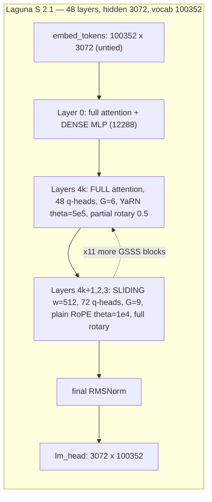
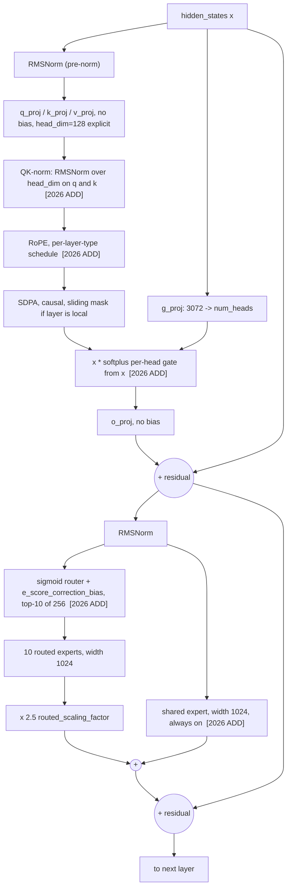
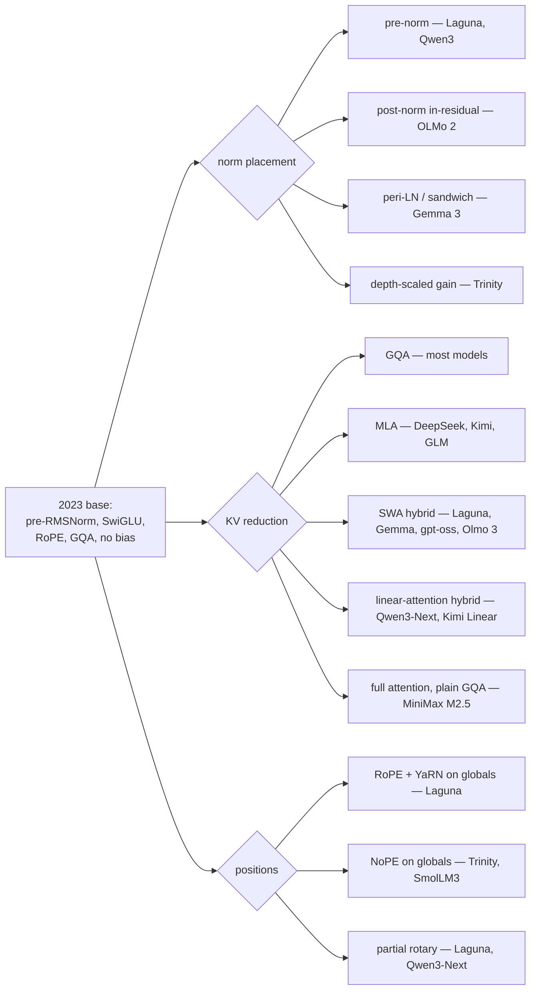

# The 2026 frontier decoder, end to end

**What this note settles.** The 2023 decoder recipe — pre-RMSNorm, SwiGLU, RoPE, GQA,
no biases — is still the load-bearing skeleton in 2026, and every widely-adopted change
since then is a *stability* fix or a *memory-bandwidth* fix rather than a new modelling
idea; only two changes (QK-norm and attention output gating) are backed by controlled
ablations at more than one scale, and the rest are inherited convention. Second: the
single largest architectural delta since 2023 is that a layer is no longer a uniform
unit — attention type, head count, RoPE schedule and MLP type are now all per-layer
lookups, and our reference model varies all four. Third: the hyperparameters most likely
to be wrong at our 20M–300M ablation scale are precisely the ones the frontier is free to
ignore, because they scale differently — vocabulary, embedding tying, and the depth/width
aspect ratio.

Written for a reader who has spent thirty years capacity-planning storage and caches.
Bridges to that experience are made explicitly, and the places where the bridge collapses
are flagged, because the collapse is where the ML content lives. The memory-side of the
story (KV byte math, eviction, serving tiers) is already written in `research/memory/` and
is referenced, not repeated.

---

## 1. The 2023 baseline, stated precisely so the delta is legible

The reference point is Llama-2-class `[C]` ([2307.09288](https://arxiv.org/abs/2307.09288),
Jul 2023; lineage from [2302.13971](https://arxiv.org/abs/2302.13971)), which itself was a
pruning of the 2017 encoder-decoder `[C]` ([1706.03762](https://arxiv.org/abs/1706.03762)):

| Component | 2023 vanilla | Why it was there |
|---|---|---|
| Norm type | RMSNorm `[C]` ([1910.07467](https://arxiv.org/abs/1910.07467)) | drops the mean-centering term of LayerNorm `[C]` ([1607.06450](https://arxiv.org/abs/1607.06450)); one fewer reduction, no measured quality cost |
| Norm placement | Pre-norm, both norms inside the residual `[C]` ([2002.04745](https://arxiv.org/abs/2002.04745)) | post-norm needs LR warmup to not diverge; pre-norm trains without it |
| Activation | SwiGLU, FFN width 8/3·d `[C]` ([2002.05202](https://arxiv.org/abs/2002.05202)) | +0.2 perplexity-equivalent at matched params in Shazeer's sweep; the 8/3 restores parameter parity against a 4·d ReLU FFN |
| Positions | RoPE, θ=10000 `[C]` ([2104.09864](https://arxiv.org/abs/2104.09864)) | relative distance for free, no learned table, KV-cache-compatible |
| Attention | MHA, later GQA `[C]` ([2305.13245](https://arxiv.org/abs/2305.13245)) | KV bytes ∝ number of KV heads |
| Biases | none on any linear | no measured benefit, one fewer tensor |
| Head dim | `hidden_size / num_heads` | convention, never justified |
| Vocab | 32k BPE, embeddings sometimes tied `[C]` ([1608.05859](https://arxiv.org/abs/1608.05859)) | inherited from the SentencePiece era |

Everything in the 2026 recipe is a modification of one row of that table. There is no new
row for "a fundamentally different block."

---

## 2. Norms: three separate decisions, only one of them settled

Three questions get collapsed into the word "normalization," and they have different
evidential status.

**(a) What function.** Settled. RMSNorm everywhere, computed in fp32 and cast back. Our
reference model does exactly this `[M]`
(`research/reference/models/laguna-s/modeling_laguna.py:58-63` — upcast to fp32 at line 60,
`rsqrt(mean(x²)+ε)`, cast back at line 63; `rms_norm_eps = 1e-06` in `config.json`). The
fp32 upcast is not cosmetic: it is the only reason RMSNorm is safe under bf16, and it is a
direct hardware-validation-gate item for us, since bf16 numerics on gfx1151 are `untested`
in `ASSUMPTIONS.md → bf16-numerics-unproven`.

**(b) Where in the block.** *Contested, and this is the live fight of 2025–26.* Four
positions are shipping simultaneously:

- **Pre-norm** (two norms per block, both inside the residual). What our reference model
  does `[M]` (`modeling_laguna.py:486-487` builds `input_layernorm` and
  `post_attention_layernorm`; `:500-518` shows the classic `residual + sublayer(norm(x))`
  twice). Also Qwen3 `[C]` ([2505.09388](https://arxiv.org/abs/2505.09388)).
- **Post-norm inside the residual.** OLMo 2 `[C]`
  ([2501.00656](https://arxiv.org/abs/2501.00656)) moved the norms after the sublayers but
  kept them inside the skip, reporting improved training stability.
- **Peri-LN / sandwich** (norm on both the input *and* the output of each sublayer, four
  RMSNorms per block). `[C]` ([2502.02732](https://arxiv.org/abs/2502.02732), Feb 2025,
  ICML 2025) argues pre-LN's hidden-state variance grows without bound with depth,
  producing massive activations, and that peripheral placement controls it; validated to
  3.2B. Gemma 3 ships a sandwich variant `[C]`
  ([2503.19786](https://arxiv.org/abs/2503.19786)).
- **Depth-scaled gain**, where the second norm in each block is initialized near 1/√L.
  Motivated by the *curse of depth* result `[C]`
  ([2502.05795](https://arxiv.org/abs/2502.05795), NeurIPS 2025): under pre-LN the output
  variance grows exponentially with depth, so the deep blocks' Jacobians approach the
  identity and those layers contribute almost nothing to training. Measured on 130M–1B.

The dispute is not decorative. `[C]` ([2603.15389](https://arxiv.org/abs/2603.15389), Mar
2026) reports that *sparsity interacts with the curse of depth*, which means the answer for
an MoE is not necessarily the answer for a dense model — and our reference model is a
sparse pre-norm model, i.e. the configuration the depth literature is most suspicious of.
Treat "pre-norm" as an inherited default in Laguna, not a demonstrated choice.

**(c) QK-norm.** Effectively settled as a practice, weakly settled as evidence. An RMSNorm
is applied over `head_dim` to the query and key *before* RoPE. `[M]` In our reference:
`modeling_laguna.py:398-399` constructs `q_norm`/`k_norm` at width `config.head_dim` (=128),
and `:421-425` applies them and *then* calls `apply_rotary_pos_emb`. Origin `[C]`
([2010.04245](https://arxiv.org/abs/2010.04245)), scaled up in ViT-22B `[C]`
([2302.05442](https://arxiv.org/abs/2302.05442)).

The mechanism is simple and worth stating for a systems reader: the attention logit is
`q·k/√d`. Nothing in the architecture bounds `‖q‖` or `‖k‖`, so a run can drift into a
regime where logits are large, softmax saturates, gradients vanish through the softmax, and
a loss spike follows. QK-norm bounds both vectors, which bounds the logit magnitude. **The
honest reading of the evidence is narrower than the adoption rate suggests:** the published
ablations show QK-norm buys *headroom at high learning rate*, and at conservative learning
rates the un-normed model is sometimes marginally better. It is a stability control, not a
quality feature — and at least one 2026 model (Cohere's Tiny Aya) dropped it on the grounds
that it interacts badly with long context. There is now a variant designed specifically to
keep QK-norm compatible with MLA's compressed cache `[C]`
([2606.16310](https://arxiv.org/abs/2606.16310), Jun 2026), which is evidence the community
considers it non-negotiable enough to redesign around.

> **Systems bridge, and where it breaks.** QK-norm is a rate limiter on a queue whose
> overflow is silent. The bridge breaks because the "overflow" is not dropped work — it is
> a *gradient* that stops flowing, so the symptom appears thousands of steps later as a
> flat loss curve rather than at the moment of saturation. There is no backpressure signal
> to observe. This is why the fix is architectural rather than a monitored threshold.

---

## 3. Activations: the one row nobody is fighting about

SwiGLU won and stayed won `[C]` ([2002.05202](https://arxiv.org/abs/2002.05202)). Our
reference sets `hidden_act: "silu"` and builds the standard three-matrix gated MLP `[M]`
(`modeling_laguna.py:134-141`: `down(silu(gate(x)) * up(x))`, all `bias=False`).

Two 2026 caveats. First, the 8/3·d convention is gone in MoE models — expert width is now
set by a *sparsity* argument, not a parameter-parity argument (Section 6). Second, gpt-oss
ships a **clamped** SwiGLU with `swiglu_limit = 7.0` `[M]`
(`research/reference/architecture/gpt-oss/gpt_oss/torch/model.py:22`), i.e. an explicit
saturation bound on the activation — a numerical-stability patch in exactly the same family
as QK-norm, applied to a different unbounded quantity. Nobody has published a controlled
comparison of the two clamping sites. That is a cheap ablation.

---

## 4. Attention: MHA → MQA → GQA → MLA, and then sideways

### 4.1 The head-sharing ladder is a bandwidth ladder, not a quality ladder

The whole ladder exists because of one identity, derived in full in
`research/memory/kv-cache-mechanics.md`: KV bytes per token are
`2 · L · n_kv · d_head · b`, and **query head count does not appear**. So:

| Variant | `n_kv` | KV bytes | What it costs |
|---|---|---|---|
| MHA | `n_q` | 1× | nothing; the baseline |
| MQA `[C]` ([1911.02150](https://arxiv.org/abs/1911.02150)) | 1 | `1/n_q` | measurable quality loss and training instability |
| GQA `[C]` ([2305.13245](https://arxiv.org/abs/2305.13245)) | `G` groups | `G/n_q` | small quality loss; uptrainable from an MHA checkpoint at ~5% of pretrain compute |
| MLA `[C]` ([2405.04434](https://arxiv.org/abs/2405.04434)) | latent rank | ~7% of MHA | implementation and serving complexity; needs decoupled RoPE |

MQA's original framing is the mental model a storage engineer should carry into everything
else here: autoregressive decode reads the entire KV cache once per token to produce one
token, so it is bandwidth-bound, not FLOPS-bound. The arithmetic intensity of decode
attention works out to `2G/bytes_per_element`, which for bf16 is exactly the GQA group
size `G` — independent of context length and of depth (derivation in
`research/memory/kv-cache-mechanics.md`).

**2026 status: GQA is the default, MLA is a house style, and the gap is contested.** MLA is
standard in the DeepSeek/Kimi/GLM lineage `[C]` ([2412.19437](https://arxiv.org/abs/2412.19437),
[2507.20534](https://arxiv.org/abs/2507.20534)) and in DeepSeek-V3.2/V4 is now *composed*
with sequence-axis sparsity `[C]` ([2512.02556](https://arxiv.org/abs/2512.02556),
[2606.19348](https://arxiv.org/abs/2606.19348)). Everyone else ships GQA. The published
MLA-beats-GQA comparisons come from the labs that ship MLA, at 100B+ MoE scale, and I found
no controlled academic replication at small scale — a gap `research/memory/README.md`
already flags as a genuinely available experiment. Meanwhile the axis is still generating
new points: low-rank multi-head attention `[C]`
([2603.02188](https://arxiv.org/abs/2603.02188), Mar 2026) and Sparse Query Attention, which
reduces *query* heads to cut prefill FLOPs rather than KV bytes `[C]`
([2510.01817](https://arxiv.org/abs/2510.01817)) — the mirror image of GQA, and a reminder
that "attention variant" conflates two different budgets.

### 4.2 Our reference model: GQA with a per-layer twist that breaks the usual arithmetic

`[M]` From `research/reference/models/laguna-s/config.json`:

- `num_key_value_heads: 8`, `head_dim: 128`, uniform across all 48 layers. K/V projections
  are built from the *global* field (`modeling_laguna.py:377-378`), so **KV bytes are
  uniform per layer**: 4 KiB/token/layer.
- `num_attention_heads_per_layer` is a 48-entry list: **48 query heads on the 12
  full-attention layers, 72 on the 36 sliding layers.** The decoder layer passes it into the
  attention constructor (`modeling_laguna.py:473-478`). The top-level
  `num_attention_heads: 48` is therefore *wrong for 36 of 48 layers* — this is the
  `laguna-heads-uniform` row in our `ASSUMPTIONS.md`, refuted.
- `head_dim` is set explicitly, not derived. `hidden_size / num_attention_heads` = 3072/48 =
  64, but the model uses 128. The query projection is therefore **wider than the residual
  stream**: 48·128 = 6144 = 2·d on full layers, 72·128 = 9216 = 3·d on sliding layers.

The consequence is that the GQA group size — and hence decode arithmetic intensity — is
**per-layer**: `G = 48/8 = 6` on full-attention layers and `G = 72/8 = 9` on sliding layers.
A single-number "this model has 8 KV heads and GQA-6" description is wrong. This matters for
Mnemosyne: a bandwidth model built from the top-level config mis-predicts three quarters of
the layers.

### 4.3 The hybrid attention layout, read from the artifact

`[M]` `layer_types` is a literal 48-entry list, strictly `full, sliding, sliding, sliding`
repeating — a 1:3 global:local ratio, 12 global and 36 sliding, `sliding_window: 512`. The
entire hybrid mechanism is a list lookup at construction time
(`modeling_laguna.py:369`), which is why the ratio is trivially ablatable and why
`research/memory/hybrid-architectures.md` treats "what goes in that list" as the research
question. llama.cpp reimplements the same thing as `set_swa_pattern(4, dense_first=true)`
`[M]` (`research/reference/architecture/llama-cpp-laguna/src/models/laguna.cpp:41`).

3:1 is the 2026 fashion, and it is fashion until someone ablates it. Gemma 3 uses 5:1 with a
1024 window `[C]` ([2503.19786](https://arxiv.org/abs/2503.19786)); gpt-oss alternates with a
**128**-token window `[C]` ([2508.10925](https://arxiv.org/abs/2508.10925), and `[M]`
`gpt-oss/gpt_oss/torch/model.py:26`); Olmo 3 uses 3:1 with a 4096 window and forces the last
layer global; Laguna uses 3:1 with 512. Same ratio, a 32× spread in window size. And the
ratio question is openly disputed: `[C]` ([2507.06457](https://arxiv.org/abs/2507.06457))
finds recall degrades sharply below 3:1 (a real ceiling), while `[C]`
([2606.15378](https://arxiv.org/abs/2606.15378), Jun 2026) finds configurations converge
given enough tokens and that larger windows *delay* retrieval-head formation
("Large-Window Laziness"). Both are 2026; both are credible; the resolution probably depends
on token budget. Present as contested.

### 4.4 Per-head output gating — the least-documented change in the recipe

`[M]` Laguna multiplies the attention output by `softplus(g_proj(x))` **before** `o_proj`,
with one scalar per head (`config.gating: "per-head"`, and all 48 entries of `gating_types`
are `per_head`). Code: `modeling_laguna.py:390` sizes `g_proj` to `num_heads` (not
`num_heads·head_dim`), `:453` computes the softplus in fp32, `:454-459` broadcasts across
`head_dim`, `:463` then applies `o_proj`. Note the gate is computed from the *layer input*
`hidden_states`, not from the attention output — it is query-dependent, not value-dependent.

The evidence for this is the strongest single-mechanism ablation in the 2026 recipe `[C]`
([2505.06708](https://arxiv.org/abs/2505.06708), NeurIPS 2025 Oral): a head-specific gate on
the SDPA output improves loss, tolerates higher LR, and — the striking result — **eliminates
attention sinks**, taking first-token attention mass from 46.7% to 4.8% at 3.5T tokens. The
paper's ablation grid finds output-position gating with a per-head gate is consistently best,
and sigmoid beats SiLU there. Laguna uses softplus rather than sigmoid, i.e. an *unbounded*
non-negative gate rather than a bounded one — a deviation from the ablated optimum that
nobody has published a comparison for. That is a clean, cheap experiment.

There is a striking corroboration sitting in the config: Laguna's code supports learnable
per-head attention sinks on sliding layers (`configuration_laguna.py:76-79`;
`modeling_laguna.py:394-395`) and the shipped config **does not enable them** —
`swa_attention_sink_enabled` is absent, so `False`. gpt-oss, which has no output gating,
ships learned sinks as a first-class parameter `[M]`
(`gpt-oss/gpt_oss/torch/model.py:189`, `gpt_oss/triton/attention.py:44-54`). `[A]` Medium
confidence that these are two solutions to the same problem — the model's need for a
no-op attention target `[C]` ([2309.17453](https://arxiv.org/abs/2309.17453),
[2410.10781](https://arxiv.org/abs/2410.10781)) — and that gating makes sinks redundant.
Cheapest falsifying test: train two matched 100M models, one with per-head output gating and
one with learned sinks, and measure first-token attention mass per layer. If gating does not
suppress the sink, the story is wrong.

---

## 5. Positional schemes: RoPE is now a per-layer-type policy, not a model constant

The 2023 model had one RoPE. The 2026 model has a *schedule*. Our reference has two entirely
different positional treatments in the same stack `[M]` (`config.json`, `rope_parameters`):

| | Full-attention layers (12) | Sliding layers (36) |
|---|---|---|
| `rope_type` | `yarn` | `default` |
| `rope_theta` | 500000.0 | 10000.0 |
| `partial_rotary_factor` | **0.5** (64 of 128 dims rotated) | 1.0 (all 128) |
| `factor` | 128.0 | — |
| `original_max_position_embeddings` | 8192 | — |
| `beta_fast` / `beta_slow` | 32 / 1 | — |
| `attention_factor` | 1.4852030263919618 | — |

Three things fall out of those numbers.

**One: 8192 × 128 = 1,048,576, exactly `max_position_embeddings`.** The model was trained at
8k and YaRN-extended 128× `[C]` ([2309.00071](https://arxiv.org/abs/2309.00071)). Laguna-XS
2.1 uses `factor: 32.0` and 8192 × 32 = 262,144 = its advertised context. The advertised
context is an arithmetic consequence of the extension factor, not an independently
established capability — and the effective-vs-advertised gap is a measured, persistent
finding `[C]` ([2404.06654](https://arxiv.org/abs/2404.06654);
[2601.02872](https://arxiv.org/abs/2601.02872), Jan 2026;
[2605.28079](https://arxiv.org/abs/2605.28079), May 2026).

**Two: `attention_factor` is YaRN's published default, carried verbatim.** YaRN prescribes a
softmax temperature of `0.1·ln(s) + 1`. For s=128 that is 1.4852030263919618; for XS's s=32
it is 1.3465735902799727. Both match the config to the last digit `[M]`. This is a clean,
checkable instance of **inherited convention rather than demonstrated choice**, and it is
worth pointing at because it is invisible unless you compute it. It is also a live target:
`[C]` ([2606.23687](https://arxiv.org/abs/2606.23687), Jun 2026) reports that *randomizing*
the YaRN factor during training improves length generalization for long-context reasoning,
and `[C]` ([2607.07740](https://arxiv.org/abs/2607.07740), Jul 2026) proposes a tuning-free
length-adaptive rescaling instead.

**Three: `partial_rotary_factor = 0.5` on the global layers is a partial NoPE.** Half of
every head's dimensions get no positional signal at all — they pass through unrotated
(`modeling_laguna.py:296-305` splits `q_rot`/`q_pass` and concatenates). The 2026 fashion
elsewhere is the *layer-granular* version of the same idea: SmolLM3 drops RoPE entirely on
every fourth layer, and Arcee Trinity (Feb 2026) makes every fourth layer global *and*
NoPE, reporting it critical for long context. The evidence base is `[C]`
([2305.19466](https://arxiv.org/abs/2305.19466)) and `[C]`
([2404.12224](https://arxiv.org/abs/2404.12224)), which find NoPE length-generalizes better
than RoPE or ALiBi in decoder-only models; `[C]`
([2512.12167](https://arxiv.org/abs/2512.12167), Dec 2025) shows you can drop positional
embeddings from an *already pretrained* model to extend context.

So Laguna and Trinity solve the same problem in orthogonal ways — dimension-split versus
layer-split — and neither has been compared against the other. Note the direction is
opposite to intuition in both cases: the *global* layers get the weakened positional signal
and the *local* layers keep full, unscaled RoPE at θ=10000. That is coherent once you see
that a 512-token window never needs to represent a distance beyond 512.

**A hardware-validation hook.** `[C]` ([2411.13476](https://arxiv.org/abs/2411.13476))
reports that bf16 breaks RoPE's relative-position property in long-context training, with
error accumulating with sequence length and concentrated on the first token. Our
`bf16-numerics-unproven` row lists matmul/softmax/RMSNorm/attention; **RoPE at long
positions belongs on that list** and currently is not on it.

---

## 6. Depth, width, and the fact that MoE moved the width knob

Classical practice sizes a model by depth `L` and width `d` with an aspect ratio `d/L`
around 100 for dense models `[C]` ([2001.08361](https://arxiv.org/abs/2001.08361)). Our
reference is far from that `[M]`: `hidden_size 3072`, `num_hidden_layers 48`, aspect ratio
**64** — a deep, narrow trunk, with the width moved into the expert bank and the attention
heads.

Everything below is computed from `config.json` `[M]`; the arithmetic reproduces the
published headline numbers, which is the check that the reading is right:

| Component | Params | Note |
|---|---|---|
| Routed experts, 47 MoE layers | 113.55 B | `256 × (2·1024·3072 + 3072·1024)` per layer |
| Shared expert, 47 layers | 0.44 B | always on, never routed |
| Attention, 12 full layers | 0.53 B | 44.2 M each |
| Attention, 36 sliding layers | 2.27 B | 63.1 M each — sliding layers are the *expensive* ones |
| Dense MLP, layer 0 only | 0.11 B | `mlp_only_layers: [0]` |
| Embeddings + untied `lm_head` | 0.62 B | 2 × 100352 × 3072 |
| **Total** | **117.5 B** | advertised 118 B |
| **Active per token** | **8.10 B** | advertised ~8 B |

Read three structural facts off that table.

**Sparsity.** 256 routed experts, top-10, `moe_intermediate_size 1024` = d/3. Active routed
fraction is 10/256 = 3.9%; including the always-on shared expert, 11/257 = 4.3%. The
fine-grained-expert design (many narrow experts plus a shared one) is DeepSeekMoE's `[C]`
([2401.06066](https://arxiv.org/abs/2401.06066)); the granularity/sparsity choice has its own
scaling literature `[C]` ([2402.07871](https://arxiv.org/abs/2402.07871),
[2501.12370](https://arxiv.org/abs/2501.12370)). What sparsity buys is params-per-FLOP; what
it costs is that 118 B of weights must be *resident* to serve 8 B of compute — for a
bandwidth-bound decode workload on unified memory, that is the whole story.

**Attention is not the cheap part.** The 36 sliding layers hold 2.27 B parameters against
the 12 global layers' 0.53 B, because they carry 72 query heads each. "Sliding window layers
are the cheap ones" is true of *KV residency* and false of *parameters and prefill FLOPs*.
Conflating these is easy and this config makes the error concrete.

**Layer 0 is dense.** `mlp_only_layers: [0]` and `mlp_layer_types[0] = "dense"`. The first
block routes nothing. This is a stability convention inherited from DeepSeek's
`moe_first_k_dense_replace` and, as far as I can find, has never been ablated in public. It
is a one-line config change and a perfect ablation for our rig.

MoE failure modes — expert collapse, hot experts, dropped tokens, capacity factors, the
aux-loss-free bias, sigmoid vs softmax routing, router-logit softcapping — are the subject of
the sibling note `moe-routing-and-failure-modes.md` and are not duplicated here. Two facts
about the reference belong in the anatomy, though. `[M]` `router_aux_loss_coef: 0.0` in the
shipped config: the load-balancing auxiliary loss is *off*, and balancing is done entirely by
the per-expert `e_score_correction_bias` added to selection scores but not to combination
weights (`modeling_laguna.py:177-182`; the bias is `requires_grad=False`, line 166) — the
aux-loss-free method `[C]` ([2408.15664](https://arxiv.org/abs/2408.15664)), now with a
primal-dual theory `[C]` ([2512.03915](https://arxiv.org/abs/2512.03915)). And `[M]`
`moe_router_logit_softcapping: 0.0`: the softcapping guard exists in the code
(`modeling_laguna.py:175-176`) and is **disabled** in the shipped checkpoint. Two
anti-collapse mechanisms present in the implementation, one enabled. Do not describe the
architecture from the code alone or from the config alone.

---

## 7. Tokenizer and embeddings — the rows that do not survive the trip to 300M

`[M]` Read from `research/reference/models/laguna-s/tokenizer.json` and
`tokenizer_config.json`:

- Byte-level **BPE**, `vocab_size = 100352`, 100,026 merges, no normalizer,
  `byte_fallback: false`, `PreTrainedTokenizerFast`.
- 100352 = 98 × 1024. Vocabulary is padded to a tensor-friendly multiple; the last few
  hundred ids are slack, which is why `tokenizer.json` carries 70 declared special tokens
  and the head still divides cleanly.
- Pre-tokenizer is a *sequence*: first a split on `(?:\r?\n)+(?!\r?\n)` with
  `MergedWithNext`, then the cl100k-style contraction/letter/number/punctuation regex, then
  ByteLevel with `add_prefix_space: false`. That first rule attaches runs of newlines to the
  following token — an indentation-and-blank-line optimization, i.e. a code-first tokenizer.
- Special tokens confirm the same: `〈|FIM_START|〉`/`FIM_MIDDLE`/`FIM_SUFFIX` (fill-in-the-middle),
  `〈|CODE_START|〉`/`CODE_END`, `〈|META_START|〉`/`META_END`.
- `eos_token_id: [2, 24]` — two EOS ids, `〈|EOS|〉` and `</assistant>`.
- `tie_word_embeddings: false`.

**Vocabulary is a scaling-law variable, not a preprocessing detail.** `[C]`
([2407.13623](https://arxiv.org/abs/2407.13623), NeurIPS 2024) fits compute-optimal
vocabulary size over 33M–3B models and concludes that models are systematically
under-vocabularized — Llama-2-70B's compute-optimal vocab would have been ≥216k against its
actual 32k. `[C]` ([2501.16975](https://arxiv.org/abs/2501.16975)) pushes further with
decoupled input/output vocabularies. `[C]`
([2512.20757](https://arxiv.org/abs/2512.20757), Dec 2025) is the current controlled study of
what tokenizer choice actually changes downstream. The 100k-ish vocab now standard across
frontier models is the compute-optimal answer *for frontier-scale models*.

**And that is exactly why it is a trap for us.** Two untied embedding matrices at
`V = 100352` cost `2 · V · d` parameters. At `d = 768` that is **154 M parameters** — more
than half of a 300 M-parameter budget, and larger than an entire 20 M-parameter model. At
our ablation scale the choices are: shrink the vocabulary (which changes tokens-per-word and
therefore the effective token budget, confounding every matched-budget comparison), or tie
the embeddings `[C]` ([1608.05859](https://arxiv.org/abs/1608.05859)) — which the reference
model does *not* do, so any Proteus arm that ties is already deviating from the anchor. This
is not a detail to settle later; it determines whether "matched param count" across arms
means anything.

> **Systems bridge, and where it breaks.** The embedding table is a hash table from token id
> to vector, and `lm_head` is the same table used in reverse; tying them is deduplication.
> The bridge breaks because the two tables want *different* geometry — the input table wants
> vectors that compose well under addition into the residual stream, the output table wants
> vectors that separate well under dot product. Deduplication here is a modelling constraint
> with a measurable cost, not a storage optimization with none. Which is why it pays at 300 M
> and is skipped at 118 B.

---

## 8. Diagrams

### 8.1 The reference model as shipped

### 8.2 One decoder block, with the 2026 additions marked

### 8.3 Where the 2026 recipe branches

---

## 9. Demonstrated vs. inherited — the ablation shortlist

The house rule is that layer ratios and hyperparameters copied across papers without
retesting are prime ablation targets. Applying it to the anchor:

| Choice in Laguna | Status | Cheapest falsifying test at our scale |
|---|---|---|
| RMSNorm, fp32 upcast | **demonstrated**, and a numerics requirement | none needed; verify on gfx1151 |
| QK-norm before RoPE | **demonstrated** as a stability control, weakly as quality | LR sweep with/without at 100 M; the claim is headroom, not loss |
| Per-head **softplus** output gate | mechanism demonstrated `[C]` 2505.06708; **softplus vs sigmoid inherited** | swap softplus↔sigmoid at matched params; measure loss and first-token attention mass |
| Pre-norm placement | **inherited**; contested by three 2025–26 lines | pre vs peri-LN vs depth-scaled gain at 100 M, 3 seeds |
| 3:1 global:sliding | **inherited** (see `research/memory/hybrid-architectures.md`) | sweep 1:1 / 3:1 / 7:1 at matched params; score recall, not perplexity |
| Window = 512 | **inherited**; peers span 128–4096 | window sweep at fixed ratio; the two interact `[C]` 2606.15378 |
| `attention_factor` = 0.1·ln(s)+1 | **inherited verbatim from the YaRN paper** | sweep the temperature at fixed factor |
| `partial_rotary_factor` 0.5 on globals | **inherited/undocumented** | 0.25 / 0.5 / 1.0 / layer-NoPE at 100 M |
| 72 q-heads on sliding, 48 on global | **undocumented anywhere I can find** | uniform-72 vs uniform-48 vs the shipped split at matched params |
| `mlp_only_layers: [0]` | **inherited** from DeepSeek | 0 / 1 / 2 dense prefix layers |
| Aux-loss coefficient 0.0 | **demonstrated** `[C]` 2408.15664, but contested at high sparsity | 0.0 / 0.001 / 0.01 with per-expert load telemetry |
| Router softcapping off | mechanism present, **unused** | enable at c=30 and watch router-logit distribution |
| Untied embeddings | **correct at 118 B, wrong at 300 M** | must be decided before any matched-param arm |

---

## 10. Where this constrains the memory track

- **Per-layer GQA groups break single-number bandwidth models.** `G = 6` on global layers,
  `G = 9` on sliding ones. The `2G/bytes` intensity result in
  `research/memory/kv-cache-mechanics.md` is correct but must be evaluated per layer type for
  this model. A Mnemosyne cost model keyed on `config.num_attention_heads` is wrong for 75%
  of layers.
- **KV bytes are uniform even though heads are not**, because K/V projections read the
  global `num_key_value_heads`. This confirms the correction already made in
  `kv-cache-mechanics.md` against the `kv-per-token-laguna` caveat in `ASSUMPTIONS.md`, from
  the shipped checkpoint's own config rather than from the transformers copy.
- **Keys in the cache are normalized *and* rotated.** QK-norm runs before RoPE
  (`modeling_laguna.py:421-425`), so a stored key is `RoPE(RMSNorm(k))`. Any Mnemosyne policy
  that re-packs, re-positions, or quantizes keys is operating on a doubly-transformed
  quantity — which is precisely why the KV-quantization literature recommends *pre-RoPE* key
  quantization `[C]` ([2401.18079](https://arxiv.org/abs/2401.18079)) and per-channel key
  treatment `[C]` ([2402.02750](https://arxiv.org/abs/2402.02750)). With QK-norm in front,
  "pre-RoPE" now means "post-norm, pre-rotation," a third point that the literature does not
  distinguish.
- **The two SWA RoPE schedules make windows non-widenable.** Sliding layers were trained with
  θ=10000 and no scaling; a long-context experiment cannot simply widen the window without
  putting those layers at positions their rotary schedule never saw. This is already noted in
  `CODE_MAP.md` from the llama.cpp side; it is confirmed here from the HF config.
- **Output gating may remove the attention sink.** Every eviction policy in
  `research/memory/kv-compression-and-eviction.md` pins a prefix because of the sink `[C]`
  ([2309.17453](https://arxiv.org/abs/2309.17453)). If per-head output gating suppresses sinks
  `[C]` ([2505.06708](https://arxiv.org/abs/2505.06708)), then **sink-pinning may be
  unnecessary on gated models** — and conversely, evicting position 0 may be safe where the
  literature says it is fatal. This is a directly testable, architecture-dependent
  contradiction between two of our tracks, and it is the most interesting thing in this note.
- **Sparsity is a residency problem, not a compute problem.** 118 B resident to serve 8 B of
  compute is the worst possible shape for a bandwidth-bound decode on a 200 GB/s unified pool
  `[M]` (`notebook/uma-carveout-controls-fast-tier.md`). Any Proteus MoE arm inherits this and
  should be costed in bytes-read-per-token, not FLOPs.

---

## 11. Contested, and left contested

1. **Norm placement.** Pre-LN vs post-in-residual vs peri-LN vs depth-scaled gain. Four
   shipping answers in 2026, three published mechanisms, no head-to-head at matched budget
   above ~3 B. `[C]` 2502.02732 / 2501.00656 / 2502.05795 / 2603.15389.
2. **Whether QK-norm is a quality feature or only a stability control**, and whether it costs
   long-context performance. Adoption is near-universal; the ablations show benefit
   concentrated at high learning rate; at least one 2026 model dropped it on long-context
   grounds.
3. **MLA vs GQA.** Vendor-reported wins at 100B+ MoE scale, no independent small-scale
   replication found. `[C]` 2405.04434 vs the GQA majority.
4. **The hybrid ratio: capability ceiling or training-speed knob.** `[C]` 2507.06457 vs `[C]`
   2606.15378, same year, incompatible framings.
5. **Whether hybrid/efficient attention is worth it at all.** MiniMax shipped M2 and M2.5 as
   full-attention plain-GQA models on reliability grounds `[C]`
   ([2605.26494](https://arxiv.org/abs/2605.26494)); Kimi Linear claims the opposite under
   matched pretraining `[C]` ([2510.26692](https://arxiv.org/abs/2510.26692)). Both are
   product retrospectives with commercial incentives.
6. **Positional weakening: dimension-split (partial rotary) vs layer-split (NoPE layers).**
   Both shipping in 2026, never compared.
7. **Optimizer as an architecture variable.** Muon `[C]`
   ([2502.16982](https://arxiv.org/abs/2502.16982)) is now in production at trillion-parameter
   scale and reports ~2× compute efficiency vs AdamW, but `[C]`
   ([2606.04058](https://arxiv.org/abs/2606.04058)) and `[C]`
   ([2607.20548](https://arxiv.org/abs/2607.20548), Jul 2026) are still arguing about how its
   advantage scales. Since optimizer choice changes which architectures are *trainable*, an
   architecture ablation is implicitly an optimizer-conditional result. See
   `pretraining-recipes.md`.
8. **Whether small-scale ablations transfer at all.** μP makes LR transfer across width `[C]`
   ([2203.03466](https://arxiv.org/abs/2203.03466)), extended to depth/batch/duration `[C]`
   ([2512.22382](https://arxiv.org/abs/2512.22382)) and to MoE `[C]`
   ([2508.09752](https://arxiv.org/abs/2508.09752)) — but the IsoFLOP fitting methodology
   underneath is itself now under attack `[C]`
   ([2603.22339](https://arxiv.org/abs/2603.22339)). This is our `ablation-scale-sufficient`
   assumption, still `untested`.

---

## 12. Open questions — testable here

Constraints: one gfx1151 GPU, no collectives (`single-device-only`, supported), 20M–300M
params, 0.5–5B tokens, a `[M]` ≥62 GiB fast tier at ~200 GB/s, and individual tensors kept
under 32 GiB (`large-tensor-fault-32gib`, refuted at 32 GiB). All of these are gated behind
the Hardware Validation Gate, which has not run.

1. **Does per-head output gating remove the attention sink, and does that make sink-pinning
   unnecessary for eviction?** Two matched ~100M models, gated vs ungated, 3 seeds. Measure
   per-layer first-token attention mass, then run StreamingLLM-style eviction *without* the
   pinned prefix on both. Directly couples this note to
   `research/memory/kv-compression-and-eviction.md` and is, as far as I can find, unpublished.
2. **Softplus vs sigmoid for the output gate.** Laguna deviates from the ablated optimum in
   `[C]` 2505.06708 and nobody says why. Same harness as (1); one config field.
3. **Do the per-layer query-head counts (72 sliding / 48 global) do anything?** Three arms at
   matched total params: uniform-low, uniform-high, and the shipped split. This is a config
   value with no published justification anywhere I could find, which makes it a real
   question rather than a replication.
4. **Partial rotary 0.5 vs layer-granular NoPE vs full RoPE on the global layers**, scored on
   length generalization beyond the training length rather than on perplexity.
5. **Does the dense first layer (`mlp_only_layers: [0]`) matter?** 0 / 1 / 2 dense prefix
   layers at matched params, measuring router entropy and load imbalance in the early layers.
   Cheap, and it tests an inherited convention nobody has published on.
6. **Vocabulary and tying at ablation scale.** At 300M with `V = 100352`, embeddings are >50%
   of the budget. Sweep V ∈ {8k, 32k, 100k} × {tied, untied} at matched *non-embedding*
   params and measure both loss and bits-per-byte, which is the only comparison that survives
   a tokenizer change. This one is a prerequisite for every other arm, not an experiment we
   choose to run.
7. **RoPE under bf16 at long positions on gfx1151.** `[C]` 2411.13476 predicts relative-
   position degradation that grows with sequence length under bf16. Compare bf16 vs fp32
   `cos`/`sin` construction at positions up to 131,072 against an fp64 reference. This is a
   Hardware Validation Gate addition, cheap, and currently missing from
   `bf16-numerics-unproven`.
8. **Pre-norm vs peri-LN vs depth-scaled gain, at fixed depth and then at 2× depth.** The
   curse-of-depth claim is specifically about depth, so a single-depth ablation cannot test
   it; the experiment must vary L. Sparsity interacts `[C]` 2603.15389, so run it dense first.

---

## Sources

Code and configs read locally (paths relative to the repo root; clones are gitignored,
rebuild with `scripts/fetch_reference.sh`, revisions in `research/reference/PROVENANCE.md`):

- `research/reference/models/laguna-s/config.json`, `configuration_laguna.py`,
  `modeling_laguna.py`, `tokenizer.json`, `tokenizer_config.json`, `chat_template.jinja`,
  `README.md`
- `research/reference/models/laguna-xs/config.json`
- `research/reference/architecture/llama-cpp-laguna/src/models/laguna.cpp`
- `research/reference/architecture/gpt-oss/gpt_oss/torch/model.py`,
  `gpt_oss/triton/attention.py`
- `research/reference/memory/vllm/vllm/model_executor/models/laguna.py`,
  `laguna_dflash.py`
- `research/reference/CODE_MAP.md`, `research/reference/papers/README.md`
- `research/memory/kv-cache-mechanics.md`, `hybrid-architectures.md`,
  `kv-compression-and-eviction.md`, `long-context-behavior.md`
- `ASSUMPTIONS.md`, `notebook/uma-carveout-controls-fast-tier.md`

Papers. Every arXiv id below was resolved against the live arXiv API on 2026-07-26.

**Baseline recipe.** [1706.03762](https://arxiv.org/abs/1706.03762) Attention Is All You Need ·
[1607.06450](https://arxiv.org/abs/1607.06450) Layer Normalization ·
[1910.07467](https://arxiv.org/abs/1910.07467) RMSNorm ·
[2002.04745](https://arxiv.org/abs/2002.04745) On Layer Normalization in the Transformer Architecture ·
[2002.05202](https://arxiv.org/abs/2002.05202) GLU Variants Improve Transformer ·
[2104.09864](https://arxiv.org/abs/2104.09864) RoFormer (RoPE) ·
[1608.05859](https://arxiv.org/abs/1608.05859) Using the Output Embedding to Improve Language Models ·
[2302.13971](https://arxiv.org/abs/2302.13971) LLaMA ·
[2307.09288](https://arxiv.org/abs/2307.09288) Llama 2 ·
[2204.02311](https://arxiv.org/abs/2204.02311) PaLM ·
[2001.08361](https://arxiv.org/abs/2001.08361) Scaling Laws for Neural Language Models ·
[2203.15556](https://arxiv.org/abs/2203.15556) Chinchilla

**Norms and stability.** [2010.04245](https://arxiv.org/abs/2010.04245) Query-Key Normalization for Transformers ·
[2302.05442](https://arxiv.org/abs/2302.05442) Scaling Vision Transformers to 22 Billion Parameters ·
[2502.02732](https://arxiv.org/abs/2502.02732) Peri-LN ·
[2502.05795](https://arxiv.org/abs/2502.05795) The Curse of Depth in Large Language Models ·
[2603.15389](https://arxiv.org/abs/2603.15389) When Does Sparsity Mitigate the Curse of Depth in LLMs ·
[2505.06708](https://arxiv.org/abs/2505.06708) Gated Attention for Large Language Models

**Attention variants.** [1911.02150](https://arxiv.org/abs/1911.02150) MQA ·
[2305.13245](https://arxiv.org/abs/2305.13245) GQA ·
[2405.04434](https://arxiv.org/abs/2405.04434) DeepSeek-V2 (MLA) ·
[2606.16310](https://arxiv.org/abs/2606.16310) QK-Normed MLA ·
[2603.02188](https://arxiv.org/abs/2603.02188) Multi-Head Low-Rank Attention ·
[2510.01817](https://arxiv.org/abs/2510.01817) Sparse Query Attention ·
[2309.17453](https://arxiv.org/abs/2309.17453) StreamingLLM / attention sinks ·
[2410.10781](https://arxiv.org/abs/2410.10781) When Attention Sink Emerges

**Hybrids and ratios.** [2507.06457](https://arxiv.org/abs/2507.06457) A Systematic Analysis of Hybrid Linear Attention ·
[2510.04800](https://arxiv.org/abs/2510.04800) Hybrid Architectures for Language Models ·
[2606.15378](https://arxiv.org/abs/2606.15378) Rethinking the Role of Efficient Attention in Hybrid Architectures ·
[2510.26692](https://arxiv.org/abs/2510.26692) Kimi Linear ·
[2605.26494](https://arxiv.org/abs/2605.26494) MiniMax-M2 Series ·
[2604.03444](https://arxiv.org/abs/2604.03444) Olmo Hybrid

**Positions and long context.** [2309.00071](https://arxiv.org/abs/2309.00071) YaRN ·
[2305.19466](https://arxiv.org/abs/2305.19466) The Impact of Positional Encoding on Length Generalization ·
[2404.12224](https://arxiv.org/abs/2404.12224) Length Generalization without Position Encoding ·
[2512.12167](https://arxiv.org/abs/2512.12167) Extending Context by Dropping Positional Embeddings ·
[2606.23687](https://arxiv.org/abs/2606.23687) Randomized YaRN ·
[2607.07740](https://arxiv.org/abs/2607.07740) Jet-Long ·
[2411.13476](https://arxiv.org/abs/2411.13476) BFloat16 Breaks Down RoPE ·
[2404.06654](https://arxiv.org/abs/2404.06654) RULER ·
[2601.02872](https://arxiv.org/abs/2601.02872) LongBench Pro ·
[2605.28079](https://arxiv.org/abs/2605.28079) ATLAS ·
[2307.03172](https://arxiv.org/abs/2307.03172) Lost in the Middle ·
[2602.16837](https://arxiv.org/abs/2602.16837) A Structural Theory of Position Bias

**MoE (anatomy only; see the sibling note).** [1701.06538](https://arxiv.org/abs/1701.06538) ·
[2101.03961](https://arxiv.org/abs/2101.03961) Switch ·
[2202.08906](https://arxiv.org/abs/2202.08906) ST-MoE ·
[2401.06066](https://arxiv.org/abs/2401.06066) DeepSeekMoE ·
[2408.15664](https://arxiv.org/abs/2408.15664) Auxiliary-Loss-Free Load Balancing ·
[2512.03915](https://arxiv.org/abs/2512.03915) Theory of aux-loss-free balancing ·
[2412.19437](https://arxiv.org/abs/2412.19437) DeepSeek-V3 ·
[2405.13997](https://arxiv.org/abs/2405.13997) Sigmoid vs Softmax Gating ·
[2402.07871](https://arxiv.org/abs/2402.07871) Scaling Laws for Fine-Grained MoE ·
[2501.12370](https://arxiv.org/abs/2501.12370) Parameters vs FLOPs ·
[2605.07260](https://arxiv.org/abs/2605.07260) When Are Experts Misrouted?

**Tokenizer and vocabulary.** [2407.13623](https://arxiv.org/abs/2407.13623) Scaling Laws with Vocabulary ·
[2501.16975](https://arxiv.org/abs/2501.16975) Over-Tokenized Transformer ·
[2512.20757](https://arxiv.org/abs/2512.20757) TokSuite

**Shipped 2025–26 models cited for their configs.**
[2503.19786](https://arxiv.org/abs/2503.19786) Gemma 3 ·
[2505.09388](https://arxiv.org/abs/2505.09388) Qwen3 ·
[2508.10925](https://arxiv.org/abs/2508.10925) gpt-oss model card ·
[2501.00656](https://arxiv.org/abs/2501.00656) 2 OLMo 2 Furious ·
[2507.20534](https://arxiv.org/abs/2507.20534) Kimi K2 ·
[2512.02556](https://arxiv.org/abs/2512.02556) DeepSeek-V3.2 ·
[2606.19348](https://arxiv.org/abs/2606.19348) DeepSeek-V4

**Optimizers, μP, scaling methodology.** [2203.03466](https://arxiv.org/abs/2203.03466) Tensor Programs V ·
[2512.22382](https://arxiv.org/abs/2512.22382) Completed Hyperparameter Transfer ·
[2508.09752](https://arxiv.org/abs/2508.09752) μ-Parametrization for MoE ·
[2502.16982](https://arxiv.org/abs/2502.16982) Muon is Scalable for LLM Training ·
[2606.04058](https://arxiv.org/abs/2606.04058) Spectral Scaling Laws of Muon ·
[2607.20548](https://arxiv.org/abs/2607.20548) SOAP, Muon, and Beyond ·
[2603.22339](https://arxiv.org/abs/2603.22339) Problems with Chinchilla Approach 2 ·
[2411.04330](https://arxiv.org/abs/2411.04330) Scaling Laws for Precision ·
[2502.18969](https://arxiv.org/abs/2502.18969) (Mis)Fitting: A Survey of Scaling Laws

**KV quantization, cited only where it constrains the anatomy.**
[2401.18079](https://arxiv.org/abs/2401.18079) KVQuant ·
[2402.02750](https://arxiv.org/abs/2402.02750) KIVI

**Non-arXiv sources, flagged as weaker venues.** Sebastian Raschka, "A Dream of Spring for
Open-Weight LLMs: 10 Architectures from Jan–Feb 2026"
(<https://magazine.sebastianraschka.com/p/a-dream-of-spring-for-open-weight>) — used for the
Arcee Trinity, Qwen3-Coder-Next, GLM-5, MiniMax M2.5, Tiny Aya and Nanbeige configuration
details, none of which have arXiv reports as far as I could establish. Olmo 3's 3:1 / 4096
window and last-layer-global rule is from the Olmo 3 technical report PDF, which I could not
resolve to an arXiv id and therefore did not cite as one. Poolside's Laguna S 2.1 model card
claims a "native FP8 KV cache"; that is a serving option, not a model property — the shipped
`config.json` is `bfloat16` with no KV dtype field, and `CODE_MAP.md` records `[M]` that a
grep for `fp8` over the llama.cpp Laguna branch returns nothing. Treat vendor cards as
claims, not configs.
